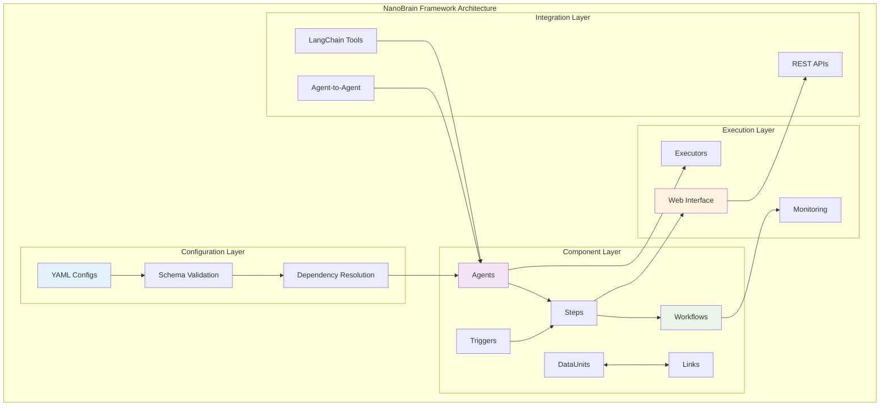

# NanoBrain Framework

**An Enterprise-Grade AI Workflow Orchestration Framework**

[](https://www.python.org/downloads/)
[](https://opensource.org/licenses/MIT)
[](https://github.com/nanobrain/nanobrain)

---

## **🧠 What is NanoBrain?**

NanoBrain is a **configuration-driven, event-driven AI workflow orchestration framework** designed for enterprise-scale AI applications. Inspired by biological neural networks, it provides a robust foundation for building sophisticated AI systems through simple, composable components.

### **🎯 Core Philosophy**

- **🔧 Configuration-Driven**: All behavior controlled via YAML configurations with zero hardcoding
- **⚡ Event-Driven**: Reactive, asynchronous processing with real-time responsiveness  
- **🚀 Production-Ready**: Enterprise-grade reliability, monitoring, and security built-in
- **🔗 from_config Pattern**: Unified component creation with mandatory framework compliance

### **🌟 Key Features**

- **Universal Web Interface**: Deploy any workflow as a REST API instantly
- **Intelligent Agent Orchestration**: Multi-agent collaboration with A2A protocol
- **Pluggable Execution**: Scale from local development to distributed HPC clusters
- **Enterprise Security**: Built-in authentication, authorization, and audit logging
- **Comprehensive Monitoring**: Real-time metrics, performance tracking, and alerting
- **LangChain Integration**: Seamless tool ecosystem compatibility

---

## **🚀 Quick Start**

### **Installation**

```bash
# Clone the repository
git clone https://github.com/nanobrain/nanobrain.git
cd nanobrain

# Install in development mode
pip install -e .

# Verify installation
python -c "import nanobrain; print('NanoBrain installed successfully!')"
```

### **Hello World Example**

```yaml
# hello_workflow.yml
name: "hello_world"
execution_strategy: "event_driven"

steps:
  greeting_step:
    class: "nanobrain.library.steps.simple_step.SimpleStep"
    config:
      name: "greeting_step"
      agent:
        class: "nanobrain.library.agents.simple_agent.SimpleAgent"
        config:
          model: "gpt-3.5-turbo"
          system_prompt: "You are a friendly AI assistant."
```

```python
# hello_world.py
from nanobrain.library.workflows.workflow import Workflow

# Create workflow from configuration
workflow = Workflow.from_config("hello_workflow.yml")

# Execute with input
result = await workflow.execute({"query": "Hello, NanoBrain!"})
print(result)
```

---

## **📚 Documentation Architecture**

NanoBrain's documentation is organized into comprehensive guides that build upon each other:

### **🏗️ [01. Framework Core Architecture](docs/01_FRAMEWORK_CORE_ARCHITECTURE.md)**
- **Foundational Principles**: Configuration-driven, event-driven, production-ready design
- **Component Hierarchy**: Complete class structure and relationships
- **Lifecycle Management**: Standard component creation and initialization patterns  
- **Tool Integration**: LangChain compatibility and A2A protocol
- **Security & Compliance**: Multi-layer security architecture

### **🔀 [02. Workflow Orchestration](docs/02_WORKFLOW_ORCHESTRATION.md)**
- **Execution Strategies**: Event-driven, imperative, and hybrid patterns
- **Component Coordination**: Steps, DataUnits, Links, and Triggers
- **Data Flow Management**: Event propagation and transformation pipelines
- **Error Handling**: Comprehensive recovery and resilience patterns
- **Performance Optimization**: Scaling and resource management

### **🌐 [03. Web Architecture](docs/03_WEB_ARCHITECTURE.md)**
- **Universal Web Interface**: Deploy any workflow as REST API
- **Request Processing**: Analysis, routing, and response generation
- **Middleware Stack**: CORS, authentication, logging, and rate limiting
- **WebSocket Support**: Real-time communication and streaming
- **API Documentation**: OpenAPI/Swagger integration

### **🤖 [04. LLM Code Generation](docs/04_LLM_CODE_GENERATION.md)**
- **Intelligent Code Generation**: AI-driven component creation
- **Configuration Synthesis**: Automatic YAML generation from descriptions
- **Best Practices**: Code quality and framework compliance patterns
- **Template System**: Reusable component templates and scaffolding
- **Validation Rules**: Automated compliance checking

### **🧪 [05. Testing and Validation](docs/05_TESTING_AND_VALIDATION.md)**
- **Multi-Phase Testing**: Component, integration, and live system validation
- **Framework Compliance**: Automated pattern and architecture validation
- **Performance Testing**: Load testing and benchmarking strategies
- **Quality Gates**: Automated quality assurance and metrics
- **Continuous Validation**: CI/CD integration and monitoring

---

## **🏗️ Architecture Overview**



---

## **🎯 Use Cases**

### **🔬 Scientific Research**
- **Bioinformatics Pipelines**: Protein analysis, genomic workflows, viral research
- **Data Processing**: Large-scale scientific data transformation and analysis
- **Research Automation**: Automated literature review and hypothesis generation

### **🏢 Enterprise Applications**  
- **Document Intelligence**: Automated document processing and analysis
- **Customer Support**: Intelligent chatbots with workflow orchestration
- **Business Process Automation**: Complex multi-step business workflows

### **🤖 AI Development**
- **Multi-Agent Systems**: Collaborative AI agent orchestration
- **LLM Integration**: Seamless integration with multiple language models
- **Tool Orchestration**: Complex tool chains and capability composition

---

## **🛠️ Development Workflow**

### **1. Design Phase**
```bash
# Generate component templates
nanobrain scaffold agent MyIntelligentAgent
nanobrain scaffold workflow MyProcessingWorkflow
```

### **2. Configuration Phase**
```yaml
# Configure components via YAML
my_agent:
  class: "myproject.agents.MyIntelligentAgent"
  config:
    model: "gpt-4"
    capabilities: ["analysis", "reasoning"]
```

### **3. Testing Phase**
```bash
# Run comprehensive tests
python -m pytest tests/ --framework-compliance
nanobrain validate config/my_workflow.yml
```

### **4. Deployment Phase**
```bash
# Deploy as web service
nanobrain serve my_workflow.yml --port 8000
# Or deploy to production cluster
nanobrain deploy my_workflow.yml --cluster production
```

---

## **🌍 Ecosystem**

### **Core Components**
- **nanobrain-core**: Framework foundation and base components
- **nanobrain-web**: Universal web interface and API generation
- **nanobrain-agents**: Pre-built intelligent agents and capabilities
- **nanobrain-tools**: Bioinformatics and scientific computing tools

### **Extensions**
- **nanobrain-langchain**: Enhanced LangChain integration
- **nanobrain-parsl**: High-performance computing integration  
- **nanobrain-monitor**: Advanced monitoring and analytics
- **nanobrain-deploy**: Production deployment and orchestration

---

## **🤝 Contributing**

We welcome contributions! Please see our [Contributing Guide](CONTRIBUTING.md) for details.

### **Development Setup**
```bash
# Clone and setup development environment
git clone https://github.com/nanobrain/nanobrain.git
cd nanobrain
pip install -e ".[dev]"

# Run tests
pytest tests/ --cov=nanobrain

# Format code
black nanobrain/ tests/
isort nanobrain/ tests/
```

### **Architecture Compliance**
All contributions must follow NanoBrain's architectural patterns:
- **Mandatory from_config pattern** for all components
- **Configuration-driven behavior** with zero hardcoding
- **Event-driven processing** with proper data flow
- **Comprehensive testing** including framework compliance

---

## **📄 License**

This project is licensed under the MIT License - see the [LICENSE](LICENSE) file for details.

---

## **🔗 Links**

- **🐛 Issues**: [GitHub Issues](https://github.com/nanobrain/nanobrain/issues)

---
**Built with ❤️ by the NanoBrain Team**

*Empowering the next generation of AI applications through intelligent orchestration.* 
