# NanoBrain Framework - Web Architecture
## Universal Web Interface and Real-Time Communication

**Document Version**: 1.0.0  
**Created**: August 2024  
**Part of**: [NanoBrain High-Level Documentation](./NANOBRAIN_HIGH_LEVEL_DOCUMENTATION_PLAN.md)

---

## **1. Web Interface Philosophy**

### **1.1 Universal Access Pattern**

**Design Intent & Purpose:**
The universal access pattern was deliberately designed to address the fundamental challenge of providing web access to AI workflows without requiring custom web development for each workflow type:

**Workflow-Agnostic Design:**
Traditional web APIs require custom endpoints and handlers for each workflow type, leading to proliferation of similar code and inconsistent interfaces. The universal access pattern provides a single, consistent interface that automatically adapts to any workflow, eliminating the need for workflow-specific web development.

**Zero Configuration Web Deployment:**
By automatically discovering workflow capabilities and requirements, the universal access pattern enables any NanoBrain workflow to be web-enabled without configuration or code changes. This dramatically reduces the time and expertise required to make AI workflows accessible via web interfaces.

**Consistent User Experience:**
All workflows, regardless of their internal complexity or domain, present consistent web interfaces with similar interaction patterns. This reduces cognitive load for users and enables training and documentation to be shared across different applications.

**Automatic Adaptation Logic:**
The system analyzes workflow schemas, input/output requirements, and execution patterns to automatically generate appropriate web interfaces, validation rules, and response formats. This intelligence eliminates manual web development while ensuring optimal user experiences.

NanoBrain's web architecture provides comprehensive web API access to all framework workflows and services through standardized HTTP/HTTPS protocols and real-time communication channels. The design follows a universal access pattern that adapts to any workflow without requiring custom development.

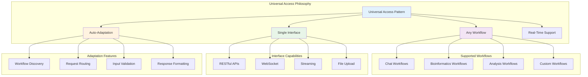

**Core Design Principles:**

**Design Intent & Purpose:**
These principles were established to ensure the web architecture provides both universal accessibility and enterprise-grade reliability:

- **Universal Compatibility**: Single interface supports any NanoBrain workflow - This eliminates the need for workflow-specific web development and ensures consistent access patterns across all AI applications.

- **Dynamic Adaptation**: Automatic adjustment to workflow-specific requirements - The interface automatically discovers workflow capabilities and requirements, generating appropriate web APIs without manual configuration.

- **Real-Time Communication**: WebSocket and Server-Sent Events support - AI workflows often involve long-running processes with intermediate results. Real-time communication enables immediate feedback and streaming responses for optimal user experience.

- **Enterprise Security**: Comprehensive authentication and authorization - Production AI systems require robust security. Built-in enterprise security patterns ensure secure access without requiring custom security implementations.

- **Performance Optimization**: Intelligent caching and load balancing - AI workflows can be computationally intensive. Automatic performance optimization ensures responsive user experiences even under high load.

---

## **2. Web Architecture Layers**

### **2.1 Complete Architecture Stack**

**Design Intent & Purpose:**
The layered architecture was designed to provide clear separation of concerns while enabling sophisticated web capabilities:

**Separation of Concerns Architecture:**
Each layer handles specific responsibilities (presentation, security, routing, processing, orchestration, business logic) enabling independent development and optimization of different aspects of the web interface.

**Enterprise-Grade Gateway Pattern:**
The API gateway layer provides enterprise capabilities (load balancing, SSL termination, rate limiting, CORS) that are essential for production deployments but separate from application logic.

**Universal Interface Abstraction:**
The web interface layer abstracts the complexity of the underlying framework, providing clean, consistent interfaces regardless of the underlying workflow complexity.

**Scalable Service Architecture:**
The service layer enables horizontal scaling by separating stateless request processing from stateful workflow execution, enabling efficient resource utilization and scaling patterns.

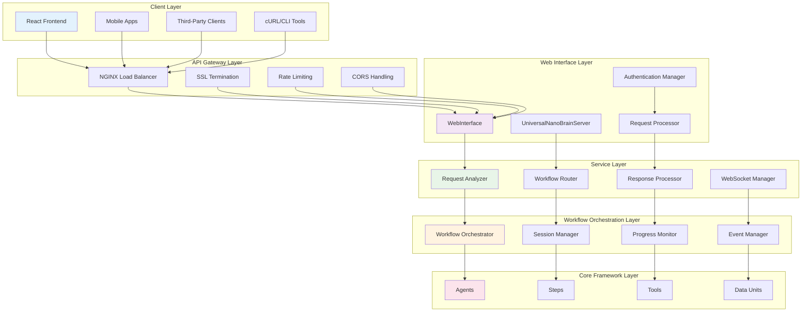

### **2.2 Layer Responsibilities**

**Design Intent & Purpose:**
Each layer was designed to handle specific concerns while maintaining clear interfaces and enabling independent evolution:

**🌐 Client Layer**

**Architectural Rationale:**
The client layer provides diverse access methods to accommodate different user needs and integration patterns:

- **Frontend Applications**: React-based SPAs provide rich, interactive user experiences for complex AI workflows
- **Mobile Applications**: Native and hybrid mobile apps enable AI capabilities on mobile devices
- **Third-Party Integration**: Standard REST APIs enable integration with existing enterprise systems and tools
- **Development Tools**: CLI and cURL access enables automation, testing, and scripting workflows

- Frontend applications and external clients
- User interface and user experience
- Client-side validation and optimization
- Real-time communication handling

**🚪 API Gateway Layer**

**Architectural Rationale:**
The API gateway provides enterprise-grade capabilities that are essential for production deployments:

- **Load Balancing**: Distributes traffic across multiple backend instances for scalability and reliability
- **SSL Termination**: Handles encryption/decryption to reduce load on application servers
- **Security Enforcement**: Rate limiting and DDoS protection prevent abuse and ensure service availability
- **Protocol Management**: CORS and request transformation enable secure cross-origin access

- Load balancing and SSL termination
- Rate limiting and DDoS protection
- CORS policy enforcement
- Request routing and transformation

**🔧 Web Interface Layer**

**Architectural Rationale:**
The web interface layer provides the universal access abstraction that enables any workflow to be web-enabled:

- **Universal Interface**: Single interface implementation supports all workflow types through automatic adaptation
- **Security Integration**: Centralized authentication and authorization for all web access
- **Request Processing**: Intelligent request analysis and routing based on content and context
- **Session Management**: Stateful session handling for complex, multi-turn AI interactions

- Core web interface implementation
- Authentication and authorization
- Request processing and validation
- Session management

**⚙️ Service Layer**

**Architectural Rationale:**
The service layer provides intelligent request processing and workflow integration:

- **Intent Analysis**: AI-powered analysis of requests to determine appropriate workflow routing
- **Workflow Discovery**: Automatic discovery and routing to the most appropriate workflow for each request
- **Response Processing**: Intelligent formatting and transformation of workflow results for web consumption
- **Real-Time Communication**: WebSocket management for streaming responses and real-time updates

- Request analysis and classification
- Workflow discovery and routing
- Response processing and formatting
- WebSocket communication management

**🎭 Workflow Orchestration Layer**

**Architectural Rationale:**
The orchestration layer bridges web interactions with framework workflow execution:

- **Workflow Execution**: Coordinates complex multi-step workflows while maintaining web session context
- **Progress Tracking**: Provides real-time progress updates for long-running workflows
- **Event Integration**: Connects web events with framework event-driven processing
- **State Management**: Maintains session state across complex, stateful AI interactions

- Workflow execution and coordination
- Progress tracking and monitoring
- Event-driven communication
- Session state management

**🏗️ Core Framework Layer**

**Architectural Rationale:**
The core framework layer provides the underlying AI and processing capabilities:

- **Framework Components**: Direct access to agents, steps, tools, and data units
- **Business Logic**: Domain-specific AI processing and workflow execution
- **Data Processing**: Sophisticated data transformation and analysis capabilities
- **Tool Integration**: Extensive tool ecosystem for specialized AI capabilities

- Framework components and services
- Business logic execution
- Data processing and storage
- Tool integration and execution

---

## **3. API Design Patterns**

### **3.1 RESTful API Architecture**

**Design Intent & Purpose:**
The RESTful API architecture was designed to provide comprehensive, standards-based access to all framework capabilities while maintaining intuitive and predictable interfaces:

**Domain-Driven API Organization:**
APIs are organized by functional domain (Chat, Workflow, Agent, Tool, Admin) rather than technical implementation, making them intuitive for users and enabling domain-specific optimizations.

**Resource-Oriented Design:**
Each API follows REST principles with clear resource identification, appropriate HTTP verbs, and stateless operations, ensuring predictable behavior and easy integration with standard HTTP tooling.

**Versioned Interface Strategy:**
Version prefixes (/api/v1/) enable API evolution without breaking existing integrations, providing stability for production systems while allowing framework enhancement.

**Comprehensive Capability Exposure:**
The API design ensures that all framework capabilities are accessible via web interfaces, enabling complete web-based AI application development without requiring direct framework access.

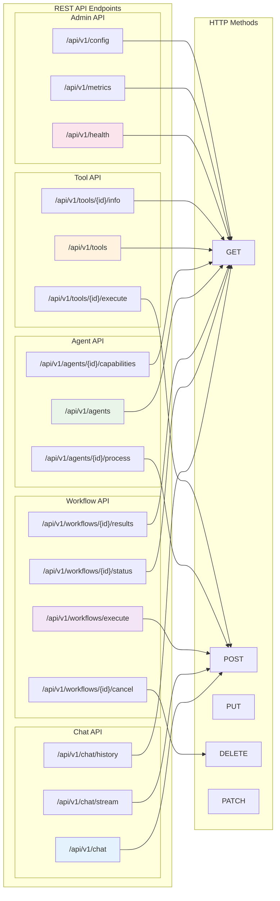

### **3.2 Request/Response Flow**

**Design Intent & Purpose:**
The request/response flow was designed to provide comprehensive processing while maintaining performance and reliability:

**Intelligent Request Pipeline:**
Each request passes through multiple processing stages (security, analysis, routing, execution, formatting) to ensure appropriate handling while maintaining clear separation of concerns.

**Automatic Workflow Discovery:**
The system analyzes request content and context to automatically route to the most appropriate workflow, eliminating the need for clients to understand internal workflow organization.

**Comprehensive Validation and Security:**
Security and validation occur at multiple stages to ensure both security and data integrity while providing clear error messages for failed requests.

**Performance Optimization:**
The pipeline includes optimization opportunities at each stage (caching, load balancing, result formatting) to ensure responsive performance even for complex AI workflows.

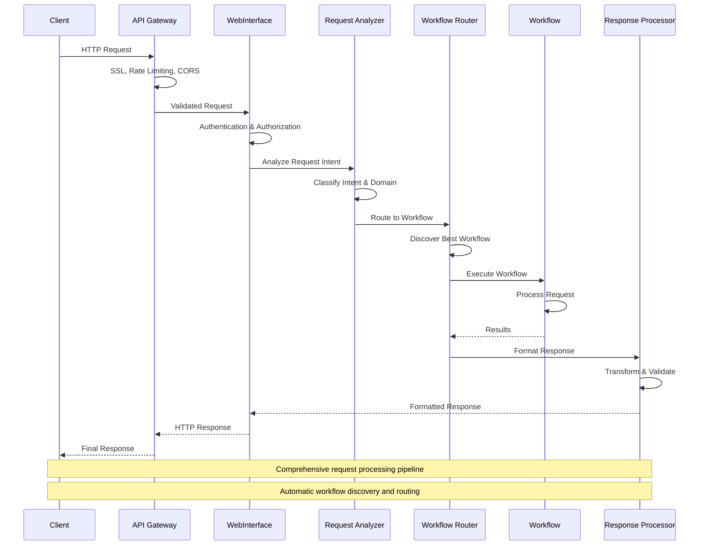

### **3.3 WebSocket Communication Patterns**

**Design Intent & Purpose:**
WebSocket communication was designed to provide real-time, bidirectional communication for interactive AI applications:

**Real-Time Interaction Support:**
AI workflows often involve long-running processes with intermediate results. WebSocket communication enables immediate feedback and streaming responses, providing responsive user experiences even for complex processing.

**Stateful Session Management:**
WebSocket connections maintain session state across multiple interactions, enabling sophisticated conversational AI and multi-turn interactions without losing context.

**Event-Driven Updates:**
The WebSocket system integrates with the framework's event-driven architecture to provide real-time updates on workflow progress, intermediate results, and system status.

**Efficient Resource Utilization:**
WebSocket connections eliminate the overhead of connection establishment for multiple interactions, enabling efficient resource utilization for interactive applications.

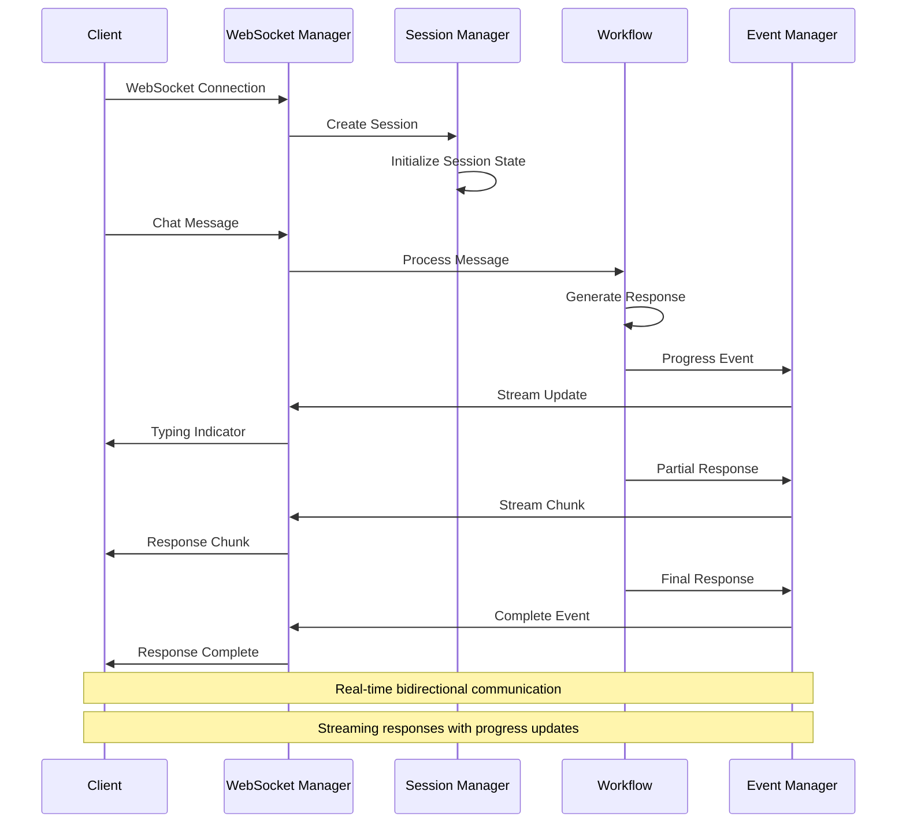

---

## **4. Authentication and Security Architecture**

### **4.1 Security Layer Design**

**Design Intent & Purpose:**
The multi-layered security architecture was designed to provide defense-in-depth protection for AI systems handling potentially sensitive data:

**Layered Defense Strategy:**
Multiple independent security layers ensure that failure of any single security control doesn't compromise the entire system. Each layer provides specific protections that complement other layers.

**AI-Specific Security Considerations:**
AI systems face unique security challenges including prompt injection, data poisoning, and model extraction. The security architecture addresses these specific threats while maintaining standard web security practices.

**Enterprise Compliance:**
The security architecture supports compliance with enterprise security requirements including data encryption, audit logging, and access controls needed for regulated environments.

**Performance-Optimized Security:**
Security controls are designed to minimize performance impact while providing comprehensive protection, ensuring that security doesn't compromise user experience.

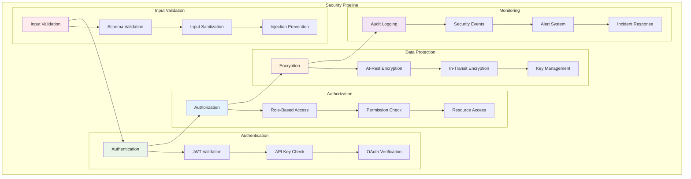

### **4.2 Authentication Flow**

**Design Intent & Purpose:**
The authentication flow was designed to provide secure, user-friendly authentication while supporting enterprise integration patterns:

**JWT-Based Stateless Authentication:**
JWT tokens provide stateless authentication that scales horizontally and integrates well with microservices architectures, while enabling secure token-based access control.

**Multi-Provider Support:**
Support for multiple authentication providers (OAuth, API keys, enterprise SSO) enables integration with existing enterprise authentication systems while providing flexibility for different deployment scenarios.

**Token Lifecycle Management:**
Automatic token refresh and expiration handling reduces security risks while maintaining seamless user experiences, ensuring that authentication doesn't interfere with long-running AI workflows.

**Enterprise Integration:**
The authentication flow supports enterprise patterns including role-based access control, audit logging, and integration with existing identity management systems.

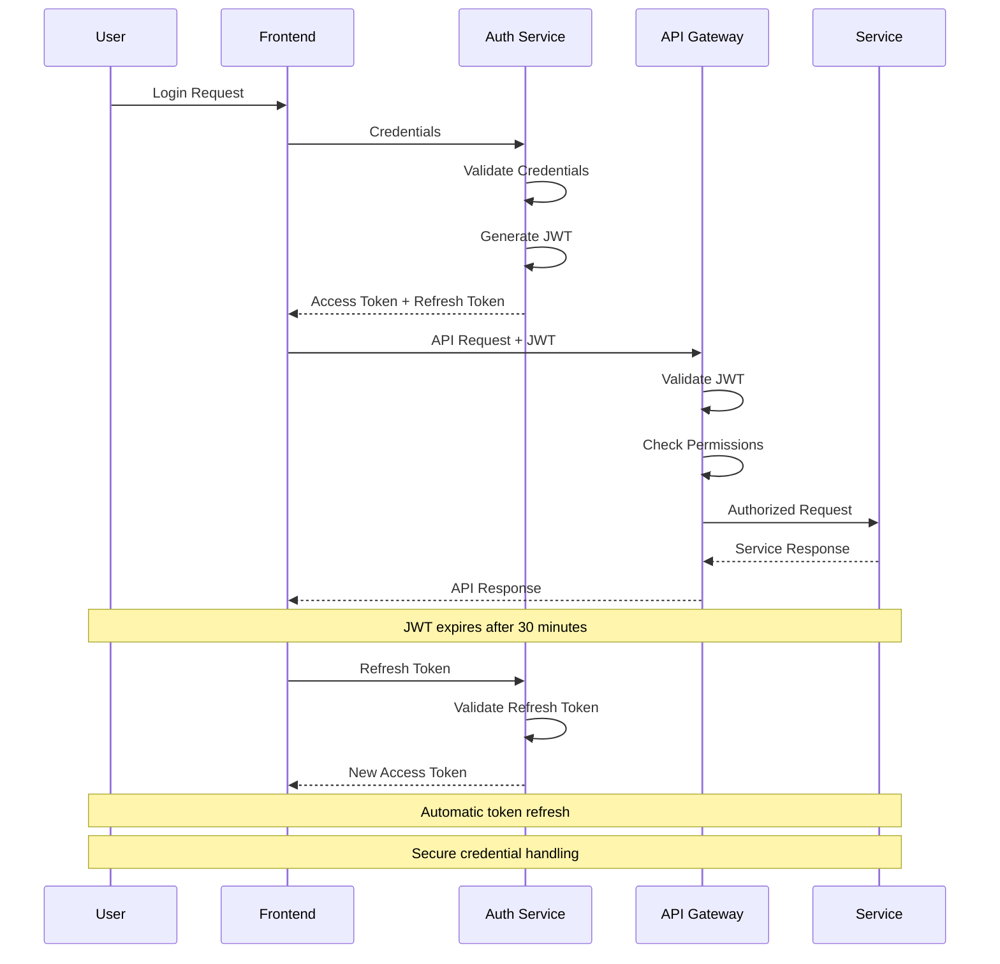

### **4.3 Role-Based Access Control (RBAC)**

**Design Intent & Purpose:**
The RBAC system was designed to provide fine-grained access control while maintaining simplicity and enterprise compatibility:

**Hierarchical Permission Model:**
The role hierarchy enables inheritance of permissions while allowing fine-grained control over specific capabilities, reducing administrative overhead while maintaining security.

**Resource-Specific Access Control:**
Permissions are tied to specific resources (workflows, agents, tools, configuration) enabling precise control over what users can access and modify.

**Enterprise Role Compatibility:**
Standard roles (Admin, Developer, User, Guest) map to common enterprise roles while allowing customization for specific organizational needs.

**Scalable Permission Management:**
The permission system scales from simple single-user deployments to complex enterprise environments with thousands of users and sophisticated permission requirements.

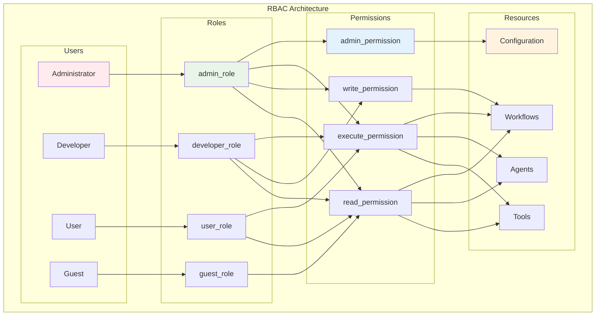

---

## **5. Frontend Integration Architecture**

### **5.1 Dynamic Component System**

**Design Intent & Purpose:**
The dynamic component system was designed to provide universal frontend interfaces that automatically adapt to different workflow types without requiring custom frontend development:

**Workflow-Agnostic Frontend:**
Traditional web applications require custom frontend development for each workflow type. The dynamic component system automatically generates appropriate interfaces based on workflow schemas and requirements, eliminating custom frontend development.

**Real-Time State Synchronization:**
The system maintains synchronized state between frontend and backend components, ensuring that user interfaces reflect current workflow state and provide real-time updates without manual state management.

**Component Library Architecture:**
Reusable component libraries enable sophisticated user interfaces while maintaining consistency across different workflow types, reducing development effort and ensuring uniform user experiences.

**Performance-Optimized Rendering:**
The component system includes optimization strategies (virtual scrolling, lazy loading, efficient updates) to ensure responsive user interfaces even for complex AI workflows with large datasets.

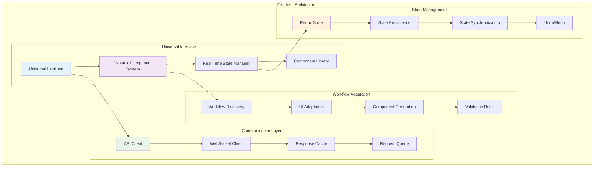

### **5.2 Real-Time Communication Flow**

**Design Intent & Purpose:**
Real-time communication was designed to provide responsive, interactive user experiences for AI workflows that often involve long-running processes:

**Streaming Response Handling:**
AI workflows often generate responses incrementally. The real-time communication system enables streaming these partial responses to users immediately, providing responsive experiences even for complex processing.

**Progressive Loading Strategy:**
Users see immediate feedback and partial results rather than waiting for complete workflow execution, improving perceived performance and enabling users to intervene or adjust requests based on partial results.

**Optimistic UI Updates:**
The interface updates optimistically based on expected outcomes while handling corrections when actual results differ, providing responsive interfaces that feel immediate while maintaining accuracy.

**Connection Resilience:**
The communication system handles network interruptions and connection failures gracefully, ensuring that user interactions aren't lost due to temporary connectivity issues.

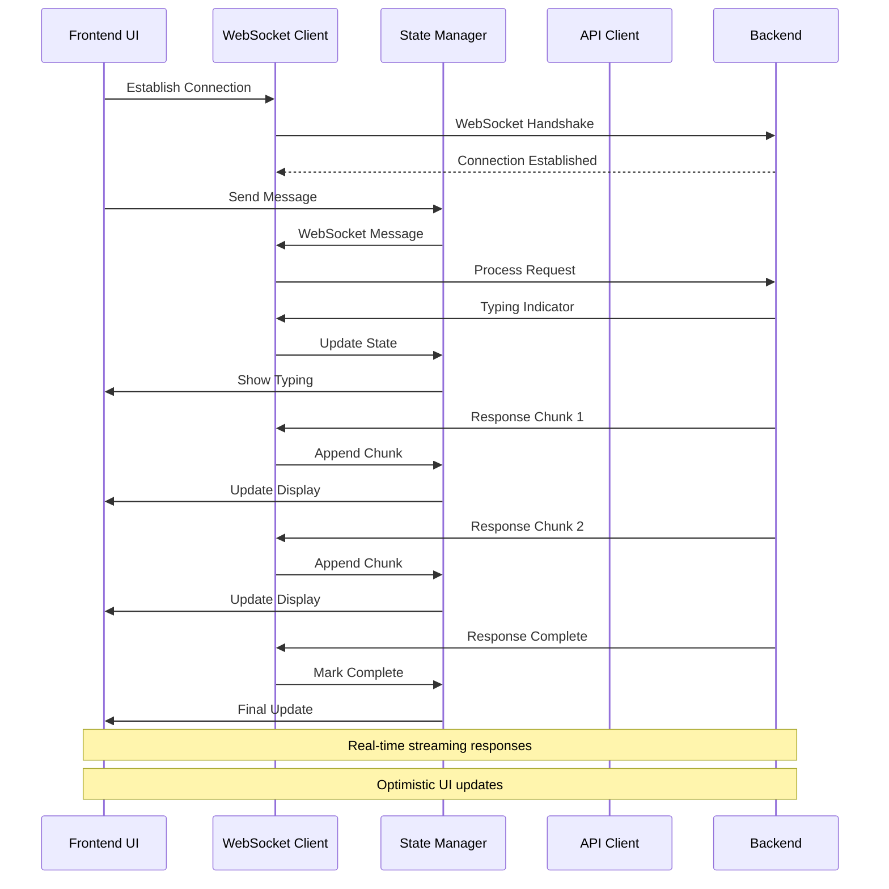

### **5.3 Component Library Integration**

**Design Intent & Purpose:**
The component library integration provides a sophisticated foundation for building universal AI interfaces while maintaining consistency and reusability:

**Universal Interface Generation:**
The system automatically generates appropriate user interfaces based on workflow schemas, requirements, and capabilities, eliminating the need for custom interface development for each workflow type.

**Adaptive Component Selection:**
Components are selected and configured based on data types, interaction patterns, and workflow requirements, ensuring optimal user experiences for different types of AI workflows.

**Type-Safe Component Integration:**
Strong typing and validation ensure that components receive appropriate data and configuration, preventing runtime errors and ensuring reliable user interfaces.

**Performance-Optimized Rendering:**
The component system includes sophisticated optimization strategies to ensure responsive user interfaces even for complex workflows with large datasets or frequent updates.

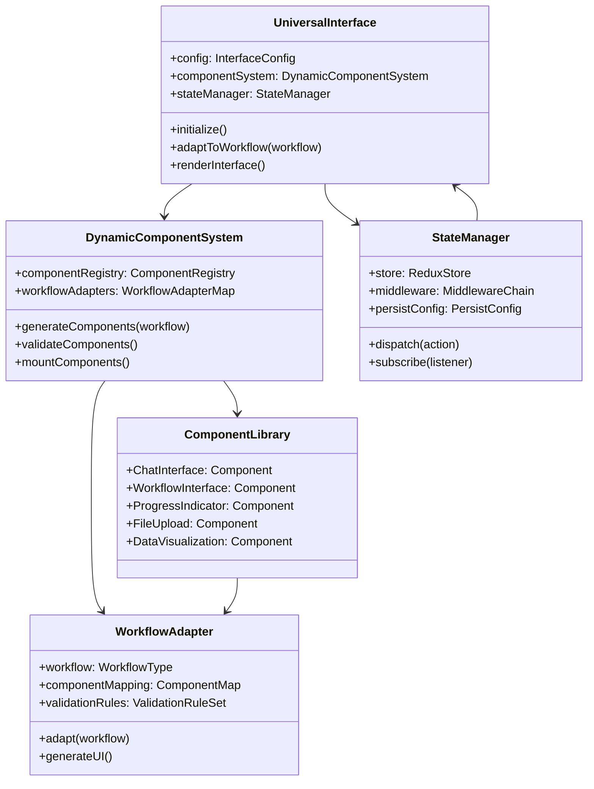

---

## **6. Performance Optimization**

### **6.1 Caching Strategy**

**Design Intent & Purpose:**
The multi-tier caching strategy was designed to provide optimal performance across different access patterns and deployment scenarios:

**Layered Performance Optimization:**
Multiple caching layers address different performance bottlenecks - browser caching for static assets, CDN for global content delivery, application caching for dynamic content, and database caching for data access.

**Intelligent Cache Management:**
Different caching strategies (LRU, TTL, invalidation, warming) are applied based on content characteristics and access patterns, ensuring optimal performance while maintaining data freshness.

**Global Performance Optimization:**
CDN and edge server distribution ensure optimal performance for users worldwide, reducing latency and improving user experiences regardless of geographic location.

**Dynamic Content Optimization:**
Application-level caching handles dynamic AI workflow results and computed content, reducing computation time for repeated requests while ensuring result accuracy.

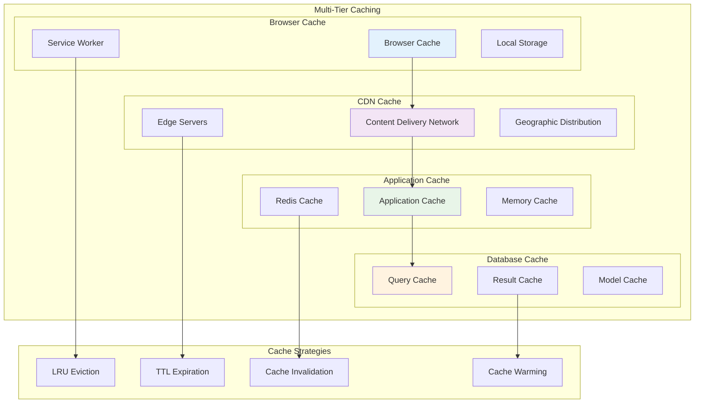

### **6.2 Load Balancing and Scaling**

**Design Intent & Purpose:**
The load balancing and scaling architecture was designed to provide transparent scaling from development to production while maintaining performance and reliability:

**Horizontal Scaling Architecture:**
The system is designed to scale horizontally by adding more instances rather than relying on vertical scaling, providing cost-effective performance improvements and better resource utilization.

**Intelligent Load Distribution:**
Load balancing algorithms consider multiple factors (current load, response time, health status) to optimize request distribution and ensure optimal resource utilization.

**Auto-Scaling Integration:**
The system automatically adjusts capacity based on demand, ensuring optimal performance during usage spikes while minimizing costs during low-usage periods.

**Service Discovery and Health Management:**
Automatic service discovery and health monitoring ensure that traffic is only routed to healthy instances, maintaining system reliability even during component failures.

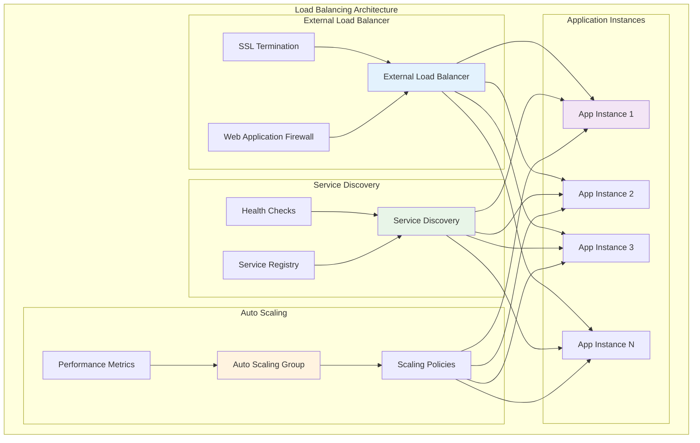

---

## **7. Deployment Scenarios**

### **7.1 Container-Based Deployment**

**Design Intent & Purpose:**
Container-based deployment was designed to provide consistent, scalable, and manageable deployment patterns for diverse environments:

**Environment Consistency:**
Containers ensure that the web interface behaves identically across development, staging, and production environments, eliminating environment-specific issues and deployment complexity.

**Microservices Architecture:**
Each component (API, web interface, WebSocket service) can be deployed and scaled independently, enabling optimal resource utilization and independent component evolution.

**Service Mesh Integration:**
Service mesh capabilities provide sophisticated networking, security, and observability for microservices communication without requiring application-level implementation.

**Infrastructure as Code:**
Container orchestration platforms enable infrastructure definition as code, providing version control, reproducible deployments, and automated infrastructure management.

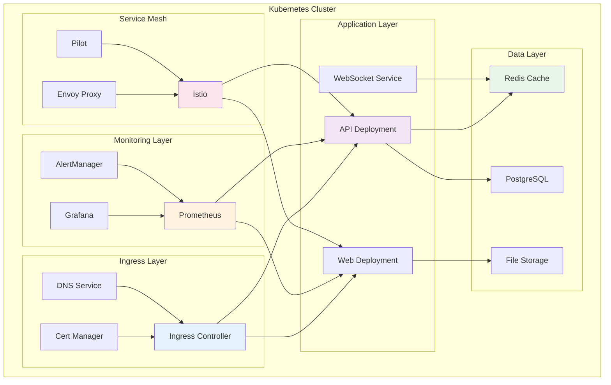

### **7.2 Development vs Production Configuration**

**Design Intent & Purpose:**
Environment-specific configuration patterns enable optimal performance and security for different deployment scenarios:

**Development Optimization:**
Development configurations prioritize developer productivity with features like hot reloading, detailed debugging, and relaxed security constraints that speed development cycles.

**Production Security and Performance:**
Production configurations prioritize security, performance, and reliability with features like authentication, SSL, clustering, and comprehensive monitoring.

**Configuration Management:**
Environment-specific configurations are managed through environment variables and configuration files, enabling the same codebase to adapt to different deployment requirements.

**Operational Visibility:**
Production configurations include comprehensive monitoring, alerting, and logging to enable effective operations and rapid issue resolution.

```yaml
# Development Configuration
development:
  web_interface:
    server_config:
      host: "localhost"
      port: 8000
      workers: 1
      debug: true
    
    auth_config:
      enabled: false
      mock_users: true
    
    cors_config:
      allow_origins: ["http://localhost:3000"]
      allow_credentials: true
    
    ssl_config:
      enabled: false
    
    cache_config:
      enabled: false

# Production Configuration  
production:
  web_interface:
    server_config:
      host: "0.0.0.0"
      port: 443
      workers: 8
      debug: false
    
    auth_config:
      enabled: true
      jwt_secret: "${JWT_SECRET}"
      oauth_providers: ["google", "microsoft", "okta"]
    
    cors_config:
      allow_origins: ["https://api.yourdomain.com"]
      allow_credentials: true
    
    ssl_config:
      enabled: true
      cert_file: "/etc/ssl/certs/api.crt"
      key_file: "/etc/ssl/private/api.key"
    
    cache_config:
      enabled: true
      backend: "redis"
      cluster_nodes: ["redis1:6379", "redis2:6379", "redis3:6379"]
    
    monitoring:
      enabled: true
      metrics_endpoint: "/metrics"
      health_endpoint: "/health"
      alerting: true
```

---

## **8. Monitoring and Observability**

### **8.1 Comprehensive Monitoring Stack**

**Design Intent & Purpose:**
The comprehensive monitoring stack was designed to provide complete visibility into web interface performance and behavior for both development and production environments:

**Multi-Dimensional Observability:**
The monitoring stack covers metrics (performance data), logging (event data), and tracing (request flow data) to provide complete visibility into system behavior and performance.

**Real-Time Operations Support:**
Real-time dashboards and alerting enable immediate response to issues, minimizing user impact and enabling proactive issue resolution.

**Performance Optimization Data:**
Detailed performance metrics enable data-driven optimization decisions, helping identify bottlenecks and optimization opportunities.

**Development and Debugging Support:**
Comprehensive logging and tracing support development and debugging activities, enabling rapid issue identification and resolution.

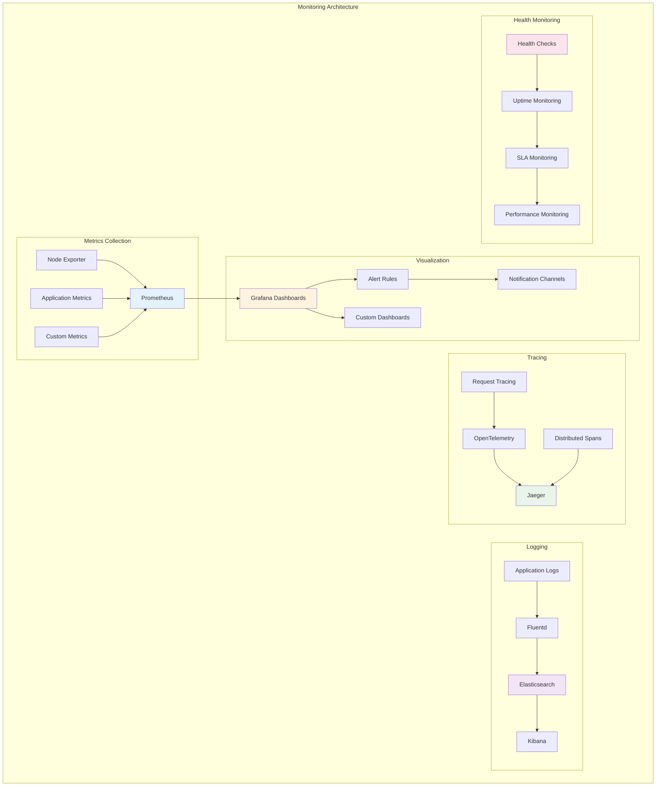

---

## **9. Next Steps**

This web architecture provides the foundation for:

1. **[LLM Code Generation](./04_LLM_CODE_GENERATION.md)** - AI-driven web development rules
2. **[Component Library](./05_COMPONENT_LIBRARY.md)** - Web interface implementations
3. **[Configuration Management](./06_CONFIGURATION_MANAGEMENT.md)** - Web interface configuration
4. **[Integration Patterns](./07_INTEGRATION_PATTERNS.md)** - External system connectivity

---

**📚 Related Documentation:**
- [Framework Core Architecture](./01_FRAMEWORK_CORE_ARCHITECTURE.md) - Foundation components
- [Workflow Orchestration](./02_WORKFLOW_ORCHESTRATION.md) - Workflow integration
- [API Reference](./build/html/index.html) - Detailed web interface API documentation
- [Configuration Examples](../config/) - Sample web interface configurations
- [Frontend Documentation](./frontend/) - React component library documentation 