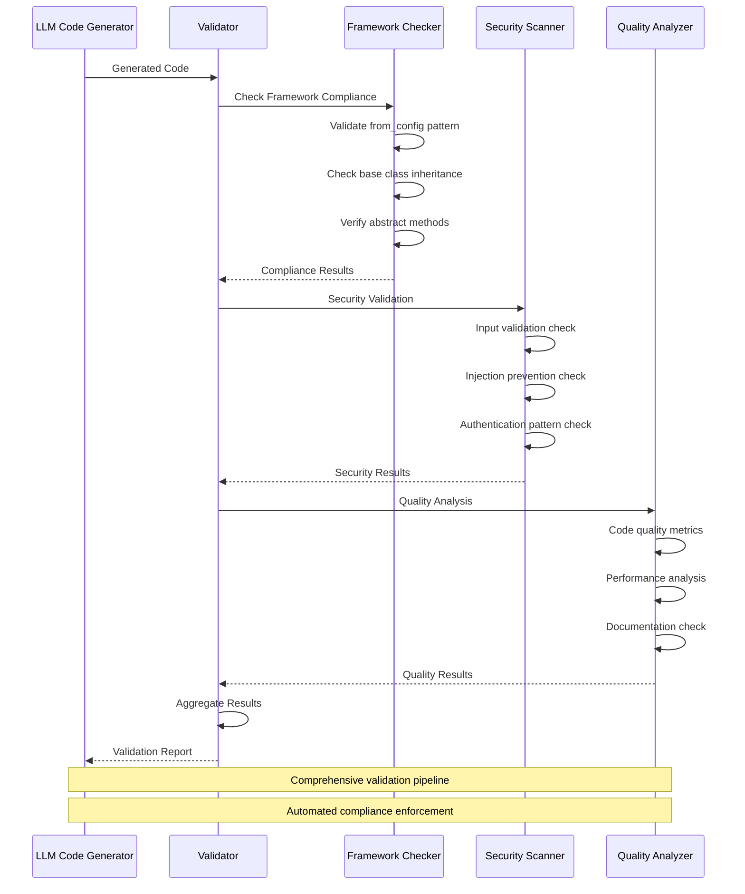
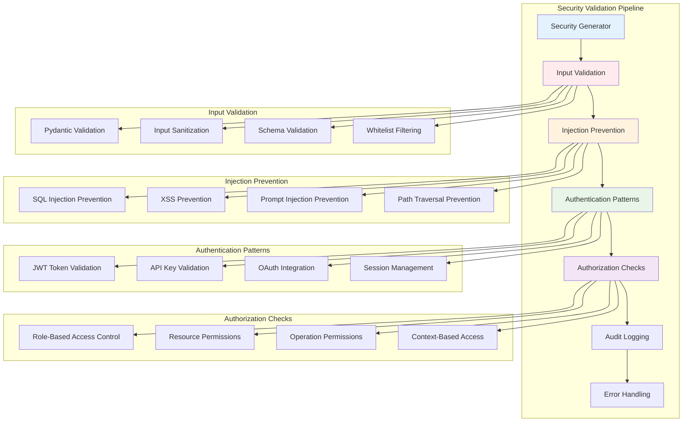
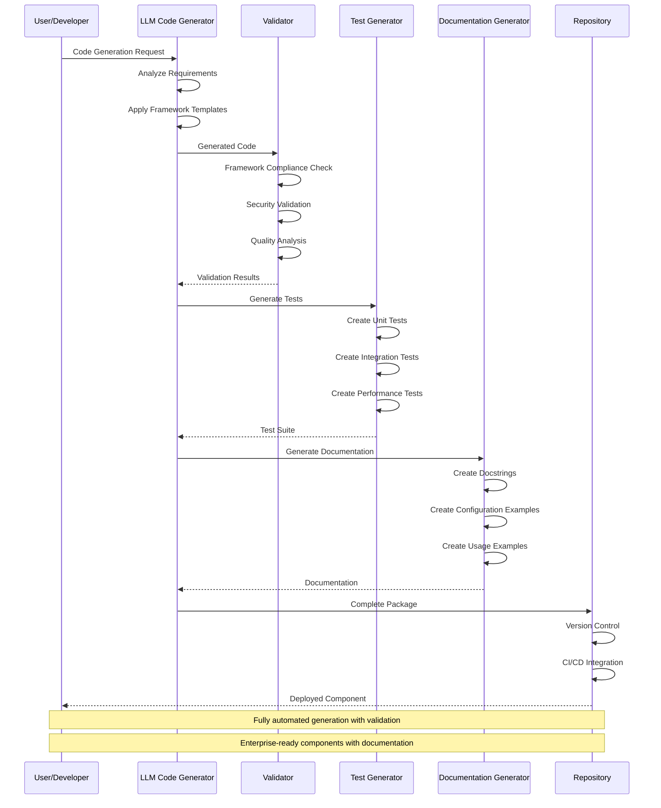

# NanoBrain Framework - LLM-Based Code Generation Rules
## AI-Driven Development Standards and Mandatory Patterns

**Document Version**: 1.0.0  
**Created**: August 2024  
**Part of**: [NanoBrain High-Level Documentation](./NANOBRAIN_HIGH_LEVEL_DOCUMENTATION_PLAN.md)

---

## **1. Code Generation Philosophy**

### **1.1 AI-Driven Development Principles**

**Design Intent & Purpose:**
The AI-driven development philosophy was designed to address the fundamental challenge of enabling LLMs to generate production-ready code that integrates seamlessly with complex framework architectures:

**Consistency and Quality Assurance:**
Traditional code generation often produces inconsistent results that require significant manual refinement. NanoBrain's AI-driven approach enforces strict patterns and validation rules that ensure generated code meets enterprise quality standards without manual intervention.

**Framework Integration Complexity:**
Modern frameworks like NanoBrain have sophisticated architectural patterns that must be followed precisely for proper integration. The AI-driven development system encodes these patterns as mandatory rules, enabling LLMs to generate code that integrates perfectly with existing framework components.

**Security-First Generation:**
AI-generated code poses unique security risks including injection vulnerabilities and insecure patterns. The security-first approach embeds security considerations into every aspect of code generation, ensuring that generated code follows secure coding practices automatically.

**Production-Ready Output:**
Generated code must be production-ready without manual refinement. The AI-driven system includes performance optimization, error handling, monitoring, and documentation patterns that ensure generated components meet production standards immediately.

NanoBrain's LLM-based code generation follows strict principles to ensure generated code integrates seamlessly with the framework architecture while maintaining enterprise-grade quality and security.

```mermaid
graph TD
    subgraph "AI-Driven Development Philosophy"
        ADP[AI-Driven Development]
        
        ADP --> FC[Framework Compliance]
        ADP --> SC[Security-First]
        ADP --> PO[Performance Optimization]
        ADP --> CA[Context Awareness]
    end
    
    subgraph "Framework Compliance"
        FC --> FCP[from_config Pattern]
        FC --> CB[ConfigBase Inheritance]
        FC --> AM[Abstract Methods]
        FC --> YC[YAML Configuration]
    end
    
    subgraph "Security-First"
        SC --> IV[Input Validation]
        SC --> IP[Injection Prevention]
        SC --> AP[Authentication Patterns]
        SC --> AL[Audit Logging]
    end
    
    subgraph "Performance Optimization"
        PO --> AA[Async/Await]
        PO --> RP[Resource Pooling]
        PO --> C[Caching]
        PO --> LB[Load Balancing]
    end
    
    subgraph "Context Awareness"
        CA --> PA[Pattern Adaptation]
        CA --> DR[Dependency Resolution]
        CA --> EH[Error Handling]
        CA --> LS[Logging Standards]
    end
    
    style ADP fill:#e3f2fd
    style FC fill:#f3e5f5
    style SC fill:#ffebee
    style PO fill:#e8f5e8
    style CA fill:#fff3e0
```



**Core Principles:**

**Design Intent & Purpose:**
These principles were established to ensure AI-generated code meets the same standards as hand-crafted framework components:

- **Framework Integration**: All generated code must integrate seamlessly with NanoBrain patterns - This ensures that AI-generated components work perfectly with existing framework components without requiring manual integration work.

- **Security by Design**: Security considerations built into every generated component - This prevents common security vulnerabilities in AI-generated code by embedding security patterns at the generation level rather than as an afterthought.

- **Performance Optimization**: Generated code optimized for production environments - This ensures that AI-generated components perform efficiently in production without requiring manual optimization.

- **Context Awareness**: Code generation adapts to specific use cases and requirements - This enables the AI to generate appropriate code for different scenarios while maintaining framework consistency.

---

## **2. Mandatory Framework Compliance Rules**

### **2.1 Universal Compliance Requirements**

**Design Intent & Purpose:**
The mandatory compliance rules were designed to enforce framework patterns automatically, ensuring that AI-generated code cannot violate critical architectural principles:

**Pattern Enforcement Automation:**
Manual enforcement of framework patterns is error-prone and inconsistent. Mandatory rules encoded in the AI generation system ensure that framework patterns are followed automatically without requiring human review or intervention.

**Enterprise Integration Consistency:**
Enterprise systems require consistent integration patterns across all components. The mandatory rules ensure that AI-generated components integrate with enterprise systems (monitoring, security, configuration management) exactly like hand-crafted components.

**Technical Debt Prevention:**
Inconsistent code patterns create technical debt that becomes expensive to fix later. Mandatory compliance rules prevent technical debt by ensuring all generated code follows the same high-quality patterns from the beginning.

**Deployment Reliability:**
Production deployments require predictable component behavior. The mandatory rules ensure that all generated components behave consistently, reducing deployment risks and operational complexity.

```mermaid
flowchart TD
    subgraph "Mandatory Compliance Rules"
        MCR[Mandatory Compliance Rules]
        
        MCR --> RULE1[MUST use from_config pattern]
        MCR --> RULE2[MUST inherit from base classes]
        MCR --> RULE3[MUST implement abstract methods]
        MCR --> RULE4[PROHIBITED direct instantiation]
        MCR --> RULE5[MUST use configuration-driven behavior]
    end
    
    subgraph "Rule 1: from_config Pattern"
        RULE1 --> FC1[All components created via from_config]
        RULE1 --> FC2[Configuration file validation]
        RULE1 --> FC3[Dependency resolution]
        RULE1 --> FC4[Unified error handling]
    end
    
    subgraph "Rule 2: Base Class Inheritance"
        RULE2 --> BC1[FromConfigBase for components]
        RULE2 --> BC2[ConfigBase for configurations]
        RULE2 --> BC3[Proper method overrides]
        RULE2 --> BC4[Maintain inheritance chain]
    end
    
    subgraph "Rule 3: Abstract Methods"
        RULE3 --> AM1[_get_config_class implementation]
        RULE3 --> AM2[_init_from_config implementation]
        RULE3 --> AM3[Component-specific methods]
        RULE3 --> AM4[Proper type hints]
    end
    
    subgraph "Rule 4: Prohibited Direct Instantiation"
        RULE4 --> DI1[No __init__ direct calls]
        RULE4 --> DI2[RuntimeError on direct instantiation]
        RULE4 --> DI3[from_config enforcement]
        RULE4 --> DI4[Configuration validation]
    end
    
    subgraph "Rule 5: Configuration-Driven Behavior"
        RULE5 --> CD1[No hardcoded values]
        RULE5 --> CD2[YAML configuration support]
        RULE5 --> CD3[Environment variable interpolation]
        RULE5 --> CD4[Schema validation]
    end
    
    style MCR fill:#e3f2fd
    style RULE1 fill:#f3e5f5
    style RULE2 fill:#e8f5e8
    style RULE3 fill:#fff3e0
    style RULE4 fill:#ffebee
    style RULE5 fill:#fce4ec
```



### **2.2 Framework Compliance Validation**

**Design Intent & Purpose:**
The comprehensive validation pipeline was designed to provide automated quality assurance for AI-generated code without human intervention:

**Multi-Dimensional Validation:**
Different types of validation (framework compliance, security, quality) address different aspects of code quality. The comprehensive pipeline ensures that all aspects are validated automatically before code is accepted.

**Automated Quality Gates:**
Manual code review is time-consuming and inconsistent. Automated validation provides consistent, thorough quality checks that catch issues immediately rather than allowing them to propagate to production systems.

**Continuous Learning Integration:**
The validation pipeline generates feedback that can be used to improve the AI generation process, creating a continuous improvement cycle where validation results inform better code generation.

**Enterprise Development Integration:**
The validation pipeline integrates with enterprise development workflows (CI/CD, code review, deployment) to provide seamless quality assurance without disrupting existing development processes.



---

## **3. Code Generation Templates**

### **3.1 Component Template**

**Design Intent & Purpose:**
The component template was designed to provide a comprehensive, reusable pattern that ensures all AI-generated components follow identical structure and quality standards:

**Standardized Component Architecture:**
All framework components should follow identical patterns for configuration, initialization, execution, and lifecycle management. The template ensures that every generated component includes all necessary elements without omission or variation.

**Enterprise Documentation Standards:**
Production components require comprehensive documentation for maintenance and operation. The template includes detailed docstring patterns that ensure generated components are properly documented with examples, usage patterns, and configuration details.

**Type Safety and Validation:**
Modern Python requires comprehensive type hints and validation for maintainability and IDE support. The template includes complete type annotations and Pydantic validation patterns that ensure generated code is type-safe and validates inputs properly.

**Production-Ready Error Handling:**
Production components must handle errors gracefully and provide meaningful error messages. The template includes comprehensive error handling patterns that ensure generated components fail gracefully with useful debugging information.

```python
"""
Template for generating NanoBrain framework components
MANDATORY PATTERN - ALL generated components MUST follow this template
"""

from abc import ABC, abstractmethod
from typing import Any, Dict, Optional, List, Union
from pathlib import Path
import logging

from nanobrain.core.component_base import FromConfigBase
from nanobrain.core.config.config_base import ConfigBase
from nanobrain.core.logging_system import get_logger
from pydantic import BaseModel, Field, ConfigDict


class {ComponentName}Config(ConfigBase):
    """
    Configuration schema for {ComponentName}
    
    MANDATORY FIELDS:
    - All configuration classes MUST inherit from ConfigBase
    - MUST include comprehensive field documentation
    - MUST use Pydantic V2 validation with ConfigDict
    - MUST include json_schema_extra with examples
    """
    
    # REQUIRED FIELDS (must be specified in all configurations)
    name: str = Field(..., description="Component identifier for logging and monitoring")
    
    # OPTIONAL FIELDS (with sensible defaults)
    description: str = Field(
        default="",
        description="Human-readable component description and purpose"
    )
    auto_initialize: bool = Field(
        default=True,
        description="Whether component initializes automatically on creation"
    )
    debug_mode: bool = Field(
        default=False,
        description="Enable enhanced debugging and logging"
    )
    enable_logging: bool = Field(
        default=True,
        description="Enable comprehensive logging and monitoring"
    )
    
    # COMPONENT-SPECIFIC FIELDS (customize based on component requirements)
    # Add component-specific configuration fields here
    
    # MANDATORY PYDANTIC V2 CONFIGURATION
    model_config = ConfigDict(
        arbitrary_types_allowed=True,
        extra="allow",
        use_enum_values=False,  # Preserve enum objects
        validate_assignment=True,
        str_strip_whitespace=True,
        json_schema_extra={
            "examples": [
                {
                    "name": "example_{component_name}",
                    "description": "Example {ComponentName} configuration",
                    "auto_initialize": True,
                    "debug_mode": False,
                    "enable_logging": True
                }
            ],
            "nanobrain_metadata": {
                "framework_version": "2.0.0",
                "component_type": "{component_type}",
                "config_loading_method": "from_config_only",
                "supports_recursive_references": True
            }
        }
    )


class {ComponentName}(FromConfigBase, ABC):
    """
    {ComponentName} - [Brief Description of Component Purpose]
    ========================================================
    
    [Comprehensive docstring following framework patterns]
    
    **Core Architecture:**
        [Description of component's role and capabilities]
        
        * **[Capability 1]**: [Description]
        * **[Capability 2]**: [Description]
        * **[Capability 3]**: [Description]
    
    **Configuration Architecture:**
        ```yaml
        # Basic {component_name} configuration
        name: "example_{component_name}"
        description: "Example component for demonstration"
        auto_initialize: true
        enable_logging: true
        
        # Component-specific configuration
        # Add relevant configuration examples here
        ```
    
    **Usage Patterns:**
        ```python
        from nanobrain.library.{module_path} import {ComponentName}
        
        # Create component from configuration
        component = {ComponentName}.from_config('config/{component_name}.yml')
        
        # Execute component operations
        result = await component.execute()
        ```
    
    Attributes:
        name (str): Component identifier for logging and debugging
        description (str): Human-readable component description
        logger (logging.Logger): Component-specific logger instance
        config ({ComponentName}Config): Component configuration instance
        
    Note:
        This component follows the mandatory from_config pattern and cannot be
        instantiated directly. All configurations must be loaded from YAML files
        using the from_config method.
    
    Warning:
        [Any specific warnings or considerations for this component]
    
    See Also:
        * :class:`FromConfigBase`: Base framework component interface
        * :class:`{ComponentName}Config`: Configuration schema
        * :mod:`nanobrain.core`: Core framework components
    """
    
    # MANDATORY COMPONENT METADATA
    COMPONENT_TYPE: str = "{component_type}"
    REQUIRED_CONFIG_FIELDS: List[str] = ['name']
    OPTIONAL_CONFIG_FIELDS: Dict[str, Any] = {
        'description': '',
        'auto_initialize': True,
        'debug_mode': False,
        'enable_logging': True
    }
    
    # MANDATORY FRAMEWORK METHODS
    @classmethod
    def _get_config_class(cls) -> type:
        """
        Return the configuration class for this component.
        
        MANDATORY IMPLEMENTATION - This is the ONLY method that differs
        between component types in the unified framework pattern.
        
        Returns:
            Configuration class type for this component
        """
        return {ComponentName}Config
    
    def _init_from_config(self, config: '{ComponentName}Config') -> None:
        """
        Initialize component from validated configuration.
        
        MANDATORY IMPLEMENTATION - Component-specific initialization logic.
        
        Args:
            config: Validated configuration instance
            
        Raises:
            ComponentConfigurationError: If configuration is invalid
            ComponentDependencyError: If dependencies cannot be resolved
        """
        # Store configuration
        self.config = config
        self.name = config.name
        self.description = config.description
        
        # Initialize logging
        self.logger = get_logger(
            f"{self.__class__.__module__}.{self.__class__.__name__}",
            enable_logging=config.enable_logging,
            debug_mode=config.debug_mode
        )
        
        # Log component initialization
        self.logger.info(
            f"Initializing {self.__class__.__name__}",
            extra={
                "component_name": self.name,
                "component_type": self.COMPONENT_TYPE,
                "config_source": "from_config"
            }
        )
        
        # COMPONENT-SPECIFIC INITIALIZATION
        # Add component-specific initialization logic here
        
        # Log successful initialization
        self.logger.info(
            f"{self.__class__.__name__} initialized successfully",
            extra={
                "component_name": self.name,
                "initialization_time": "timestamp_here"
            }
        )
    
    # COMPONENT-SPECIFIC METHODS
    async def execute(self) -> Any:
        """
        Execute component's primary functionality.
        
        IMPLEMENTATION REQUIRED - Override with component-specific logic.
        
        Returns:
            Component execution results
            
        Raises:
            NotImplementedError: If not overridden in subclass
        """
        raise NotImplementedError(
            f"{self.__class__.__name__}.execute() must be implemented by subclass"
        )
    
    # OPTIONAL METHODS (implement as needed)
    async def validate(self) -> bool:
        """
        Validate component state and configuration.
        
        Returns:
            True if component is valid, False otherwise
        """
        try:
            # Add component-specific validation logic
            return True
        except Exception as e:
            self.logger.error(f"Component validation failed: {e}")
            return False
    
    def get_status(self) -> Dict[str, Any]:
        """
        Get current component status and metrics.
        
        Returns:
            Dictionary containing component status information
        """
        return {
            "name": self.name,
            "type": self.COMPONENT_TYPE,
            "status": "operational",
            "configuration": {
                "auto_initialize": self.config.auto_initialize,
                "debug_mode": self.config.debug_mode,
                "enable_logging": self.config.enable_logging
            }
        }
    
    # MANDATORY CLEANUP METHOD
    def cleanup(self) -> None:
        """
        Clean up component resources.
        
        RECOMMENDED IMPLEMENTATION - Override for component-specific cleanup.
        """
        self.logger.info(f"Cleaning up {self.__class__.__name__}")
        # Add component-specific cleanup logic here
```

### **3.2 Configuration Template**

**Design Intent & Purpose:**
The configuration template was designed to provide comprehensive, standardized configuration patterns that ensure all generated components are configurable and deployable across different environments:

**Environment-Agnostic Configuration:**
Components must work across development, staging, and production environments with different configuration values. The template includes environment variable support and templating patterns that enable environment-specific deployment without code changes.

**Validation and Documentation:**
Configuration files serve as both runtime configuration and documentation of component capabilities. The template includes comprehensive field documentation and validation rules that make configuration files self-documenting and prevent configuration errors.

**Enterprise Integration Patterns:**
Enterprise deployments require integration with existing configuration management, secret management, and deployment systems. The template includes patterns for environment variables, external configuration sources, and security-sensitive configuration handling.

**Nested Component Support:**
Complex components often require other components as dependencies. The template includes the class+config pattern that enables sophisticated component composition through configuration without requiring code changes.

```yaml
# {ComponentName} Configuration Template
# MANDATORY STRUCTURE - All configuration files MUST follow this pattern

# REQUIRED FIELDS
name: "example_{component_name}"
description: "Example {ComponentName} for demonstration purposes"

# FRAMEWORK FIELDS
auto_initialize: true
debug_mode: false
enable_logging: true

# COMPONENT-SPECIFIC FIELDS
# Add component-specific configuration fields here
# Example:
# processing_mode: "async"
# max_retries: 3
# timeout: 300

# NESTED COMPONENT CONFIGURATION (if applicable)
# Use class+config pattern for nested components
# Example:
# executor:
#   class: "nanobrain.core.executor.LocalExecutor"
#   config: "config/local_executor.yml"
#   # OR inline configuration:
#   config:
#     max_workers: 4
#     timeout: 300

# tools:
#   - class: "nanobrain.library.tools.ExampleTool"
#     config: "config/example_tool.yml"

# ENVIRONMENT VARIABLES (for sensitive values)
# api_key: "${API_KEY}"
# database_url: "${DATABASE_URL}"
# secret_key: "${SECRET_KEY}"

# VALIDATION SCHEMA (optional but recommended)
# validation_schema: "schemas/{component_name}_schema.json"

# PERFORMANCE CONFIGURATION
# performance_config:
#   enable_caching: true
#   cache_ttl: 3600
#   max_memory_usage: "1GB"
#   enable_monitoring: true

# SECURITY CONFIGURATION
# security_config:
#   enable_encryption: true
#   require_authentication: true
#   audit_logging: true
#   input_validation: true
```

### **3.3 Agent Template (Specialized)**

**Design Intent & Purpose:**
The agent template was designed to provide specialized patterns for AI agent components that require additional capabilities beyond standard framework components:

**AI-Specific Integration Patterns:**
AI agents require integration with language models, tool systems, and conversation management that standard components don't need. The agent template includes patterns for model integration, tool selection, context management, and conversation state handling.

**Enterprise AI Requirements:**
Production AI agents must handle authentication, audit logging, performance monitoring, and security considerations specific to AI systems. The agent template includes patterns for AI-specific security, monitoring, and compliance requirements.

**Multi-Agent Collaboration:**
Modern AI systems often involve multiple agents working together. The agent template includes A2A (Agent-to-Agent) protocol integration patterns that enable agent collaboration and task delegation.

**Extensible Tool Integration:**
AI agents need access to diverse tool ecosystems including custom tools, LangChain tools, and framework-native tools. The agent template includes patterns for tool discovery, validation, and execution that ensure secure and efficient tool use.

```python
"""
Template for generating AI Agent components
MANDATORY PATTERN for all Agent implementations
"""

from typing import Any, Dict, List, Optional, Union
import asyncio

from nanobrain.core.agent import Agent, AgentConfig
from nanobrain.core.logging_system import get_logger
from nanobrain.core.tool import ToolBase
from pydantic import Field, ConfigDict


class {AgentName}Config(AgentConfig):
    """
    Configuration schema for {AgentName}
    
    MANDATORY: Inherits from AgentConfig for agent-specific validation
    """
    
    # AGENT-SPECIFIC FIELDS
    specialized_capability: str = Field(
        default="general",
        description="Specialized capability of this agent"
    )
    max_tool_calls: int = Field(
        default=10,
        description="Maximum number of tool calls per request"
    )
    
    # MANDATORY PYDANTIC CONFIGURATION
    model_config = ConfigDict(
        arbitrary_types_allowed=True,
        extra="allow",
        json_schema_extra={
            "examples": [
                {
                    "name": "example_{agent_name}",
                    "description": "Example {AgentName} configuration",
                    "model": "gpt-4",
                    "temperature": 0.7,
                    "specialized_capability": "analysis",
                    "max_tool_calls": 10
                }
            ]
        }
    )


class {AgentName}(Agent):
    """
    {AgentName} - [Specialized Agent Description]
    ============================================
    
    [Comprehensive agent-specific docstring]
    
    **Agent Capabilities:**
        * **[Capability 1]**: [Description]
        * **[Capability 2]**: [Description]
        * **Tool Integration**: [Tool-specific capabilities]
    
    **Configuration Example:**
        ```yaml
        name: "specialized_agent"
        model: "gpt-4"
        temperature: 0.7
        specialized_capability: "analysis"
        
        tools:
          - class: "nanobrain.library.tools.AnalysisTool"
            config: "config/analysis_tool.yml"
        ```
    """
    
    COMPONENT_TYPE = "agent"
    REQUIRED_CONFIG_FIELDS = ['name', 'model']
    
    @classmethod
    def _get_config_class(cls):
        return {AgentName}Config
    
    def _init_from_config(self, config: '{AgentName}Config') -> None:
        """Initialize agent with specialized capabilities."""
        # Call parent initialization
        super()._init_from_config(config)
        
        # Agent-specific initialization
        self.specialized_capability = config.specialized_capability
        self.max_tool_calls = config.max_tool_calls
        
        self.logger.info(
            f"Agent initialized with capability: {self.specialized_capability}"
        )
    
    async def aprocess(self, input_text: str, **kwargs) -> Any:
        """
        Process input with specialized agent capabilities.
        
        MANDATORY IMPLEMENTATION for all agents.
        """
        try:
            self.logger.info(f"Processing request: {input_text[:100]}...")
            
            # Agent-specific processing logic
            result = await self._specialized_processing(input_text, **kwargs)
            
            self.logger.info("Request processed successfully")
            return result
            
        except Exception as e:
            self.logger.error(f"Agent processing failed: {e}")
            raise
    
    async def _specialized_processing(self, input_text: str, **kwargs) -> Any:
        """Implement specialized processing logic."""
        # Add agent-specific processing implementation
        pass
```

---

## **4. Security and Validation Rules**

### **4.1 Security-First Code Generation**

**Design Intent & Purpose:**
The security-first approach was designed to address the unique security challenges posed by AI-generated code and ensure that all generated components follow secure coding practices:

**AI-Generated Code Security Risks:**
AI-generated code can introduce security vulnerabilities including injection attacks, insecure authentication patterns, and data exposure. The security-first approach embeds security validation into the generation process rather than relying on post-generation security review.

**Defense-in-Depth for Generated Code:**
Security vulnerabilities in AI-generated code can be particularly dangerous because they may be replicated across many components. The defense-in-depth approach ensures multiple layers of security validation that catch vulnerabilities at different stages of the generation process.

**Enterprise Security Compliance:**
Enterprise environments have specific security requirements including authentication patterns, audit logging, and access controls. The security-first approach ensures that all generated code meets these requirements automatically without requiring manual security implementation.

**Automated Security Validation:**
Manual security review of AI-generated code is impractical at scale. Automated security validation provides consistent, thorough security checks that can be applied to all generated code without human intervention.



### **4.2 Mandatory Security Patterns**

**Design Intent & Purpose:**
Mandatory security patterns were designed to provide reusable, validated security implementations that can be automatically included in all generated code:

**Consistent Security Implementation:**
Security vulnerabilities often arise from inconsistent security implementations across different components. Mandatory security patterns ensure that all generated components implement security in exactly the same way, reducing the attack surface and simplifying security auditing.

**Proven Security Practices:**
The mandatory patterns encode proven security practices that have been validated in production environments. This ensures that generated code follows established security best practices rather than experimenting with potentially vulnerable approaches.

**Enterprise Integration:**
Enterprise environments have existing security infrastructure (authentication systems, audit logging, monitoring) that generated code must integrate with properly. The mandatory patterns include integration points for enterprise security systems.

**Security-by-Default:**
Rather than requiring manual security implementation, the mandatory patterns provide security-by-default where secure practices are automatically included in all generated code unless explicitly overridden.

```python
"""
MANDATORY SECURITY PATTERNS for all generated code
These patterns MUST be included in all generated components
"""

# 1. INPUT VALIDATION PATTERN
from pydantic import BaseModel, Field, validator
import re
from typing import Any, Dict

class SecureInputModel(BaseModel):
    """MANDATORY: All user inputs MUST be validated using Pydantic models"""
    
    user_input: str = Field(
        ...,
        min_length=1,
        max_length=10000,
        description="User input with length constraints"
    )
    
    @validator('user_input')
    def validate_user_input(cls, v):
        """MANDATORY: Validate and sanitize user input"""
        # Remove potentially dangerous characters
        dangerous_patterns = [
            r'<script.*?>.*?</script>',  # XSS prevention
            r'javascript:',               # JavaScript injection
            r'on\w+\s*=',                # Event handler injection
            r'eval\s*\(',                # Code injection
            r'exec\s*\(',                # Code execution
        ]
        
        for pattern in dangerous_patterns:
            if re.search(pattern, v, re.IGNORECASE):
                raise ValueError(f"Input contains potentially dangerous content")
        
        return v.strip()

# 2. AUTHENTICATION PATTERN
import jwt
from datetime import datetime, timedelta
from typing import Optional

class AuthenticationHandler:
    """MANDATORY: Authentication handling for all API endpoints"""
    
    def __init__(self, secret_key: str):
        self.secret_key = secret_key
    
    def validate_jwt_token(self, token: str) -> Optional[Dict[str, Any]]:
        """MANDATORY: JWT token validation"""
        try:
            payload = jwt.decode(
                token, 
                self.secret_key, 
                algorithms=['HS256']
            )
            
            # Check token expiration
            if payload.get('exp', 0) < datetime.utcnow().timestamp():
                return None
                
            return payload
            
        except jwt.InvalidTokenError:
            return None
    
    def check_permissions(self, user: Dict[str, Any], resource: str, operation: str) -> bool:
        """MANDATORY: Permission checking"""
        user_roles = user.get('roles', [])
        required_permission = f"{resource}:{operation}"
        
        # Check if user has required permission
        for role in user_roles:
            role_permissions = self.get_role_permissions(role)
            if required_permission in role_permissions:
                return True
        
        return False

# 3. AUDIT LOGGING PATTERN
import logging
from nanobrain.core.logging_system import get_logger

class AuditLogger:
    """MANDATORY: Audit logging for all security-sensitive operations"""
    
    def __init__(self, component_name: str):
        self.logger = get_logger(f"audit.{component_name}")
    
    def log_authentication_attempt(self, user_id: str, success: bool, ip_address: str):
        """MANDATORY: Log authentication attempts"""
        self.logger.info(
            "Authentication attempt",
            extra={
                "event_type": "authentication",
                "user_id": user_id,
                "success": success,
                "ip_address": ip_address,
                "timestamp": datetime.utcnow().isoformat()
            }
        )
    
    def log_authorization_check(self, user_id: str, resource: str, operation: str, granted: bool):
        """MANDATORY: Log authorization checks"""
        self.logger.info(
            "Authorization check",
            extra={
                "event_type": "authorization",
                "user_id": user_id,
                "resource": resource,
                "operation": operation,
                "granted": granted,
                "timestamp": datetime.utcnow().isoformat()
            }
        )
    
    def log_data_access(self, user_id: str, data_type: str, operation: str):
        """MANDATORY: Log data access operations"""
        self.logger.info(
            "Data access",
            extra={
                "event_type": "data_access",
                "user_id": user_id,
                "data_type": data_type,
                "operation": operation,
                "timestamp": datetime.utcnow().isoformat()
            }
        )

# 4. ERROR HANDLING PATTERN
from nanobrain.core.exceptions import (
    ComponentConfigurationError,
    ComponentDependencyError
)

class SecureErrorHandler:
    """MANDATORY: Secure error handling that doesn't leak sensitive information"""
    
    def __init__(self, logger: logging.Logger):
        self.logger = logger
    
    def handle_error(self, error: Exception, user_context: Dict[str, Any]) -> Dict[str, Any]:
        """MANDATORY: Secure error handling"""
        
        # Log full error details for debugging (server-side only)
        self.logger.error(
            f"Error occurred: {type(error).__name__}",
            extra={
                "error_type": type(error).__name__,
                "error_message": str(error),
                "user_id": user_context.get('user_id'),
                "timestamp": datetime.utcnow().isoformat()
            }
        )
        
        # Return sanitized error message to user
        if isinstance(error, (ComponentConfigurationError, ComponentDependencyError)):
            return {
                "error": "Configuration error",
                "message": "Please check your configuration and try again",
                "code": "CONFIG_ERROR"
            }
        else:
            return {
                "error": "Internal error",
                "message": "An unexpected error occurred. Please try again later.",
                "code": "INTERNAL_ERROR"
            }
```

---

## **5. Language-Specific Rules**

### **5.1 Python Code Generation Rules**

**Design Intent & Purpose:**
Python-specific rules were designed to ensure that generated Python code follows modern Python best practices and integrates well with the Python ecosystem:

**Modern Python Standards:**
Python has evolved significantly with new features, typing systems, and best practices. The Python-specific rules ensure that generated code uses modern Python features (async/await, type hints, context managers) appropriately and consistently.

**Enterprise Python Requirements:**
Enterprise Python environments have specific requirements for code style (PEP 8), testing patterns, documentation standards, and dependency management. The rules ensure that generated code meets these enterprise requirements automatically.

**Performance and Maintainability:**
Generated code must be performant and maintainable for production use. The Python-specific rules include patterns for efficient resource management, proper error handling, and comprehensive documentation that enable long-term maintainability.

**Integration with Python Tooling:**
Modern Python development relies on extensive tooling (IDEs, linters, formatters, testing frameworks). The rules ensure that generated code works well with standard Python tooling without requiring manual adjustment.

```mermaid
graph TD
    subgraph "Python Code Generation Standards"
        PY[Python Standards]
        
        PY --> STYLE[Code Style]
        PY --> TYPE[Type Hints]
        PY --> ASYNC[Async/Await]
        PY --> ERROR[Error Handling]
        PY --> DOC[Documentation]
    end
    
    subgraph "Code Style Requirements"
        STYLE --> PEP8[PEP 8 Compliance]
        STYLE --> BLACK[Black Formatting]
        STYLE --> IMPORTS[Import Organization]
        STYLE --> NAMING[Naming Conventions]
    end
    
    subgraph "Type Annotations"
        TYPE --> MANDATORY[Mandatory Type Hints]
        TYPE --> GENERIC[Generic Types]
        TYPE --> UNION[Union Types]
        TYPE --> OPTIONAL[Optional Types]
    end
    
    subgraph "Asynchronous Programming"
        ASYNC --> AWAIT[async/await Patterns]
        ASYNC --> CONTEXT[Async Context Managers]
        ASYNC --> EXCEPTION[Async Exception Handling]
        ASYNC --> RESOURCE[Resource Management]
    end
    
    subgraph "Error Handling"
        ERROR --> SPECIFIC[Specific Exceptions]
        ERROR --> CHAIN[Exception Chaining]
        ERROR --> CONTEXT[Error Context]
        ERROR --> RECOVERY[Recovery Mechanisms]
    end
    
    style PY fill:#e3f2fd
    style STYLE fill:#f3e5f5
    style TYPE fill:#e8f5e8
    style ASYNC fill:#fff3e0
    style ERROR fill:#ffebee
```



**Mandatory Python Rules:**

**Design Intent & Purpose:**
Each Python rule addresses specific code quality and maintainability requirements:

1. **Code Style (MUST follow)**:
   **Purpose**: Ensure consistent, readable code that integrates with enterprise development workflows.
   **Design Intent**: Consistent code style reduces cognitive load for developers and enables automated tooling to work effectively.
   ```python
   # REQUIRED: PEP 8 compliance with Black formatting (88 character line limit)
   # REQUIRED: Comprehensive type hints for all function signatures
   # REQUIRED: Proper import organization (standard, third-party, local)
   
   from typing import Any, Dict, List, Optional, Union
   import asyncio
   import logging
   
   from nanobrain.core.component_base import FromConfigBase
   ```

2. **Type Hints (MANDATORY)**:
   **Purpose**: Enable static analysis, IDE support, and runtime validation of code correctness.
   **Design Intent**: Comprehensive type hints catch errors at development time rather than runtime and improve code maintainability.
   ```python
   # REQUIRED: Complete type annotations
   async def process_data(
       input_data: Dict[str, Any],
       config: ComponentConfig,
       timeout: Optional[float] = None
   ) -> Dict[str, Union[str, int, List[Any]]]:
       pass
   ```

3. **Async/Await Patterns (REQUIRED for I/O)**:
   **Purpose**: Ensure efficient resource utilization and proper handling of I/O operations.
   **Design Intent**: Asynchronous patterns enable high-performance applications that can handle many concurrent operations efficiently.
   ```python
   # REQUIRED: Use async/await for all I/O operations
   async def execute_workflow(self) -> Dict[str, Any]:
       async with self.resource_manager() as resources:
           results = await self.process_async(resources)
           return results
   ```

### **5.2 YAML Configuration Rules**

**Design Intent & Purpose:**
YAML configuration rules were designed to ensure that all generated configuration files are consistent, maintainable, and suitable for enterprise deployment scenarios:

**Enterprise Configuration Management:**
Enterprise environments require configuration files that integrate with existing configuration management systems, support environment-specific deployment, and provide appropriate security for sensitive values.

**Documentation and Maintainability:**
Configuration files serve as documentation of component capabilities and requirements. The YAML rules ensure that configuration files are self-documenting and provide clear guidance for system administrators and developers.

**Environment Portability:**
Generated components must work across different environments (development, staging, production) with different configuration requirements. The YAML rules support environment variable interpolation and templating that enable environment-specific deployment.

**Security and Compliance:**
Configuration files often contain sensitive information that must be handled securely. The YAML rules include patterns for secure handling of secrets and integration with enterprise secret management systems.

```yaml
# MANDATORY YAML CONFIGURATION STANDARDS

# 1. CONSISTENT INDENTATION (2 spaces)
name: "example_component"
description: "Example component configuration"

# 2. DESCRIPTIVE COMMENTS
# Component behavior configuration
auto_initialize: true  # Initialize component automatically on creation
debug_mode: false      # Enable enhanced debugging features
enable_logging: true   # Enable comprehensive logging

# 3. ENVIRONMENT VARIABLE SUPPORT
api_key: "${API_KEY}"                    # Required: API key from environment
database_url: "${DATABASE_URL}"         # Required: Database connection string
secret_key: "${SECRET_KEY}"             # Required: Application secret key
optional_setting: "${OPTIONAL_VAR:-default_value}"  # Optional with default

# 4. FRAMEWORK NAMING CONVENTIONS
component_config:
  class: "nanobrain.core.component.ExampleComponent"
  config: "config/example_component.yml"

# 5. NESTED CONFIGURATION VALIDATION
validation_schema: "schemas/component_schema.json"
performance_config:
  enable_caching: true
  cache_ttl: 3600
  max_memory_usage: "1GB"

# 6. SECURITY CONFIGURATION
security_config:
  enable_encryption: true
  require_authentication: true
  audit_logging: true
  input_validation: true
```

### **5.3 JavaScript/TypeScript Frontend Rules**

**Design Intent & Purpose:**
JavaScript/TypeScript rules were designed to ensure that generated frontend code follows modern web development best practices and integrates with the framework's web interface architecture:

**Modern Web Development Standards:**
Frontend development has specific requirements for type safety, component architecture, state management, and performance optimization. The TypeScript rules ensure that generated frontend code follows current best practices.

**Framework Integration:**
Generated frontend code must integrate with the framework's universal web interface and real-time communication systems. The rules include patterns for API integration, WebSocket communication, and state management that work seamlessly with the backend framework.

**Enterprise Frontend Requirements:**
Enterprise frontend applications require specific patterns for error handling, security, performance monitoring, and accessibility. The rules ensure that generated frontend code meets these enterprise requirements.

**Type Safety and Developer Experience:**
TypeScript provides type safety and enhanced developer experience through IDE support and compile-time error checking. The rules ensure that generated TypeScript code is fully typed and provides excellent developer experience.

```typescript
/**
 * MANDATORY TYPESCRIPT/JAVASCRIPT STANDARDS
 * All frontend code MUST follow these patterns
 */

// 1. STRICT TYPE DEFINITIONS
interface ComponentConfig {
  name: string;
  description?: string;
  autoInitialize: boolean;
  debugMode: boolean;
}

interface APIResponse<T = any> {
  success: boolean;
  data?: T;
  error?: {
    code: string;
    message: string;
  };
}

// 2. MANDATORY ERROR HANDLING
class APIClient {
  async callAPI<T>(endpoint: string, data?: any): Promise<APIResponse<T>> {
    try {
      const response = await fetch(endpoint, {
        method: 'POST',
        headers: {
          'Content-Type': 'application/json',
          'Authorization': `Bearer ${this.getAuthToken()}`
        },
        body: JSON.stringify(data)
      });
      
      if (!response.ok) {
        throw new Error(`HTTP ${response.status}: ${response.statusText}`);
      }
      
      const result = await response.json();
      return { success: true, data: result };
      
    } catch (error) {
      console.error('API call failed:', error);
      return {
        success: false,
        error: {
          code: 'API_ERROR',
          message: error instanceof Error ? error.message : 'Unknown error'
        }
      };
    }
  }
}

// 3. REACTIVE COMPONENT PATTERNS
import React, { useState, useEffect, useCallback } from 'react';

interface ComponentProps {
  config: ComponentConfig;
  onUpdate?: (data: any) => void;
}

const UniversalComponent: React.FC<ComponentProps> = ({ config, onUpdate }) => {
  const [state, setState] = useState<any>(null);
  const [loading, setLoading] = useState(false);
  const [error, setError] = useState<string | null>(null);
  
  // MANDATORY: Proper cleanup and error handling
  useEffect(() => {
    let mounted = true;
    
    const initializeComponent = async () => {
      setLoading(true);
      setError(null);
      
      try {
        const result = await apiClient.callAPI('/initialize', config);
        
        if (mounted && result.success) {
          setState(result.data);
          onUpdate?.(result.data);
        } else if (result.error) {
          setError(result.error.message);
        }
      } catch (err) {
        if (mounted) {
          setError('Failed to initialize component');
        }
      } finally {
        if (mounted) {
          setLoading(false);
        }
      }
    };
    
    initializeComponent();
    
    return () => {
      mounted = false;
    };
  }, [config, onUpdate]);
  
  if (loading) return <div>Loading...</div>;
  if (error) return <div>Error: {error}</div>;
  
  return (
    <div className="universal-component">
      {/* Component content */}
    </div>
  );
};
```

---

## **6. Code Quality Standards**

### **6.1 Quality Metrics and Validation**

**Design Intent & Purpose:**
The comprehensive quality metrics system was designed to provide automated quality assurance for AI-generated code that matches or exceeds the quality of hand-written code:

**Objective Quality Measurement:**
Human assessment of code quality is subjective and inconsistent. Automated quality metrics provide objective, repeatable measurements that can be used to continuously improve the code generation process.

**Multi-Dimensional Quality Assessment:**
Code quality involves multiple dimensions (complexity, coverage, documentation, performance, security) that must all be assessed to ensure overall quality. The comprehensive metrics system evaluates all dimensions automatically.

**Continuous Quality Improvement:**
Quality metrics provide feedback that can be used to improve the AI generation process over time. By tracking quality trends and identifying common quality issues, the system can continuously improve code generation quality.

**Enterprise Quality Standards:**
Enterprise environments have specific quality requirements for code maintainability, reliability, and performance. The quality metrics system ensures that generated code meets these enterprise standards automatically.

```mermaid
flowchart TD
    subgraph "Code Quality Pipeline"
        CQ[Code Quality Validator]
        
        CQ --> COMPLEXITY[Complexity Analysis]
        CQ --> COVERAGE[Test Coverage]
        CQ --> DOCUMENTATION[Documentation Check]
        CQ --> PERFORMANCE[Performance Analysis]
        CQ --> SECURITY[Security Scan]
        CQ --> COMPLIANCE[Framework Compliance]
    end
    
    subgraph "Complexity Analysis"
        COMPLEXITY --> CYCLOMATIC[Cyclomatic Complexity]
        COMPLEXITY --> COGNITIVE[Cognitive Complexity]
        COMPLEXITY --> HALSTEAD[Halstead Metrics]
        COMPLEXITY --> MAINTAINABILITY[Maintainability Index]
    end
    
    subgraph "Test Coverage"
        COVERAGE --> UNIT[Unit Test Coverage]
        COVERAGE --> INTEGRATION[Integration Test Coverage]
        COVERAGE --> BRANCH[Branch Coverage]
        COVERAGE --> FUNCTIONAL[Functional Coverage]
    end
    
    subgraph "Documentation"
        DOCUMENTATION --> DOCSTRING[Docstring Completeness]
        DOCUMENTATION --> EXAMPLES[Code Examples]
        DOCUMENTATION --> TYPE_HINTS[Type Annotation Coverage]
        DOCUMENTATION --> API_DOCS[API Documentation]
    end
    
    subgraph "Performance"
        PERFORMANCE --> EXECUTION_TIME[Execution Time]
        PERFORMANCE --> MEMORY_USAGE[Memory Usage]
        PERFORMANCE --> RESOURCE_EFFICIENCY[Resource Efficiency]
        PERFORMANCE --> SCALABILITY[Scalability Analysis]
    end
    
    style CQ fill:#e3f2fd
    style COMPLEXITY fill:#f3e5f5
    style COVERAGE fill:#e8f5e8
    style DOCUMENTATION fill:#fff3e0
    style PERFORMANCE fill:#fce4ec
```



### **6.2 Quality Gates and Thresholds**

**Design Intent & Purpose:**
Quality gates provide objective criteria for determining whether AI-generated code is acceptable for production use:

**Objective Quality Standards:**
Quality gates eliminate subjective judgment in code acceptance by providing clear, measurable criteria that must be met. This ensures consistent quality standards regardless of who is reviewing the code.

**Production-Ready Criteria:**
The quality thresholds are set based on production requirements for maintainability, reliability, and performance. Generated code that meets these thresholds is ready for production deployment without additional quality work.

**Continuous Quality Improvement:**
Quality gates provide feedback that can be used to improve the code generation process. Code that fails quality gates provides information about areas where the generation process can be improved.

**Enterprise Quality Compliance:**
Enterprise environments have specific quality requirements for code that enters production systems. The quality gates ensure that all generated code meets these requirements automatically.

```python
"""
MANDATORY QUALITY GATES for all generated code
These thresholds MUST be met before code is considered acceptable
"""

QUALITY_GATES = {
    # Code Complexity Thresholds
    'cyclomatic_complexity': {
        'max_function_complexity': 10,
        'max_class_complexity': 50,
        'max_module_complexity': 100
    },
    
    # Test Coverage Requirements
    'test_coverage': {
        'minimum_line_coverage': 80,
        'minimum_branch_coverage': 75,
        'minimum_function_coverage': 90
    },
    
    # Documentation Requirements
    'documentation': {
        'docstring_coverage': 95,
        'type_hint_coverage': 100,
        'example_coverage': 80
    },
    
    # Performance Thresholds
    'performance': {
        'max_function_execution_time': 1.0,  # seconds
        'max_memory_usage': 100,  # MB
        'max_startup_time': 5.0   # seconds
    },
    
    # Security Requirements
    'security': {
        'vulnerability_scan': 'pass',
        'dependency_scan': 'pass',
        'secret_detection': 'pass'
    }
}

# MANDATORY VALIDATION FUNCTION
def validate_code_quality(code_metrics: Dict[str, Any]) -> bool:
    """
    Validate generated code against quality gates.
    
    MANDATORY: All generated code MUST pass these quality checks.
    """
    violations = []
    
    # Check complexity thresholds
    if code_metrics.get('cyclomatic_complexity', 0) > QUALITY_GATES['cyclomatic_complexity']['max_function_complexity']:
        violations.append("Cyclomatic complexity too high")
    
    # Check test coverage
    if code_metrics.get('test_coverage', 0) < QUALITY_GATES['test_coverage']['minimum_line_coverage']:
        violations.append("Test coverage below minimum threshold")
    
    # Check documentation
    if code_metrics.get('docstring_coverage', 0) < QUALITY_GATES['documentation']['docstring_coverage']:
        violations.append("Docstring coverage insufficient")
    
    # Log violations
    if violations:
        logger.error(f"Code quality violations: {violations}")
        return False
    
    return True
```

---

## **7. Testing and Validation Patterns**

### **7.1 Mandatory Testing Patterns**

**Design Intent & Purpose:**
Mandatory testing patterns were designed to ensure that all AI-generated components include comprehensive testing that validates functionality, security, and performance:

**Automated Quality Assurance:**
Manual testing of AI-generated code is impractical at scale. Mandatory testing patterns ensure that all generated components include comprehensive automated tests that validate functionality without human intervention.

**Framework Integration Testing:**
Generated components must integrate properly with the framework's patterns and infrastructure. The mandatory testing patterns include framework-specific tests that validate proper integration and compliance.

**Regression Prevention:**
AI-generated code changes over time as the generation system improves. Comprehensive testing ensures that changes don't introduce regressions in functionality or performance.

**Production Readiness Validation:**
Generated code must be ready for production deployment. The testing patterns include performance tests, error handling tests, and integration tests that validate production readiness.

```python
"""
MANDATORY TESTING PATTERNS for all generated components
Every generated component MUST include comprehensive tests
"""

import pytest
import asyncio
from unittest.mock import Mock, patch, AsyncMock
from pathlib import Path
import tempfile
import yaml

from nanobrain.core.exceptions import ComponentConfigurationError


class TestComponentGeneration:
    """
    MANDATORY TEST CLASS for all generated components
    """
    
    @pytest.fixture
    def valid_config(self):
        """Provide valid configuration for testing."""
        return {
            "name": "test_component",
            "description": "Test component configuration",
            "auto_initialize": True,
            "debug_mode": False,
            "enable_logging": True
        }
    
    @pytest.fixture
    def invalid_config(self):
        """Provide invalid configuration for testing."""
        return {
            "description": "Missing required name field"
        }
    
    @pytest.fixture
    def temp_config_file(self, valid_config):
        """Create temporary configuration file."""
        with tempfile.NamedTemporaryFile(mode='w', suffix='.yml', delete=False) as f:
            yaml.dump(valid_config, f)
            return f.name
    
    # MANDATORY: Test component creation via from_config
    def test_from_config_success(self, temp_config_file):
        """Test successful component creation from configuration."""
        component = TestComponent.from_config(temp_config_file)
        
        assert component.name == "test_component"
        assert component.description == "Test component configuration"
        assert component.config.auto_initialize is True
    
    # MANDATORY: Test validation failure
    def test_from_config_validation_failure(self, invalid_config):
        """Test component creation fails with invalid configuration."""
        with tempfile.NamedTemporaryFile(mode='w', suffix='.yml', delete=False) as f:
            yaml.dump(invalid_config, f)
            
            with pytest.raises(ComponentConfigurationError):
                TestComponent.from_config(f.name)
    
    # MANDATORY: Test direct instantiation prevention
    def test_direct_instantiation_prohibited(self):
        """Test that direct instantiation is prohibited."""
        with pytest.raises(RuntimeError, match="use from_config"):
            TestComponent()
    
    # MANDATORY: Test component execution
    @pytest.mark.asyncio
    async def test_component_execution(self, temp_config_file):
        """Test component execution functionality."""
        component = TestComponent.from_config(temp_config_file)
        
        result = await component.execute()
        
        assert result is not None
        assert isinstance(result, dict)
    
    # MANDATORY: Test error handling
    @pytest.mark.asyncio
    async def test_error_handling(self, temp_config_file):
        """Test component error handling."""
        component = TestComponent.from_config(temp_config_file)
        
        with patch.object(component, '_execute_internal', side_effect=Exception("Test error")):
            with pytest.raises(Exception):
                await component.execute()
    
    # MANDATORY: Test configuration validation
    def test_configuration_validation(self, valid_config):
        """Test configuration field validation."""
        config = TestComponentConfig(**valid_config)
        
        assert config.name == "test_component"
        assert config.auto_initialize is True
    
    # MANDATORY: Test cleanup functionality
    def test_component_cleanup(self, temp_config_file):
        """Test component cleanup functionality."""
        component = TestComponent.from_config(temp_config_file)
        
        # Test cleanup doesn't raise exceptions
        component.cleanup()
    
    # MANDATORY: Test status reporting
    def test_status_reporting(self, temp_config_file):
        """Test component status reporting."""
        component = TestComponent.from_config(temp_config_file)
        
        status = component.get_status()
        
        assert isinstance(status, dict)
        assert "name" in status
        assert "type" in status
        assert "status" in status


# MANDATORY: Integration testing
class TestComponentIntegration:
    """
    MANDATORY INTEGRATION TESTS for component interaction
    """
    
    @pytest.mark.asyncio
    async def test_component_workflow_integration(self):
        """Test component integration within workflows."""
        # Test component works correctly in workflow context
        pass
    
    @pytest.mark.asyncio
    async def test_component_tool_integration(self):
        """Test component integration with tools."""
        # Test component works correctly with tool system
        pass


# MANDATORY: Performance testing
class TestComponentPerformance:
    """
    MANDATORY PERFORMANCE TESTS for generated components
    """
    
    @pytest.mark.asyncio
    async def test_execution_performance(self, temp_config_file):
        """Test component execution performance meets requirements."""
        component = TestComponent.from_config(temp_config_file)
        
        import time
        start_time = time.time()
        
        await component.execute()
        
        execution_time = time.time() - start_time
        
        # MANDATORY: Execution time must be under threshold
        assert execution_time < 1.0, f"Execution time {execution_time}s exceeds 1.0s threshold"
    
    def test_memory_usage(self, temp_config_file):
        """Test component memory usage is within limits."""
        import psutil
        import os
        
        process = psutil.Process(os.getpid())
        initial_memory = process.memory_info().rss / 1024 / 1024  # MB
        
        component = TestComponent.from_config(temp_config_file)
        
        final_memory = process.memory_info().rss / 1024 / 1024  # MB
        memory_increase = final_memory - initial_memory
        
        # MANDATORY: Memory increase must be under threshold
        assert memory_increase < 50, f"Memory increase {memory_increase}MB exceeds 50MB threshold"
```

---

## **8. Automated Code Generation Workflow**

### **8.1 Generation Pipeline**

**Design Intent & Purpose:**
The automated generation pipeline was designed to provide end-to-end code generation that produces production-ready components without manual intervention:

**Complete Automation:**
Manual steps in code generation introduce delays and inconsistencies. The fully automated pipeline generates complete, production-ready components including code, tests, documentation, and deployment configurations without human intervention.

**Quality Assurance Integration:**
Quality assurance is integrated throughout the generation pipeline rather than being a separate step. This ensures that quality issues are caught and addressed immediately rather than being discovered later in the development process.

**Enterprise Development Integration:**
The generation pipeline integrates with enterprise development workflows including version control, CI/CD systems, and deployment pipelines. This enables generated code to flow smoothly through existing development processes.

**Continuous Improvement:**
The pipeline includes feedback mechanisms that enable continuous improvement of the generation process based on validation results and usage patterns.



---

## **9. Next Steps**

This LLM code generation documentation provides the foundation for:

1. **[Component Library](./05_COMPONENT_LIBRARY.md)** - Generated component implementations
2. **[Configuration Management](./06_CONFIGURATION_MANAGEMENT.md)** - Generated configuration patterns
3. **[Integration Patterns](./07_INTEGRATION_PATTERNS.md)** - Generated integration code
4. **[Deployment and Scalability](./08_DEPLOYMENT_SCALABILITY.md)** - Generated deployment configurations

---

**📚 Related Documentation:**
- [Framework Core Architecture](./01_FRAMEWORK_CORE_ARCHITECTURE.md) - Foundation patterns
- [Workflow Orchestration](./02_WORKFLOW_ORCHESTRATION.md) - Workflow code generation
- [Web Architecture](./03_WEB_ARCHITECTURE.md) - Web interface code generation
- [API Reference](./build/html/index.html) - Generated component documentation
- [Best Practices](./BEST_PRACTICES.md) - Code generation guidelines 