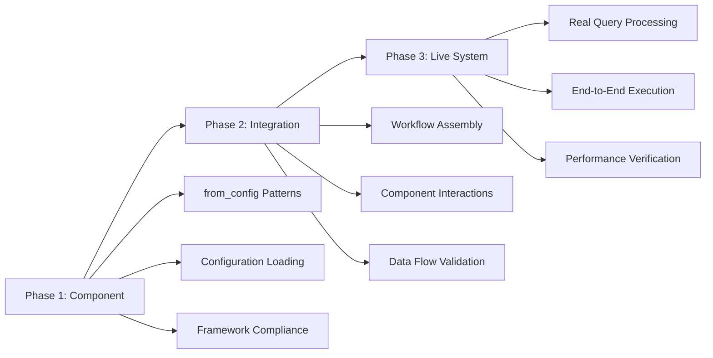
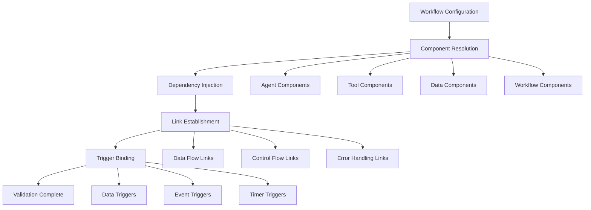
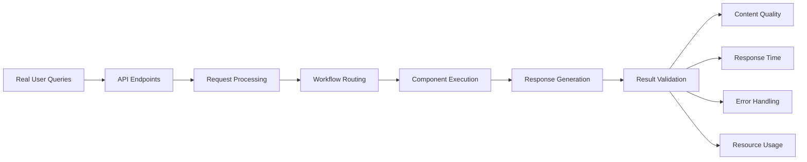
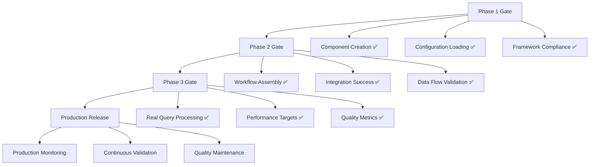
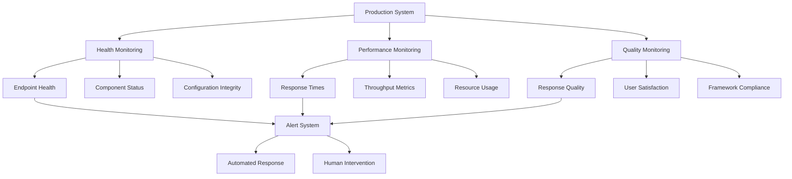

# Testing and Validation Architecture
## Comprehensive LLM-Driven Testing Framework for Enterprise AI Systems

**Document Version**: 1.0.0  
**Created**: August 2024  
**Target Audience**: QA Engineers, Test Architects, Framework Developers  

---

## **Design Intent & Purpose**

The NanoBrain testing architecture was designed to address the fundamental challenge of validating complex AI agent frameworks where traditional testing approaches fall short:

**AI System Complexity Challenge:**
Unlike traditional software systems with deterministic behavior, AI agent frameworks involve LLM interactions, dynamic workflow routing, and emergent behaviors that require specialized testing approaches. The testing architecture enables comprehensive validation of both deterministic framework components and non-deterministic AI behaviors.

**Enterprise Quality Assurance:**
Production AI systems require rigorous validation that goes beyond unit tests to include integration testing, live system validation, and framework compliance verification. The testing architecture ensures that all components meet enterprise-grade quality standards while maintaining architectural integrity.

**LLM-Driven Development Validation:**
As AI systems increasingly use LLMs for code generation and system configuration, testing must validate not just functionality but also compliance with framework patterns and architectural principles. This testing approach ensures generated code integrates seamlessly with existing framework components.

**Continuous Integration for AI:**
Traditional CI/CD approaches must be enhanced for AI systems to handle configuration-driven behavior, dynamic component creation, and complex data flows. The testing architecture provides a foundation for robust AI system deployment and validation.

---

## **1. Testing Philosophy and Design**

### **1.1 Multi-Phase Validation Strategy**

**Design Intent & Purpose:**
The multi-phase approach was designed to handle the unique challenges of testing complex AI frameworks where failures can occur at multiple levels:

**Component Isolation:**
Individual components must be validated in isolation before integration to ensure that framework patterns (from_config, ConfigBase resolution) work correctly at the atomic level. This prevents cascading failures and enables precise error localization.

**Integration Complexity Management:**
AI agent frameworks involve complex interactions between components that may not manifest in isolated testing. Integration phases validate that components work together correctly while maintaining framework compliance.

**Live System Validation:**
The ultimate test for AI systems is real-world performance with actual user queries and data. Live testing phases ensure that the complete system delivers meaningful results under production conditions.

**Failure Isolation Strategy:**
Each phase acts as a gate, preventing advanced testing until foundational issues are resolved. This approach minimizes debugging complexity and ensures systematic issue resolution.

NanoBrain testing follows a systematic three-phase approach designed to validate AI frameworks at increasing levels of complexity and integration.



**Core Testing Principles:**
- **Configuration-Driven Validation**: All test behavior controlled via YAML configurations
- **Framework Pattern Enforcement**: Tests validate compliance with from_config and ConfigBase patterns
- **Systematic Issue Analysis**: Structured approach to root cause identification and resolution
- **LLM-Aware Testing**: Specialized validation for AI agent behaviors and interactions

### **1.2 Issue Analysis and Resolution Protocol**

**Design Intent & Purpose:**
The systematic issue analysis protocol was designed to handle the complexity of debugging AI frameworks where issues can stem from configuration mismatches, framework pattern violations, or component integration failures:

**Structured Problem Solving:**
AI framework issues often involve complex interactions between multiple components and configuration files. The structured approach ensures comprehensive analysis that considers all potential root causes rather than addressing symptoms.

**Framework Compliance Enforcement:**
Every proposed solution must be evaluated against framework patterns to prevent the introduction of anti-patterns or architectural violations that could compromise system integrity.

**Knowledge Capture and Reuse:**
The systematic documentation approach captures resolution knowledge that can be applied to similar issues, building institutional knowledge about framework debugging and optimization.

**Quality Assurance for Fixes:**
All solutions must meet the same standards as framework development: no hardcoding, complete configurability, and full compliance with architectural patterns.

When issues are discovered during testing, a mandatory systematic analysis protocol ensures comprehensive investigation and framework-compliant resolution.

**Mandatory Process Steps:**

1. **STOP IMPLEMENTATION - Document Issue**
2. **ANALYZE AGAINST FRAMEWORK RULES**  
3. **COMPREHENSIVE REPORT GENERATION**
4. **USER CONSULTATION REQUIRED**


---

## **2. Component-Level Testing Architecture**

### **2.1 Individual Component Validation**

**Design Intent & Purpose:**
Component-level testing addresses the foundation of framework reliability by ensuring that each component correctly implements NanoBrain patterns:

**from_config Pattern Validation:**
Every framework component must be creatable via the from_config pattern. Testing validates that components can be instantiated from configuration files without direct constructor calls, ensuring consistent behavior across the framework.

**Configuration Resolution Testing:**
The ConfigBase._resolve_nested_objects() mechanism must work correctly for all component types. Testing validates that complex configuration hierarchies resolve properly and that circular dependencies are handled gracefully.

**Framework Pattern Compliance:**
Components must follow established architectural patterns for error handling, logging, and interaction protocols. Testing ensures that components integrate seamlessly with the framework infrastructure.

**Isolation and Reproducibility:**
Component testing in isolation ensures that issues can be precisely localized and that fixes don't introduce regressions in other components.

Individual components are tested in isolation to validate framework pattern compliance and configuration loading behavior.

**Success Criteria:**
- ✅ All components created via `ComponentClass.from_config()`
- ✅ No custom creation methods used
- ✅ Framework resolution working correctly
- ✅ Configuration loading without errors

**Component Testing Framework:**

```python
class ComponentTestSuite:
    """Framework-compliant component testing"""
    
    def test_from_config_creation(self, component_class, config_path):
        """Validate from_config pattern implementation"""
        component = component_class.from_config(config_path)
        assert component is not None
        assert isinstance(component, component_class)
    
    def test_configuration_resolution(self, component_class, config_path):
        """Validate ConfigBase._resolve_nested_objects functionality"""
        config = component_class._get_config_class().from_config(config_path)
        assert config._validate_configuration()
        assert config._resolve_nested_objects() is True
    
    def test_framework_compliance(self, component):
        """Validate framework pattern adherence"""
        assert hasattr(component, 'from_config')
        assert hasattr(component, '_get_config_class')
        assert isinstance(component, FromConfigBase)
```

### **2.2 Configuration Testing Patterns**

**Design Intent & Purpose:**
Configuration testing ensures that the YAML-driven architecture works correctly across all component types and deployment scenarios:

**Schema Validation:**
All configuration files must conform to defined schemas to prevent runtime errors and ensure consistent behavior. Testing validates that configurations match expected schemas and that validation errors are properly reported.

**Path Resolution Testing:**
The framework uses relative path resolution for deployment flexibility. Testing ensures that path resolution works correctly across different deployment scenarios and directory structures.

**Template and Inheritance Testing:**
Configuration templates and inheritance patterns must work correctly to enable reusable configuration patterns. Testing validates that template resolution and value inheritance operate as expected.

**Environment-Specific Configuration:**
Different deployment environments require different configuration values while maintaining the same structure. Testing ensures that environment-specific configurations are properly isolated and applied.

Configuration files are validated for schema compliance, path resolution, and template inheritance patterns.

**Configuration Test Types:**

1. **Schema Validation Tests**
   - YAML syntax validation
   - Schema conformance checking
   - Required field verification
   - Type constraint validation

2. **Path Resolution Tests**
   - Relative path resolution across deployment scenarios
   - Configuration file discovery validation
   - Cross-reference integrity checking

3. **Template Inheritance Tests**
   - Base template loading and application
   - Override behavior validation
   - Circular dependency detection

```yaml
# Configuration Test Specification
configuration_tests:
  schema_validation:
    required_fields: ["class", "config"]
    type_constraints:
      execution_strategy: "ExecutionStrategy"
      error_handling: "ErrorHandlingStrategy"
    
  path_resolution:
    relative_paths: ["../config/", "../../nanobrain/"]
    deployment_scenarios: ["local", "docker", "production"]
    
  template_inheritance:
    base_templates: ["agent_base.yml", "workflow_base.yml"]
    override_patterns: ["environment_overrides", "component_overrides"]
```

---

## **3. Integration Testing Framework**

### **3.1 Workflow Assembly Validation**

**Design Intent & Purpose:**
Integration testing addresses the complexity of validating multi-component AI workflows where the interactions between components are as important as individual component functionality:

**Component Interaction Validation:**
AI workflows involve complex interactions between agents, tools, data units, and triggers. Integration testing ensures that these interactions work correctly and that data flows properly between components.

**Configuration Integration Testing:**
While individual configurations may be valid, their combination in workflows can reveal integration issues. Testing validates that all configurations work together harmoniously.

**Dynamic Component Resolution:**
The framework's ability to dynamically resolve and instantiate components from configuration must work correctly for complete workflows. Integration testing validates this end-to-end resolution process.

**Event-Driven Behavior Validation:**
Many framework components use event-driven patterns where triggers activate processing chains. Integration testing ensures that these event patterns work correctly across component boundaries.

Integration testing validates complete workflow loading and component interaction patterns.

**Success Criteria:**
- ✅ Complete workflow loading
- ✅ All steps instantiated correctly  
- ✅ All links resolved properly
- ✅ All triggers bound successfully
- ✅ No framework pattern violations

**Integration Test Architecture:**



### **3.2 Data Flow and Component Communication**

**Design Intent & Purpose:**
Data flow testing ensures that information moves correctly through complex AI workflows while maintaining type safety and framework compliance:

**Type Safety Validation:**
The framework uses typed data units to ensure data integrity across component boundaries. Testing validates that type constraints are enforced and that data transformations maintain integrity.

**Communication Protocol Testing:**
Components communicate using standardized protocols (A2A, MCP). Testing ensures that these protocols work correctly and that messages are properly formatted and delivered.

**Error Propagation Testing:**
When errors occur in complex workflows, they must be properly propagated and handled without corrupting the overall system state. Testing validates error handling patterns across component boundaries.

**Performance and Resource Testing:**
AI workflows can involve significant computational resources. Integration testing includes performance validation to ensure that resource usage is appropriate and that workflows complete within reasonable timeframes.

Data flow testing validates information movement and communication protocols between framework components.

**Data Flow Test Categories:**

1. **Type Safety and Validation**
   - Data unit type constraint enforcement
   - Schema validation at component boundaries
   - Type transformation and compatibility checking

2. **Communication Protocol Testing**
   - A2A (Agent-to-Agent) communication validation
   - MCP (Multi-Component Protocol) testing
   - Message formatting and delivery verification

3. **Error Handling and Recovery**
   - Error propagation across component boundaries
   - Recovery mechanism validation
   - State consistency during error conditions

4. **Performance and Resource Management**
   - Resource usage monitoring and validation
   - Performance threshold verification
   - Scalability and load testing

```python
class DataFlowTestSuite:
    """Integration testing for data flow and communication"""
    
    def test_data_unit_flow(self, workflow, test_data):
        """Validate data movement through workflow"""
        results = workflow.execute(test_data)
        assert results.validate_data_integrity()
        assert results.check_type_consistency()
    
    def test_component_communication(self, source_component, target_component):
        """Validate inter-component communication"""
        message = source_component.create_message(test_payload)
        response = target_component.process_message(message)
        assert response.is_valid()
        assert response.follows_protocol()
    
    def test_error_propagation(self, workflow, error_scenario):
        """Validate error handling across components"""
        with pytest.raises(ExpectedFrameworkError):
            workflow.execute_with_error(error_scenario)
        assert workflow.state.is_consistent()
```

---

## **4. Live System Testing and Validation**

### **4.1 Real-World Query Processing**

**Design Intent & Purpose:**
Live system testing represents the ultimate validation of AI framework functionality under real-world conditions:

**Actual User Query Processing:**
AI systems must perform correctly with real user queries that may be ambiguous, complex, or outside training expectations. Live testing ensures that the complete system handles real-world input appropriately.

**End-to-End System Validation:**
All previous testing phases validate individual components and their interactions, but live testing validates the complete system including user interfaces, API endpoints, and external integrations.

**Performance Under Load:**
Production AI systems must perform adequately under realistic load conditions. Live testing includes performance validation to ensure that response times and resource usage are acceptable.

**Result Quality and Relevance:**
Beyond functional correctness, AI systems must produce meaningful, relevant results. Live testing validates that the system generates high-quality responses that meet user expectations.

Live system testing validates end-to-end functionality with real user queries and production-like conditions.

**ULTIMATE SUCCESS CRITERIA:**
- ✅ **Real query processing**: Actual user queries processed successfully
- ✅ **Meaningful results**: Non-empty, relevant response data generated  
- ✅ **End-to-end execution**: Complete workflow execution without errors
- ✅ **Data flow validation**: Proper data transfer between all components
- ✅ **Performance verification**: Reasonable execution times
- ✅ **Error handling**: Graceful handling of edge cases

**Live Testing Framework:**



### **4.2 Performance and Quality Metrics**

**Design Intent & Purpose:**
Comprehensive metrics collection enables continuous monitoring and improvement of AI system performance:

**Response Quality Metrics:**
AI systems must be evaluated not just for functional correctness but for the quality and relevance of their responses. Metrics capture both quantitative performance data and qualitative assessment of output quality.

**System Performance Monitoring:**
Production AI systems require continuous monitoring of performance characteristics including response times, resource usage, and error rates. Metrics enable proactive identification of performance issues.

**Framework Compliance Monitoring:**
Live systems must maintain framework compliance even under load and with real user queries. Monitoring ensures that framework patterns continue to be followed correctly in production.

**Continuous Improvement Data:**
Metrics collection provides data for continuous improvement of both individual components and overall system architecture. This data informs optimization efforts and future development priorities.

Comprehensive metrics collection enables continuous monitoring and validation of system performance and quality.

**Performance Metrics:**

1. **Response Quality Metrics**
   - Result relevance and accuracy scoring
   - User satisfaction measurements  
   - Content completeness validation
   - Expert evaluation of AI responses

2. **System Performance Metrics**
   - Query processing latency distribution
   - Resource utilization patterns
   - Error rate and recovery statistics
   - Concurrent user capacity testing

3. **Framework Compliance Metrics**
   - Configuration-driven behavior verification
   - Component creation pattern adherence
   - Error handling consistency measurement
   - Architecture pattern compliance scoring

```yaml
# Performance Testing Configuration
performance_metrics:
  response_quality:
    relevance_threshold: 0.85
    accuracy_threshold: 0.90
    completeness_threshold: 0.80
    
  system_performance:
    max_response_time_ms: 30000
    max_memory_usage_mb: 2048
    max_error_rate_percent: 5
    
  framework_compliance:
    from_config_usage_percent: 100
    configuration_driven_percent: 100
    pattern_adherence_score: 0.95
```

---

## **5. Framework Compliance and Quality Assurance**

### **5.1 Mandatory Testing Requirements**

**Design Intent & Purpose:**
Mandatory requirements ensure that all testing efforts maintain the high standards necessary for enterprise AI framework deployment:

**Framework Pattern Enforcement:**
All testing must validate that framework patterns are correctly implemented and maintained. This prevents the introduction of anti-patterns that could compromise system architecture.

**Quality Gate Implementation:**
Each testing phase acts as a quality gate that must be passed before proceeding to the next phase. This ensures systematic validation and prevents advanced testing of fundamentally flawed components.

**Comprehensive Documentation:**
All testing activities must be thoroughly documented to enable knowledge sharing, issue reproduction, and continuous improvement of testing processes.

**No Shortcuts Policy:**
Testing cannot be abbreviated or simplified even under time pressure. This ensures that quality is never compromised for speed and that all deployments meet enterprise standards.

Framework compliance testing ensures that all solutions adhere to NanoBrain architectural patterns and quality standards.

**MANDATORY TESTING REQUIREMENTS:**

1. **NO SHORTCUTS**: All phases must be completed in sequence
2. **NO PARTIAL SUCCESS**: Only live server functionality counts  
3. **ISSUE ANALYSIS**: Any issue requires full analysis and user consultation
4. **FRAMEWORK COMPLIANCE**: All solutions must follow NanoBrain patterns
5. **NO WARNINGS IGNORING**: All framework warnings must be investigated and fixed
6. **COMPREHENSIVE REPORTING**: All issues must be documented thoroughly
7. **USER APPROVAL**: No fixes implemented without explicit user approval

### **5.2 Quality Gates and Success Criteria**

**Design Intent & Purpose:**
Quality gates provide objective criteria for determining when systems are ready for advancement to the next testing phase or production deployment:

**Objective Success Measurement:**
Quality gates provide clear, measurable criteria that eliminate subjective judgment about system readiness. This ensures consistent quality standards across all deployments.

**Risk Mitigation:**
By requiring specific criteria to be met before advancement, quality gates reduce the risk of deploying systems with hidden defects or performance issues.

**Continuous Improvement Foundation:**
Quality gate metrics provide baseline data for continuous improvement efforts and help identify areas where standards should be raised or testing approaches modified.

**Stakeholder Confidence:**
Clear quality gates provide stakeholders with confidence that deployed systems meet established standards and can be relied upon for production use.

**Quality Gate Framework:**



Each testing phase includes specific quality gates that must be satisfied before proceeding:

**Phase 1 Quality Gates (Component Testing):**
- All components created via from_config pattern
- Zero configuration loading errors
- Complete framework pattern compliance
- Comprehensive error handling validation

**Phase 2 Quality Gates (Integration Testing):**
- Complete workflow loading success
- All component interactions validated
- Data flow integrity confirmed
- Communication protocol compliance verified

**Phase 3 Quality Gates (Live System Testing):**
- Real query processing functionality
- Performance targets achieved
- Quality metrics met
- User acceptance criteria satisfied

```yaml
# Quality Gate Configuration
quality_gates:
  phase_1_component:
    from_config_success_rate: 100
    configuration_error_rate: 0
    framework_compliance_score: 1.0
    
  phase_2_integration:
    workflow_loading_success_rate: 100
    component_interaction_success_rate: 100
    data_flow_integrity_score: 1.0
    
  phase_3_live_system:
    query_processing_success_rate: 95
    response_time_p95_ms: 30000
    quality_score_threshold: 0.85
```

---

## **6. Testing Tools and Infrastructure**

### **6.1 Automated Testing Framework**

**Design Intent & Purpose:**
Automated testing infrastructure enables consistent, repeatable validation of complex AI frameworks while reducing manual effort and human error:

**Consistency and Reproducibility:**
Automated tests ensure that validation procedures are executed consistently across different environments and team members. This eliminates variability introduced by manual testing processes.

**Comprehensive Coverage:**
Automated frameworks can execute extensive test suites that would be impractical to run manually, ensuring comprehensive coverage of framework functionality and edge cases.

**Continuous Integration Support:**
Automated testing enables continuous integration pipelines that validate changes automatically, providing rapid feedback to developers and preventing integration issues.

**Regression Prevention:**
Automated test suites serve as regression prevention mechanisms, ensuring that new changes don't break existing functionality that was previously validated.

Automated testing infrastructure provides consistent, repeatable validation of framework components and behaviors.

**Testing Framework Architecture:**

```python
class NanoBrainTestFramework:
    """Comprehensive testing framework for NanoBrain components"""
    
    def __init__(self, config_path: str):
        self.config = TestFrameworkConfig.from_config(config_path)
        self.test_suite_registry = TestSuiteRegistry()
        self.metrics_collector = TestMetricsCollector()
    
    async def run_component_tests(self, component_type: str):
        """Execute component-level test suite"""
        test_suite = self.test_suite_registry.get_component_suite(component_type)
        results = await test_suite.execute_all_tests()
        return self.validate_component_results(results)
    
    async def run_integration_tests(self, workflow_config: str):
        """Execute integration test suite"""
        workflow = Workflow.from_config(workflow_config)
        test_suite = IntegrationTestSuite(workflow)
        results = await test_suite.execute_integration_tests()
        return self.validate_integration_results(results)
    
    async def run_live_system_tests(self, test_queries: List[str]):
        """Execute live system validation"""
        live_system = LiveSystemTestHarness.from_config(self.config)
        results = await live_system.process_test_queries(test_queries)
        return self.validate_live_system_results(results)
```

### **6.2 Configuration-Driven Test Execution**

**Design Intent & Purpose:**
Configuration-driven testing aligns with NanoBrain's architecture philosophy while providing flexibility for different testing scenarios:

**Framework Consistency:**
Test configuration uses the same patterns as framework configuration, ensuring consistency and enabling the testing framework to validate its own configuration patterns.

**Environment Flexibility:**
Different testing environments (development, staging, production) require different test configurations while maintaining the same test logic. Configuration-driven approaches enable this flexibility.

**Test Customization:**
Different development teams or deployment scenarios may require customized test suites. Configuration-driven testing enables this customization without code changes.

**Validation of Configuration Systems:**
By using the same configuration patterns as the framework itself, the testing system validates that the configuration mechanisms work correctly for complex scenarios.

Test execution is controlled via YAML configurations, following the same patterns as framework components.

```yaml
# Test Framework Configuration
test_framework:
  component_tests:
    enabled: true
    test_suites:
      - "agent_component_tests"
      - "tool_component_tests" 
      - "workflow_component_tests"
    
  integration_tests:
    enabled: true
    workflows:
      - "config/test_workflows/basic_chat_workflow.yml"
      - "config/test_workflows/viral_analysis_workflow.yml"
    
  live_system_tests:
    enabled: true
    test_queries:
      - "Create PSSM matrix for Eastern Equine Encephalitis virus"
      - "What causes alphavirus diseases?"
      - "Tell me about Chikungunya virus structure"
    
  quality_gates:
    component_gate:
      from_config_success_rate: 1.0
      configuration_error_rate: 0.0
    integration_gate:
      workflow_loading_success_rate: 1.0
      data_flow_success_rate: 1.0
    live_system_gate:
      query_success_rate: 0.95
      performance_threshold_ms: 30000
```

---

## **7. Continuous Testing and Monitoring**

### **7.1 Production Testing Strategy**

**Design Intent & Purpose:**
Production testing ensures that deployed systems continue to meet quality standards under real-world conditions:

**Continuous Validation:**
Production environments can present conditions that weren't anticipated during development testing. Continuous testing validates that systems continue to perform correctly under these conditions.

**Performance Degradation Detection:**
System performance can degrade over time due to data drift, increased load, or infrastructure changes. Continuous monitoring enables early detection of performance issues.

**Framework Compliance in Production:**
Production systems must maintain framework compliance even under load and with diverse user inputs. Monitoring ensures that architectural patterns continue to be followed correctly.

**User Experience Monitoring:**
The ultimate measure of system success is user experience. Production testing includes user experience monitoring to ensure that deployed systems meet user expectations.

Continuous testing and monitoring ensure that deployed systems maintain quality and performance standards in production environments.

**Production Testing Framework:**

1. **Health Check Monitoring**
   - Continuous endpoint availability verification
   - Component health status monitoring
   - Configuration integrity validation
   - Resource utilization tracking

2. **Performance Monitoring**  
   - Response time distribution analysis
   - Throughput and capacity measurement
   - Error rate and recovery monitoring
   - Resource consumption optimization

3. **Quality Assurance Monitoring**
   - Response quality automated assessment
   - User satisfaction measurement
   - Framework compliance validation
   - Architectural pattern adherence



### **7.2 Feedback Loop and Continuous Improvement**

**Design Intent & Purpose:**
Continuous improvement processes ensure that testing frameworks and production systems evolve to meet changing requirements and improve quality over time:

**Learning from Production Data:**
Production systems generate valuable data about real-world usage patterns, performance characteristics, and failure modes. This data informs improvements to both testing approaches and system architecture.

**Test Framework Evolution:**
As systems evolve and new patterns emerge, testing frameworks must evolve to validate new functionality and patterns. Continuous improvement ensures that testing remains comprehensive and relevant.

**Quality Standard Advancement:**
As teams gain experience and systems mature, quality standards should advance to reflect higher expectations and capabilities. Feedback loops enable systematic raising of quality bars.

**Knowledge Sharing and Best Practices:**
Testing experiences and solutions should be captured and shared to benefit the entire development organization. Systematic knowledge capture enables organizational learning and improvement.

Feedback loops capture testing insights and production data to continuously improve testing strategies and system quality.

**Continuous Improvement Framework:**

```yaml
# Continuous Improvement Configuration
continuous_improvement:
  feedback_collection:
    production_metrics: true
    user_feedback: true
    testing_results: true
    performance_data: true
    
  analysis_processes:
    weekly_metric_review: true
    monthly_quality_assessment: true
    quarterly_framework_evaluation: true
    annual_strategy_review: true
    
  improvement_actions:
    test_framework_updates: true
    quality_gate_adjustments: true
    performance_target_optimization: true
    process_refinement: true
    
  knowledge_management:
    best_practices_documentation: true
    lessons_learned_capture: true
    testing_pattern_library: true
    training_material_updates: true
```

**Improvement Cycle:**
1. **Data Collection**: Gather metrics from testing and production systems
2. **Analysis**: Identify patterns, issues, and improvement opportunities
3. **Planning**: Develop improvement strategies and implementation plans
4. **Implementation**: Execute improvements to testing frameworks and processes
5. **Validation**: Verify that improvements achieve desired outcomes
6. **Documentation**: Capture learnings and update best practices

---

## **Conclusion**

The NanoBrain Testing and Validation Architecture provides a comprehensive framework for ensuring the quality, reliability, and performance of complex AI agent systems. Through systematic multi-phase testing, rigorous framework compliance validation, and continuous monitoring, this architecture enables the deployment of enterprise-grade AI systems with confidence.

The architecture emphasizes configuration-driven testing that aligns with NanoBrain's core principles while providing the flexibility needed for diverse deployment scenarios. By combining automated testing infrastructure with systematic quality gates and continuous improvement processes, teams can maintain high-quality standards while enabling rapid development and deployment of AI capabilities.

**Key Benefits:**
- **Comprehensive Validation**: Multi-phase testing ensures thorough validation at all levels
- **Framework Compliance**: Systematic enforcement of architectural patterns and quality standards  
- **Continuous Quality**: Ongoing monitoring and improvement of deployed systems
- **Risk Mitigation**: Early detection and resolution of issues before production impact
- **Knowledge Capture**: Systematic documentation and sharing of testing insights and best practices

For detailed implementation guidance and specific testing procedures, refer to the comprehensive testing documentation and framework-specific testing guides. 