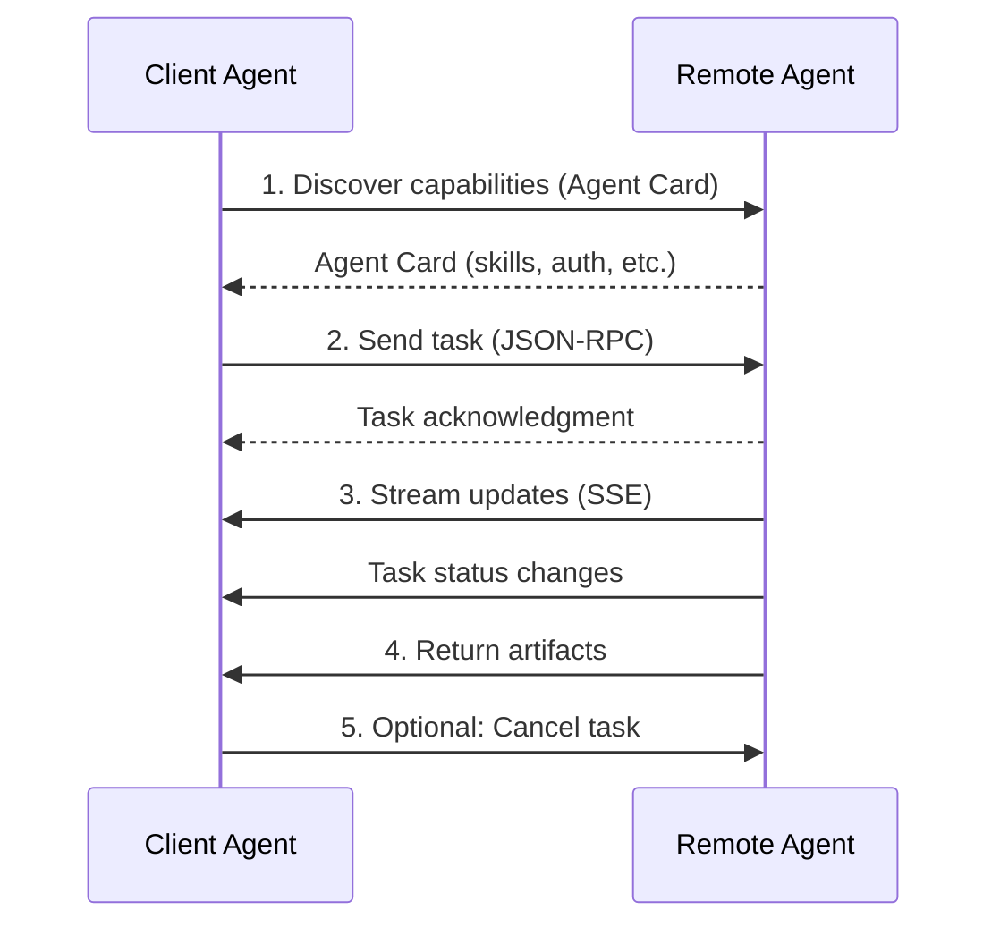

# A2A (Agent-to-Agent) Protocol Support for NanoBrain

## Overview

NanoBrain now supports the A2A (Agent-to-Agent) Protocol, enabling seamless collaboration between AI agents across different platforms and frameworks. A2A is an open protocol developed by Google in collaboration with over 50 technology partners, designed to enable true multi-agent scenarios where agents can collaborate without sharing internal state, memory, or tools.

## What is A2A?

The Agent-to-Agent (A2A) Protocol is a standardized framework for communication between autonomous AI agents. Unlike MCP (Model Context Protocol) which focuses on connecting agents to tools and resources, A2A enables agents to communicate and collaborate with each other directly.

### Key Differences: A2A vs MCP

| Aspect            | A2A Protocol                              | MCP Protocol                    |
| ----------------- | ----------------------------------------- | ------------------------------- |
| **Purpose**       | Agent-to-agent communication              | Agent-to-tool communication     |
| **Scope**         | Multi-agent collaboration                 | Single agent tool access        |
| **Communication** | Natural, unstructured modalities          | Structured tool interfaces      |
| **State Sharing** | Opaque agents (no internal state sharing) | Shared context and tools        |
| **Use Cases**     | Task delegation, agent orchestration      | Tool discovery, resource access |

**Complementary Nature**: A2A and MCP work together - agents use MCP to access tools while using A2A to collaborate with other agents.

## Architecture

### Core Components

1. **A2AClient**: Handles low-level communication with A2A agents
2. **A2AAgent**: Wraps remote A2A agents for NanoBrain compatibility  
3. **A2ASupportMixin**: Mixin class adding A2A capabilities to agents
4. **A2AAgentConfig**: Configuration for A2A agent connections

### Data Structures

- **Agent Card**: JSON metadata describing agent capabilities and connection info
- **Task**: Central unit of work with lifecycle states (submitted, working, completed, etc.)
- **Message**: Content exchanged between agents with multimodal parts
- **Artifact**: Outputs produced by tasks
- **Parts**: Individual content pieces (text, file, data)

### Protocol Flow



## Integration Patterns

### 1. Mixin Pattern

```python
from core.agent import ConversationalAgent, AgentConfig
from core.a2a_support import A2ASupportMixin

class MyAgent(A2ASupportMixin, ConversationalAgent):
    def __init__(self, config: AgentConfig, **kwargs):
        super().__init__(config, **kwargs)
        # A2A capabilities are now available
```

### 2. Decorator Pattern

```python
from core.a2a_support import with_a2a_support

@with_a2a_support
class MyAgent(ConversationalAgent):
    pass

# Agent now has A2A capabilities
agent = MyAgent(config, a2a_enabled=True, a2a_config_path="a2a_config.yaml")
```

### 3. Combined A2A + MCP

```python
from core.a2a_support import A2ASupportMixin
from core.mcp_support import MCPSupportMixin

class CollaborativeAgent(A2ASupportMixin, MCPSupportMixin, ConversationalAgent):
    """Agent with both A2A and MCP capabilities"""
    pass
```

## Configuration

### A2A Client Configuration

```yaml
# a2a_config.yaml
client:
  default_timeout: 30.0
  default_max_retries: 3
  default_retry_delay: 1.0
  connection_pool_size: 10
  enable_task_caching: true
  task_cache_ttl: 300
  auto_discover_agents: true
  fail_on_agent_error: false
  log_agent_calls: true

agents:
  - name: travel_agent
    url: https://travel.example.com/a2a
    description: Specialized agent for travel planning
    auth_type: none
    timeout: 45.0
    enabled: true
    
  - name: code_agent
    url: https://code.example.com/a2a
    description: AI agent for code generation
    auth_type: bearer
    auth_token: ${CODE_AGENT_TOKEN}
    timeout: 60.0
    enabled: true
```

### Agent Configuration with A2A

```yaml
# agent_with_a2a.yaml
agent:
  name: "CollaborativeAgent"
  description: "Agent with A2A protocol support"
  model: "gpt-3.5-turbo"
  system_prompt: |
    You are a collaborative AI assistant with access to specialized agents.
    When tasks require expertise, delegate to appropriate agents via A2A.

a2a:
  enabled: true
  config_path: "a2a_config.yaml"
  
  delegation_rules:
    - keywords: ["flight", "hotel", "travel"]
      agent: "travel_agent"
      description: "Delegate travel requests"
    
    - keywords: ["code", "program", "function"]
      agent: "code_agent"
      description: "Delegate programming tasks"
```

## Usage Examples

### Basic A2A Agent Interaction

```python
import asyncio
from core.agent import ConversationalAgent, AgentConfig
from core.a2a_support import A2ASupportMixin

class MyA2AAgent(A2ASupportMixin, ConversationalAgent):
    pass

async def main():
    # Create agent with A2A support
    config = AgentConfig(name="my_agent", description="A2A enabled agent")
    agent = MyA2AAgent(
        config,
        a2a_enabled=True,
        a2a_config_path="config/a2a_config.yaml"
    )
    
    # Initialize agent (loads A2A config)
    await agent.initialize()
    
    # Check available A2A agents
    agents = agent.get_a2a_agents()
    print(f"Available A2A agents: {agents}")
    
    # Call an A2A agent directly
    if "travel_agent" in agents:
        result = await agent.call_a2a_agent(
            "travel_agent", 
            "Find flights from NYC to Paris"
        )
        print(f"Travel agent response: {result}")
    
    await agent.shutdown()

asyncio.run(main())
```

### Automatic Task Delegation

```python
class SmartCollaborativeAgent(A2ASupportMixin, ConversationalAgent):
    async def process(self, input_text: str, **kwargs) -> str:
        # Check for delegation opportunities
        if "travel" in input_text.lower() and "travel_agent" in self.a2a_agents:
            # Delegate to travel agent
            result = await self.call_a2a_agent("travel_agent", input_text)
            return f"🤝 Travel specialist says: {result}"
        
        # Fall back to normal processing
        return await super().process(input_text, **kwargs)
```

### YAML-Based Configuration Loading

```python
async def create_configured_agent():
    # Load agent with A2A config from YAML
    from core.a2a_support import A2AClient
    
    # Create A2A client from YAML
    client = A2AClient.from_yaml_config("config/a2a_config.yaml")
    await client.initialize()
    
    # Agent automatically gets A2A capabilities
    agent = MyA2AAgent(config, a2a_client=client)
    return agent
```

## Authentication

A2A supports multiple authentication schemes:

### No Authentication
```yaml
agents:
  - name: public_agent
    auth_type: none
```

### Bearer Token
```yaml
agents:
  - name: secure_agent
    auth_type: bearer
    auth_token: "your-bearer-token"
    # Or use environment variable
    auth_token: ${AGENT_TOKEN}
```

### OAuth 2.0
```yaml
agents:
  - name: oauth_agent
    auth_type: oauth2
    oauth_config:
      client_id: ${CLIENT_ID}
      client_secret: ${CLIENT_SECRET}
      token_url: https://auth.example.com/token
      scope: "agent:read agent:write"
```

## Error Handling

A2A includes comprehensive error handling:

```python
from core.a2a_support import A2AError, A2AConnectionError, A2ATaskExecutionError

try:
    result = await agent.call_a2a_agent("travel_agent", "book flight")
except A2AConnectionError as e:
    print(f"Connection failed: {e}")
except A2ATaskExecutionError as e:
    print(f"Task execution failed: {e}")
except A2AError as e:
    print(f"General A2A error: {e}")
```

## Mock Support

For testing without real A2A servers:

```python
# Mock agents are automatically used when aiohttp is not available
# or when real agents are unreachable

# Mock agents provide realistic responses based on agent names:
# - travel_agent: Returns flight/hotel search results
# - code_agent: Returns code snippets
# - general_agent: Returns general assistance

# Enable mock mode explicitly
client = A2AClient(config, use_mock=True)
```

## Monitoring and Observability

### Status Information

```python
# Get A2A status
status = agent.get_a2a_status()
print(f"A2A enabled: {status['enabled']}")
print(f"Connected agents: {status['total_agents']}")
print(f"Agent capabilities: {status['agents']}")
```

### Logging

A2A operations are logged through NanoBrain's logging system:

```python
# A2A events are logged with structured data
# - Agent discovery
# - Task delegation
# - Response processing
# - Error conditions

# Configure logging in your agent
agent_config = AgentConfig(
    name="my_agent",
    enable_logging=True,
    log_conversations=True
)
```

## Performance Considerations

### Connection Pooling
- A2A client maintains connection pools for efficiency
- Configurable pool size and timeouts
- Automatic connection reuse

### Caching
- Task results can be cached to avoid redundant calls
- Configurable cache TTL
- Memory-based caching with size limits

### Parallel Execution
- Multiple A2A agents can be called concurrently
- Parsl integration for distributed execution
- Async/await throughout for non-blocking operations

## Security Best Practices

1. **Use HTTPS**: Always use HTTPS in production
2. **Authentication**: Implement proper authentication for sensitive agents
3. **Validation**: Validate responses from remote agents
4. **Rate Limiting**: Respect rate limits of remote agents
5. **Error Handling**: Don't expose sensitive error details
6. **Logging**: Log security events for monitoring

## Troubleshooting

### Common Issues

1. **Agent Not Found**
   ```
   A2AError: A2A agent travel_agent not found
   ```
   - Check agent name in configuration
   - Verify agent is enabled
   - Ensure agent discovery completed

2. **Connection Timeout**
   ```
   A2AConnectionError: Failed to connect to agent
   ```
   - Check agent URL accessibility
   - Verify network connectivity
   - Increase timeout values

3. **Authentication Failed**
   ```
   A2AAuthenticationError: Authentication failed
   ```
   - Verify auth tokens/credentials
   - Check token expiration
   - Validate OAuth configuration

### Debug Mode

Enable debug logging for detailed information:

```python
agent = MyA2AAgent(
    config,
    a2a_enabled=True,
    debug_mode=True  # Enables detailed A2A logging
)
```

## Future Enhancements

Planned improvements for A2A support:

1. **Streaming Support**: Real-time task updates via Server-Sent Events
2. **Push Notifications**: Webhook-based notifications for long-running tasks
3. **Agent Marketplace**: Discovery and registration of public A2A agents
4. **Advanced Orchestration**: Complex multi-agent workflows
5. **Performance Optimization**: Enhanced caching and connection management

## Examples and Demos

See the following files for complete examples:

- `nanobrain/demo/a2a_parsl_demo.py` - A2A integration with Parsl workflows
- `nanobrain/config/a2a_config.yaml` - Example A2A configuration
- `nanobrain/config/agent_with_a2a.yaml` - Agent configuration with A2A

## API Reference

### A2ASupportMixin

#### Methods

- `load_a2a_config_from_file(config_path)` - Load A2A configuration
- `initialize_a2a()` - Initialize A2A support
- `shutdown_a2a()` - Shutdown A2A support
- `add_a2a_agent(config)` - Add A2A agent configuration
- `remove_a2a_agent(agent_name)` - Remove A2A agent
- `call_a2a_agent(agent_name, message, **params)` - Call A2A agent
- `get_a2a_agents()` - Get list of available agents
- `get_a2a_agent_capabilities(agent_name)` - Get agent capabilities
- `refresh_a2a_agents()` - Refresh agent discovery
- `get_a2a_status()` - Get A2A status information

### A2AClient

#### Methods

- `from_yaml_config(config_path)` - Create client from YAML
- `initialize()` - Initialize client
- `shutdown()` - Shutdown client
- `add_agent(config)` - Add agent configuration
- `remove_agent(agent_name)` - Remove agent
- `connect_to_agent(agent_name)` - Connect to agent
- `discover_agent_capabilities(agent_name)` - Discover capabilities
- `send_task(agent_name, task_id, message)` - Send task
- `get_task(agent_name, task_id)` - Get task status
- `cancel_task(agent_name, task_id)` - Cancel task

### Configuration Classes

- `A2AClientConfig` - Client behavior configuration
- `A2AAgentConfig` - Individual agent configuration
- `A2AAgentCard` - Agent capability description

### Data Classes

- `A2ATask` - Task representation
- `A2AMessage` - Message between agents
- `A2AArtifact` - Task output
- `A2APart` - Content part (text, file, data)

## Contributing

To contribute to A2A support:

1. Follow NanoBrain's contribution guidelines
2. Add tests for new A2A functionality
3. Update documentation for API changes
4. Ensure compatibility with existing MCP support
5. Test with both real and mock A2A agents

## License

A2A support in NanoBrain follows the same license as the main project. The A2A protocol itself is open source under Apache 2.0 license. 