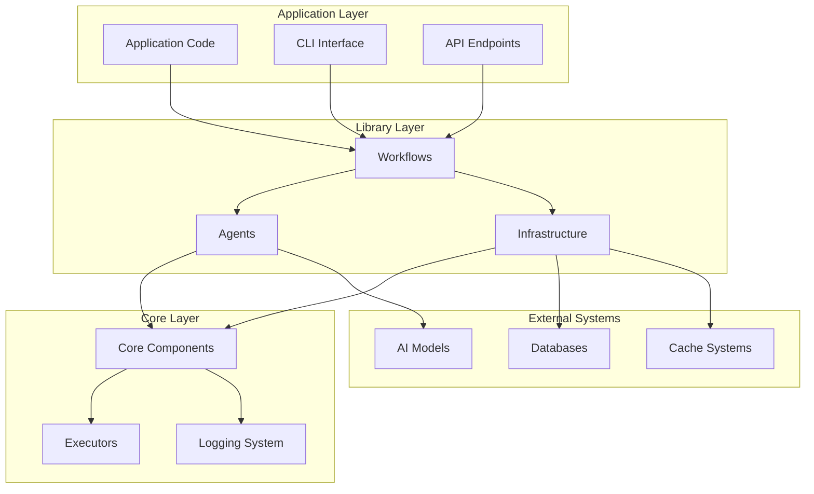
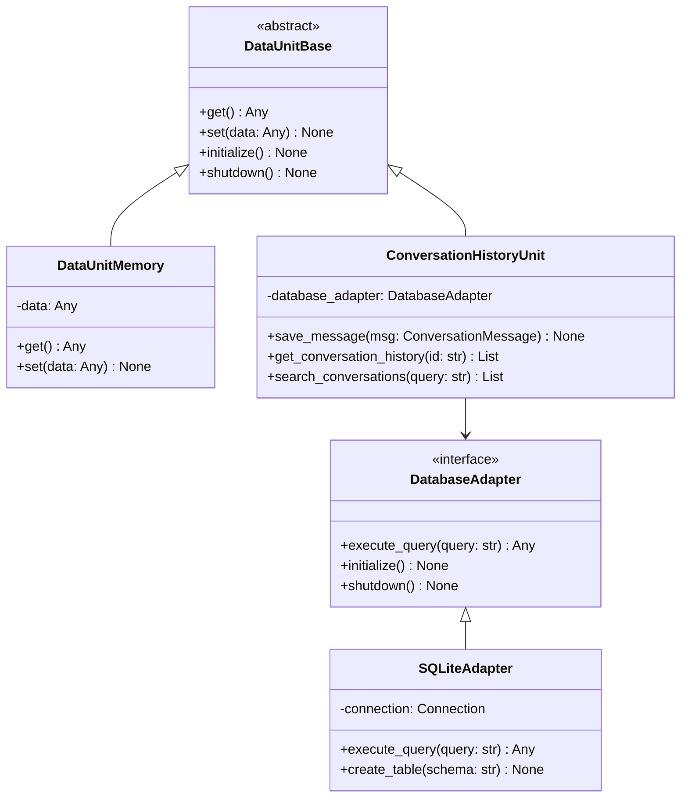
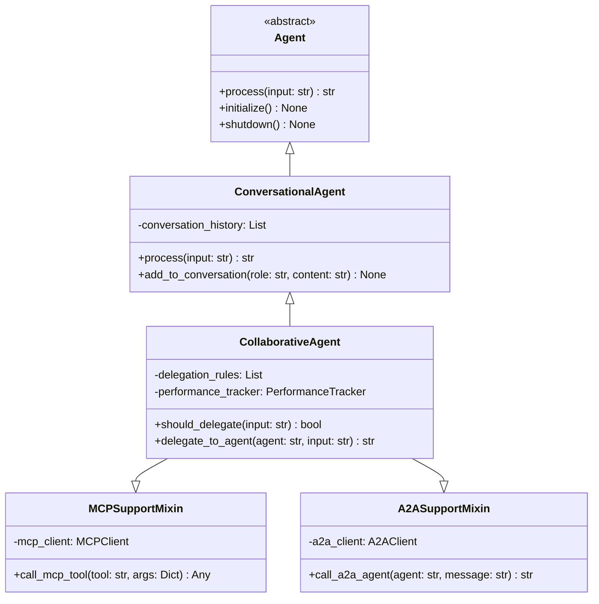
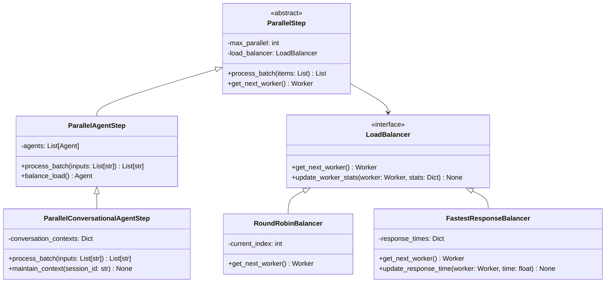
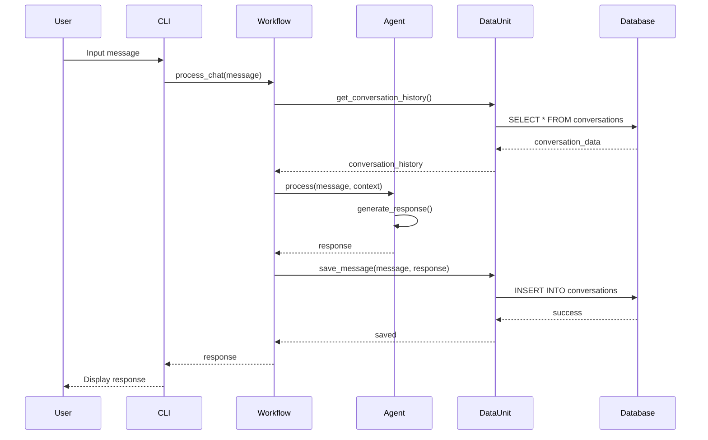
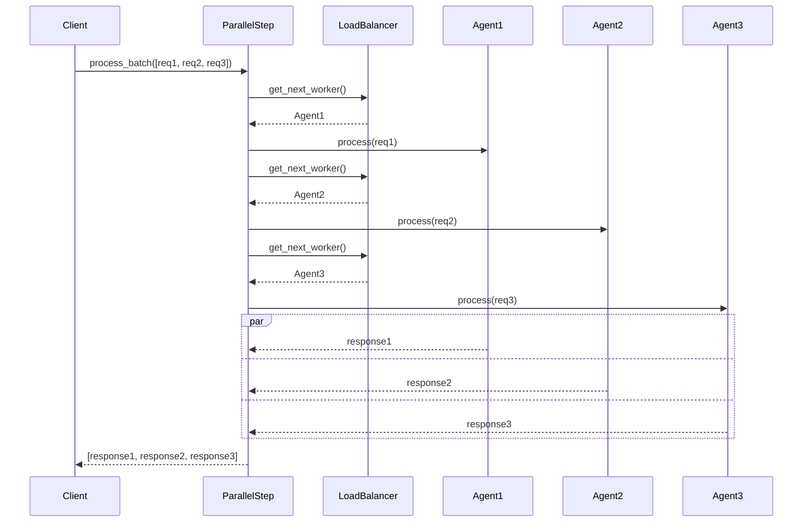
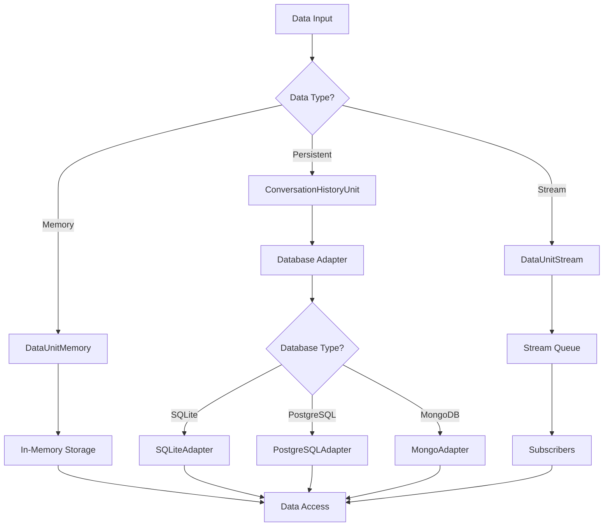

# NanoBrain Library Architecture

This document provides a comprehensive overview of the NanoBrain Library architecture, design patterns, and component interactions. It serves as a technical reference for developers working with or extending the library.

## Table of Contents

- [Overview](#overview)
- [Core Architecture](#core-architecture)
- [Component Hierarchy](#component-hierarchy)
- [Data Flow Patterns](#data-flow-patterns)
- [Design Patterns](#design-patterns)
- [Infrastructure Components](#infrastructure-components)
- [Agent System](#agent-system)
- [Workflow Orchestration](#workflow-orchestration)
- [Performance Considerations](#performance-considerations)
- [Security Architecture](#security-architecture)
- [Extensibility](#extensibility)

## Overview

The NanoBrain Library is built on a modular, event-driven architecture that emphasizes:

- **Modularity**: Components are loosely coupled and highly cohesive
- **Scalability**: Horizontal and vertical scaling capabilities
- **Extensibility**: Plugin-based architecture for custom components
- **Performance**: Async/await throughout with parallel processing
- **Reliability**: Comprehensive error handling and recovery mechanisms

### Package Structure

The NanoBrain framework is organized as a proper Python package:

```
nanobrain/
├── core/                    # Core framework components
│   ├── agent.py            # Base agent classes
│   ├── data_unit.py        # Data management
│   ├── executor.py         # Execution engines (including ParslExecutor)
│   ├── logging_system.py   # Logging and monitoring
│   └── ...
├── library/                # High-level library components (imports disabled)
│   ├── agents/             # Enhanced agent implementations
│   │   ├── conversational/ # Conversational agents
│   │   └── specialized/    # Specialized agents
│   ├── workflows/          # Complete workflow implementations
│   └── infrastructure/     # Infrastructure components
├── config/                 # Configuration management
└── __init__.py            # Main package exports

# Import examples (current working imports):
from nanobrain.core.agent import ConversationalAgent
from nanobrain.core.executor import ParslExecutor

# Library imports require full paths (library imports disabled in __init__.py):
from nanobrain.library.agents.conversational import EnhancedCollaborativeAgent
from nanobrain.library.workflows.chat_workflow.chat_workflow import ChatWorkflow
```

**Important**: The `nanobrain.library` imports are currently disabled in the main `__init__.py` file. To use library components, you must import them using their full module paths.

### Currently Available Components

**Core Components (directly importable from nanobrain):**
- `ConversationalAgent`, `AgentConfig`
- `DataUnitMemory`, `DataUnitConfig`
- `LocalExecutor`, `ParslExecutor`, `ExecutorConfig`
- `Step`, `StepConfig`
- `DataUpdatedTrigger`, `TriggerConfig`
- `DirectLink`, `LinkConfig`

**Library Components (require full module paths):**
- `nanobrain.library.agents.conversational.EnhancedCollaborativeAgent`
- `nanobrain.library.workflows.chat_workflow.chat_workflow.ChatWorkflow`

### Architectural Principles

1. **Separation of Concerns**: Each component has a single, well-defined responsibility
2. **Dependency Inversion**: High-level modules don't depend on low-level modules
3. **Interface Segregation**: Clients depend only on interfaces they use
4. **Open/Closed Principle**: Open for extension, closed for modification
5. **Single Responsibility**: Each class has one reason to change

## Core Architecture



### Layer Responsibilities

**Application Layer**:
- User interfaces (CLI, Web, API)
- Application-specific logic
- Configuration management
- Entry points

**Library Layer**:
- High-level abstractions
- Workflow orchestration
- Enhanced agents
- Infrastructure services

**Core Layer**:
- Fundamental building blocks
- Execution framework
- Logging and monitoring
- Protocol implementations

**External Systems**:
- AI model APIs
- Database systems
- Caching layers
- Message queues

## Component Hierarchy

### Data Management Hierarchy



### Agent System Hierarchy



### Parallel Processing Hierarchy



## Data Flow Patterns

### Request Processing Flow



### Parallel Processing Flow



### Data Persistence Flow



## Design Patterns

### 1. Factory Pattern

Used for creating components based on configuration:

```python
class ComponentFactory:
    @staticmethod
    def create_data_unit(config: DataUnitConfig) -> DataUnitBase:
        if config.data_type == "memory":
            return DataUnitMemory(config)
        elif config.data_type == "conversation_history":
            return ConversationHistoryUnit(config)
        elif config.data_type == "stream":
            return DataUnitStream(config)
        else:
            raise ValueError(f"Unknown data unit type: {config.data_type}")
    
    @staticmethod
    def create_agent(config: AgentConfig) -> Agent:
        if config.agent_type == "conversational":
            return ConversationalAgent(config)
        elif config.agent_type == "collaborative":
            return CollaborativeAgent(config)
        else:
            raise ValueError(f"Unknown agent type: {config.agent_type}")
```

### 2. Strategy Pattern

Used for load balancing and delegation strategies:

```python
class LoadBalancingStrategy:
    def get_next_worker(self, workers: List[Worker]) -> Worker:
        raise NotImplementedError

class RoundRobinStrategy(LoadBalancingStrategy):
    def __init__(self):
        self.current_index = 0
    
    def get_next_worker(self, workers: List[Worker]) -> Worker:
        worker = workers[self.current_index]
        self.current_index = (self.current_index + 1) % len(workers)
        return worker

class FastestResponseStrategy(LoadBalancingStrategy):
    def __init__(self):
        self.response_times = {}
    
    def get_next_worker(self, workers: List[Worker]) -> Worker:
        return min(workers, key=lambda w: self.response_times.get(w.id, 0))
```

### 3. Observer Pattern

Used for event handling and monitoring:

```python
class EventObserver:
    async def on_event(self, event: Event) -> None:
        raise NotImplementedError

class PerformanceMonitor(EventObserver):
    async def on_event(self, event: Event) -> None:
        if event.type == EventType.AGENT_RESPONSE:
            await self.record_response_time(event.data)
        elif event.type == EventType.ERROR:
            await self.record_error(event.data)

class EventPublisher:
    def __init__(self):
        self.observers: List[EventObserver] = []
    
    def add_observer(self, observer: EventObserver) -> None:
        self.observers.append(observer)
    
    async def publish_event(self, event: Event) -> None:
        for observer in self.observers:
            await observer.on_event(event)
```

### 4. Adapter Pattern

Used for database and protocol integration:

```python
class DatabaseAdapter:
    async def execute_query(self, query: str) -> Any:
        raise NotImplementedError

class SQLiteAdapter(DatabaseAdapter):
    def __init__(self, database_path: str):
        self.database_path = database_path
        self.connection = None
    
    async def execute_query(self, query: str) -> Any:
        # SQLite-specific implementation
        pass

class PostgreSQLAdapter(DatabaseAdapter):
    def __init__(self, connection_string: str):
        self.connection_string = connection_string
        self.pool = None
    
    async def execute_query(self, query: str) -> Any:
        # PostgreSQL-specific implementation
        pass
```

### 5. Mixin Pattern

Used for protocol support and feature enhancement:

```python
class MCPSupportMixin:
    def __init__(self, *args, **kwargs):
        super().__init__(*args, **kwargs)
        self.mcp_client = None
    
    async def initialize_mcp(self, config_path: str = None) -> None:
        self.mcp_client = MCPClient(config_path)
        await self.mcp_client.initialize()
    
    async def call_mcp_tool(self, tool_name: str, arguments: Dict[str, Any]) -> Any:
        if not self.mcp_client:
            raise RuntimeError("MCP not initialized")
        return await self.mcp_client.call_tool(tool_name, arguments)

class EnhancedAgent(MCPSupportMixin, A2ASupportMixin, ConversationalAgent):
    def __init__(self, config: AgentConfig, **kwargs):
        super().__init__(config, **kwargs)
```

## Infrastructure Components

### Data Management

**Data Units**: Provide abstraction over different storage backends
- **Memory**: Fast, temporary storage
- **Database**: Persistent, queryable storage
- **Stream**: Real-time data flow with subscriptions

**Database Interfaces**: Adapter pattern for different databases
- **SQLite**: Lightweight, file-based
- **PostgreSQL**: Full-featured relational database
- **MongoDB**: Document-based NoSQL

### Parallel Processing

**Load Balancing**: Distribute work across multiple workers
- **Round Robin**: Simple, fair distribution
- **Fastest Response**: Performance-based distribution
- **Least Connections**: Connection-based distribution

**Worker Management**: Handle worker lifecycle and health
- **Health Monitoring**: Track worker status
- **Auto-scaling**: Add/remove workers based on load
- **Failure Recovery**: Handle worker failures gracefully

### Communication

**Protocol Support**: Multiple communication protocols
- **MCP (Model Context Protocol)**: Tool calling and context sharing
- **A2A (Agent-to-Agent)**: Direct agent communication
- **HTTP/REST**: Standard web APIs
- **WebSocket**: Real-time bidirectional communication

## Agent System

### Agent Types

**ConversationalAgent**: Basic chat functionality
- Maintains conversation history
- Supports system prompts
- Handles tool calling

**CollaborativeAgent**: Advanced multi-agent coordination
- Delegation rules and strategies
- Performance tracking
- Load balancing across agents

**SpecializedAgent**: Domain-specific functionality
- Custom processing logic
- Specialized tool sets
- Domain knowledge integration

### Agent Capabilities

**Tool Integration**: Seamless tool calling
- Function tools (Python functions)
- Agent tools (other agents)
- External API tools
- Custom tool implementations

**Context Management**: Intelligent context handling
- Conversation history
- Session persistence
- Context compression
- Relevance filtering

**Performance Optimization**: Efficient processing
- Response caching
- Parallel processing
- Resource pooling
- Memory management

## Workflow Orchestration

### Workflow Components

**Steps**: Individual processing units
- Input/output data units
- Trigger-based execution
- Error handling and recovery
- Performance monitoring

**Links**: Data flow connections
- Direct data transfer
- Transformation pipelines
- Conditional routing
- Error propagation

**Triggers**: Execution control
- Data-driven triggers
- Time-based triggers
- Manual triggers
- Composite triggers

### Orchestration Patterns

**Sequential Processing**: Step-by-step execution
```python
step1 -> step2 -> step3 -> output
```

**Parallel Processing**: Concurrent execution
```python
input -> [step1, step2, step3] -> merge -> output
```

**Conditional Processing**: Decision-based routing
```python
input -> decision -> {step1 | step2 | step3} -> output
```

**Pipeline Processing**: Stream-based processing
```python
input_stream -> transform1 -> transform2 -> output_stream
```

## Performance Considerations

### Scalability Strategies

**Horizontal Scaling**: Multiple instances
- Load balancing across instances
- Shared state management
- Service discovery
- Health monitoring

**Vertical Scaling**: Resource optimization
- Memory management
- CPU utilization
- I/O optimization
- Caching strategies

### Performance Optimization

**Caching**: Multiple caching layers
- Response caching
- Context caching
- Database query caching
- Static resource caching

**Connection Pooling**: Efficient resource usage
- Database connection pools
- HTTP connection pools
- Agent instance pools
- Tool connection pools

**Async Processing**: Non-blocking operations
- Async/await throughout
- Event-driven architecture
- Non-blocking I/O
- Concurrent processing

### Monitoring and Metrics

**Performance Metrics**: Key performance indicators
- Response times
- Throughput rates
- Error rates
- Resource utilization

**Health Monitoring**: System health tracking
- Component status
- Resource availability
- Error tracking
- Performance degradation

**Alerting**: Proactive issue detection
- Threshold-based alerts
- Anomaly detection
- Escalation procedures
- Recovery automation

## Security Architecture

### Authentication and Authorization

**Authentication**: Identity verification
- API key authentication
- JWT token authentication
- OAuth 2.0 integration
- Multi-factor authentication

**Authorization**: Access control
- Role-based access control (RBAC)
- Attribute-based access control (ABAC)
- Resource-level permissions
- API endpoint protection

### Data Security

**Encryption**: Data protection
- Data at rest encryption
- Data in transit encryption
- Key management
- Certificate management

**Privacy**: Data privacy protection
- PII detection and masking
- Data anonymization
- Consent management
- Data retention policies

### Security Monitoring

**Audit Logging**: Security event tracking
- Authentication events
- Authorization events
- Data access events
- Configuration changes

**Threat Detection**: Security threat identification
- Anomaly detection
- Pattern recognition
- Behavioral analysis
- Automated response

## Extensibility

### Plugin Architecture

**Plugin Interface**: Standard plugin contract
```python
class PluginInterface:
    def initialize(self, config: Dict[str, Any]) -> None:
        pass
    
    def process(self, data: Any) -> Any:
        pass
    
    def shutdown(self) -> None:
        pass
```

**Plugin Types**: Different plugin categories
- **Data Unit Plugins**: Custom storage backends
- **Agent Plugins**: Specialized agent types
- **Tool Plugins**: Custom tool implementations
- **Protocol Plugins**: New communication protocols

### Custom Components

**Custom Data Units**: Specialized storage
```python
class CustomDataUnit(DataUnitBase):
    async def get(self) -> Any:
        # Custom retrieval logic
        pass
    
    async def set(self, data: Any) -> None:
        # Custom storage logic
        pass
```

**Custom Agents**: Domain-specific agents
```python
class DomainSpecificAgent(ConversationalAgent):
    async def process(self, input_text: str, **kwargs) -> str:
        # Domain-specific processing
        pass
```

**Custom Workflows**: Specialized orchestration
```python
class CustomWorkflow(WorkflowBase):
    async def execute(self, input_data: Any) -> Any:
        # Custom workflow logic
        pass
```

### Integration Points

**External Systems**: Third-party integration
- Database systems
- Message queues
- Monitoring systems
- Authentication providers

**API Extensions**: Custom API endpoints
- REST API extensions
- GraphQL schema extensions
- WebSocket handlers
- Custom protocols

**Configuration Extensions**: Dynamic configuration
- Environment-based configuration
- Runtime configuration updates
- Feature flags
- A/B testing support

---

This architecture document provides a comprehensive overview of the NanoBrain Library's design and implementation. It serves as a reference for understanding the system's structure, patterns, and extensibility points.

For implementation details, see the [API Reference](API_REFERENCE.md) and [Getting Started Guide](LIBRARY_GETTING_STARTED.md). 