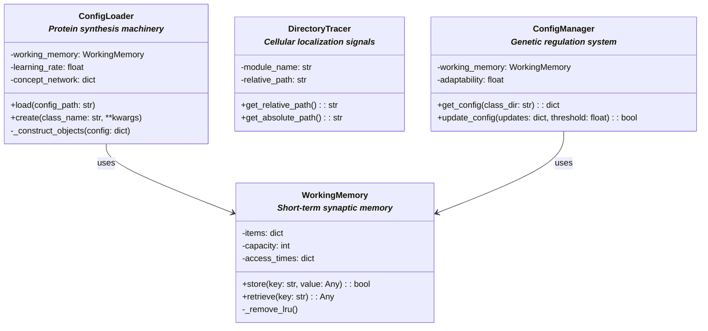
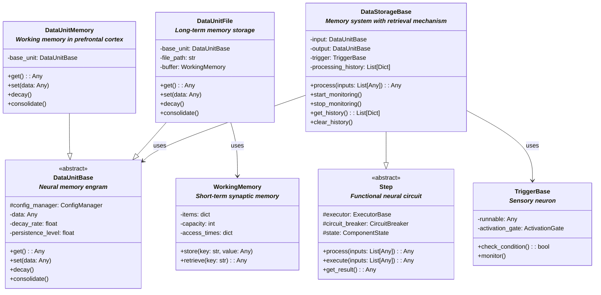
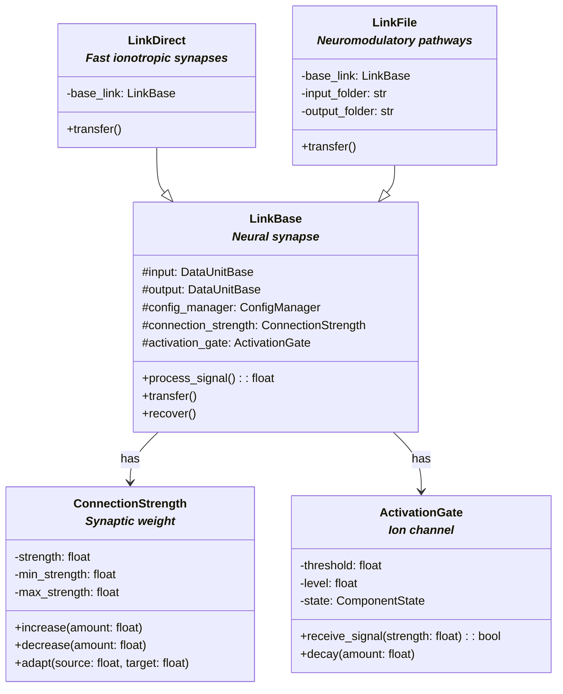
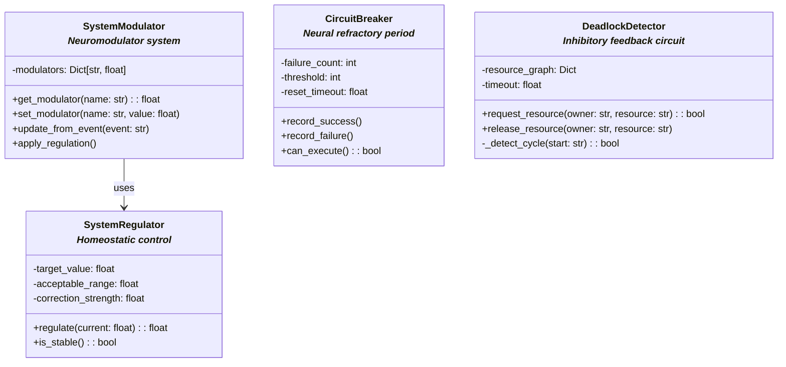
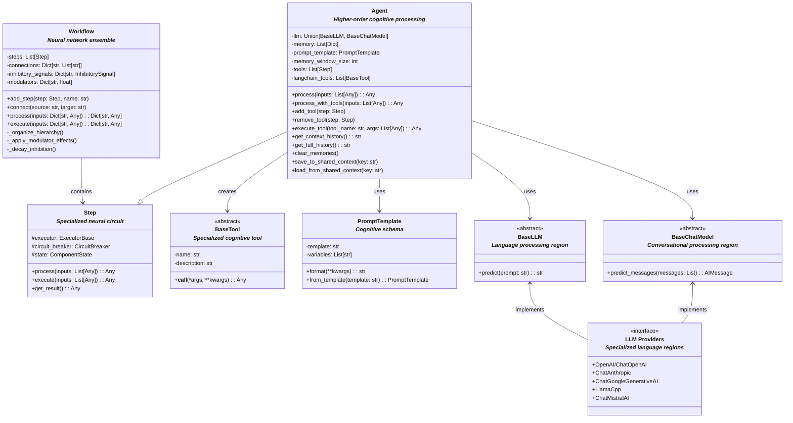
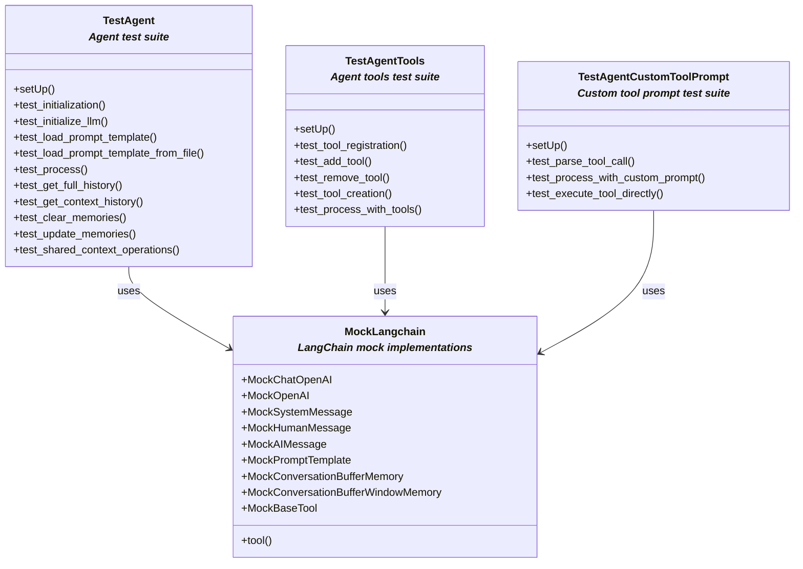

# Framework UML Diagrams

This document contains UML class diagrams for the NanoBrain framework, split into logical components.

## Project Structure

```mermaid
graph TD
    Root[NanoBrain Root]
    Src[src/]
    Test[test/]
    Prompts[prompts/]
    Docs[docs/]
    DefaultConfigs[default_configs/]
    
    Root --> Src
    Root --> Test
    Root --> Prompts
    Root --> Docs
    Root --> DefaultConfigs
    
    Src --> CoreClasses["Core Classes<br>(ConfigManager, DirectoryTracer, etc.)"]
    Src --> DataClasses["Data Classes<br>(DataUnitBase, DataUnitMemory, etc.)"]
    Src --> LinkClasses["Link Classes<br>(LinkBase, LinkDirect, etc.)"]
    Src --> ExecutionClasses["Execution Classes<br>(Runner, Router, etc.)"]
    Src --> AgentClasses["Agent Classes<br>(Agent, Step, Workflow, etc.)"]
    
    Test --> TestFiles["Test Files<br>(test_agent.py, test_workflow.py, etc.)"]
    Test --> MockFiles["Mock Files<br>(mock_langchain.py)"]
    Test --> TestConfigs["Test Configs<br>(test_default_configs/)"]
    
    Prompts --> PromptTemplates["Prompt Templates<br>(templates.py)"]
    Prompts --> ToolCallingPrompt["Tool Calling Prompt<br>(tool_calling_prompt.py)"]
    
    Docs --> UMLDiagrams["UML Diagrams<br>(UML.md)"]
    Docs --> ToolCallingDocs["Tool Calling Docs<br>(tool_calling.md, tool_calling_summary.md)"]
```

## 1. Core Foundation and Configuration

## 2. Data Storage and Memory

## 3. Connection and Links

## 4. Execution and Control

## 5. Regulation and Control

## 6. Agent and Tool Calling

## 7. Testing Structure

## Legend

The diagrams use standard UML notation:
- Inheritance: Solid arrow with triangle (--|>)
- Implementation: Dashed arrow with triangle (..|>)
- Composition/Usage: Solid arrow with diamond (-->)
- Abstract classes: Marked with <<abstract>>
- Interfaces: Marked with <<interface>>
- Biological analogies: Shown in italic text below class names

## Notes

1. The project is now organized into three main directories:
   - `src/`: Contains all source code files
   - `test/`: Contains all test files and mock implementations
   - `prompts/`: Contains prompt templates and tool calling prompts

2. Each diagram focuses on a specific aspect of the framework while showing clear relationships between components.

3. The diagrams are organized to show the hierarchical nature of the framework, from core foundation to specialized components.

4. Biological analogies are maintained in the relationships between components, mirroring natural neural systems.

5. The Agent class now includes tool calling capabilities, allowing it to use other Step objects as tools to perform specific tasks.

6. The Agent class supports multiple LLM providers (OpenAI, Anthropic, Google, Meta/Llama, Mistral) and can work with both chat-based models (BaseChatModel) and completion-based models (BaseLLM). 