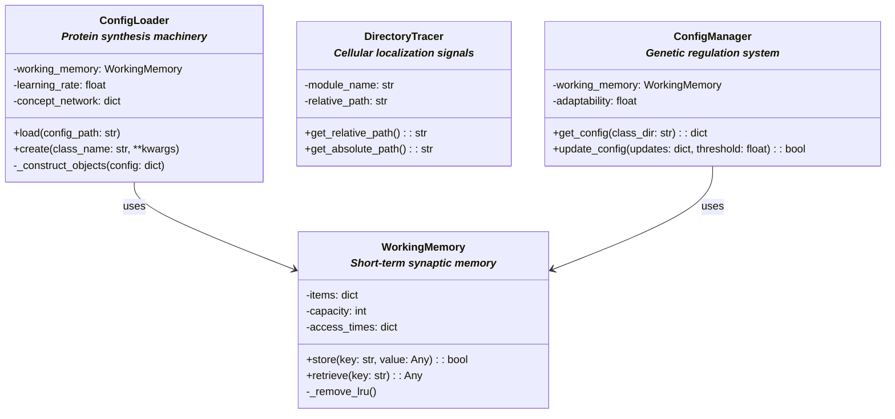
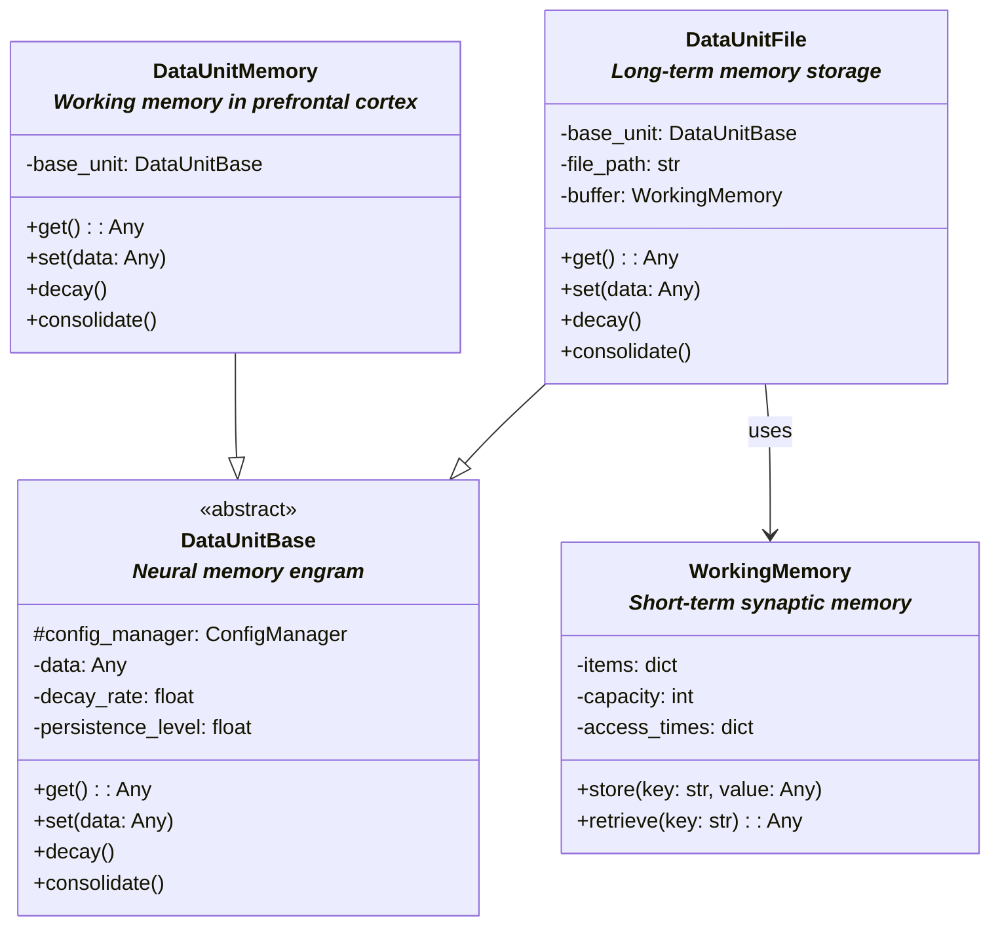
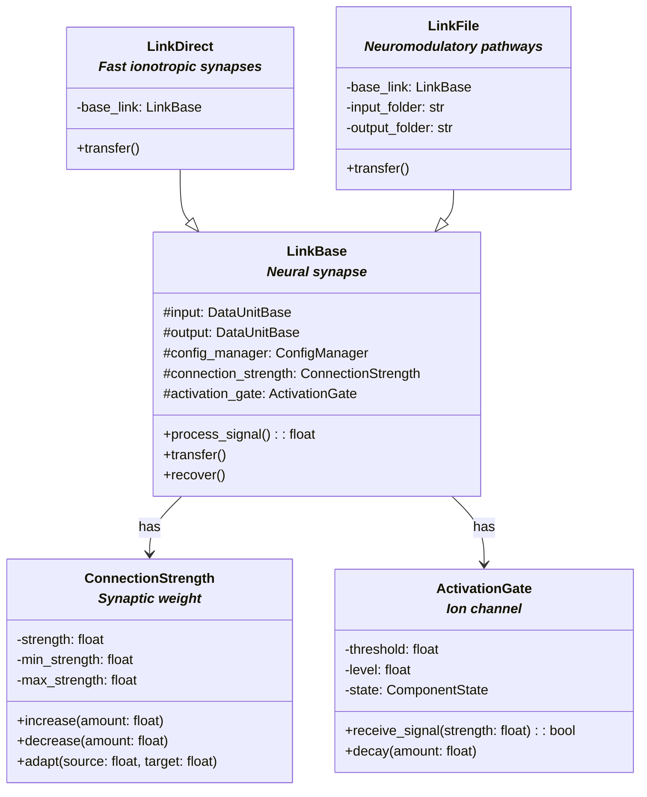
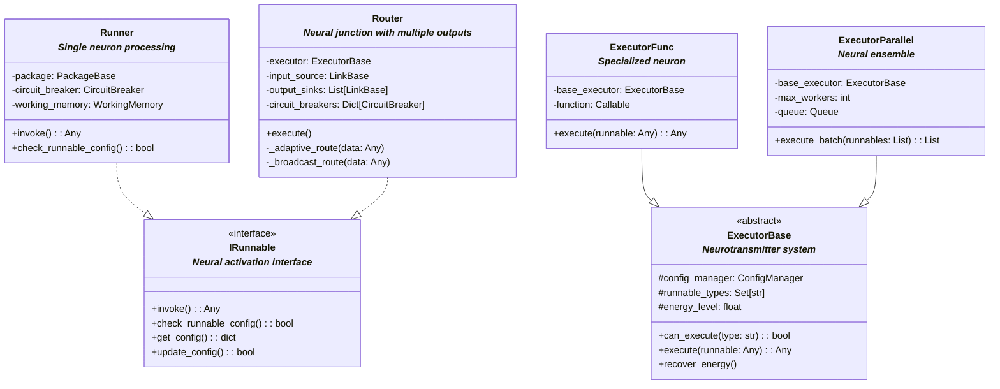
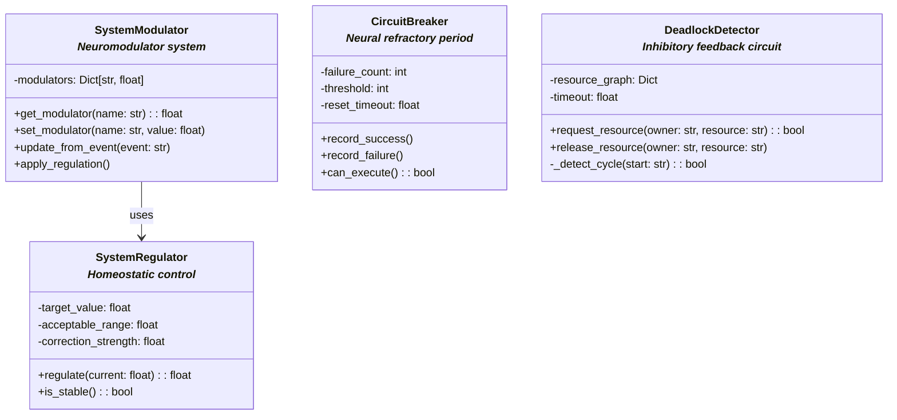

# Framework UML Diagrams

This document contains UML class diagrams for the NanoBrain framework, split into logical components.

## 1. Core Foundation and Configuration

## 2. Data Storage and Memory

## 3. Connection and Links

## 4. Execution and Control

## 5. Regulation and Control

## Legend

The diagrams use standard UML notation:
- Inheritance: Solid arrow with triangle (--|>)
- Implementation: Dashed arrow with triangle (..|>)
- Composition/Usage: Solid arrow with diamond (-->)
- Abstract classes: Marked with <<abstract>>
- Interfaces: Marked with <<interface>>
- Biological analogies: Shown in italic text below class names

## Notes

1. Each diagram focuses on a specific aspect of the framework while showing clear relationships between components.
2. The diagrams are organized to show the hierarchical nature of the framework, from core foundation to specialized components.
3. Biological analogies are maintained in the relationships between components, mirroring natural neural systems.
4. The separation into different diagrams helps manage complexity while maintaining clarity of relationships within each subsystem. 