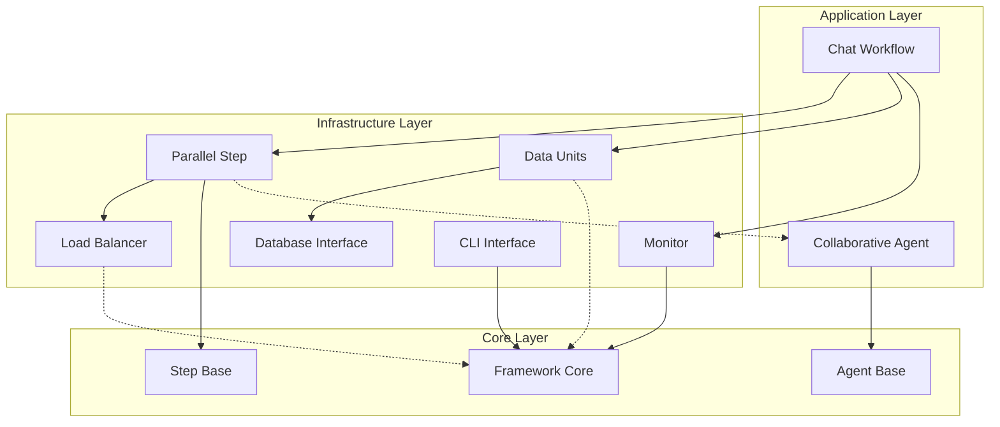
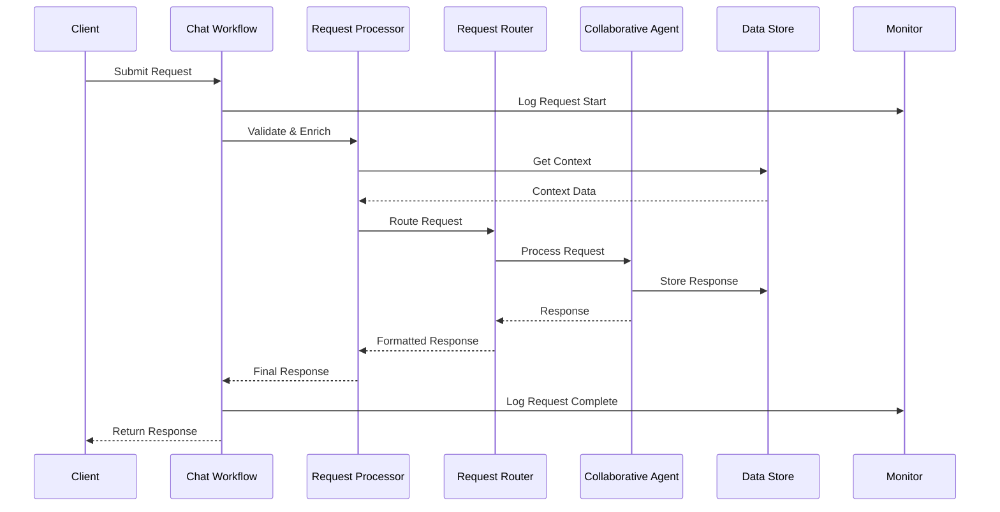
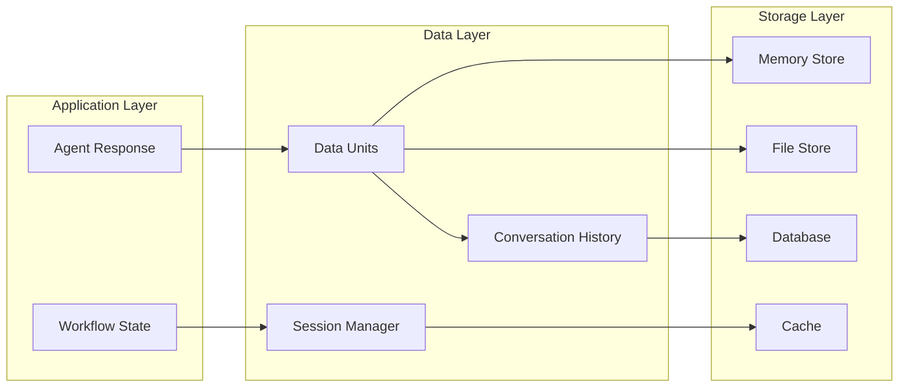
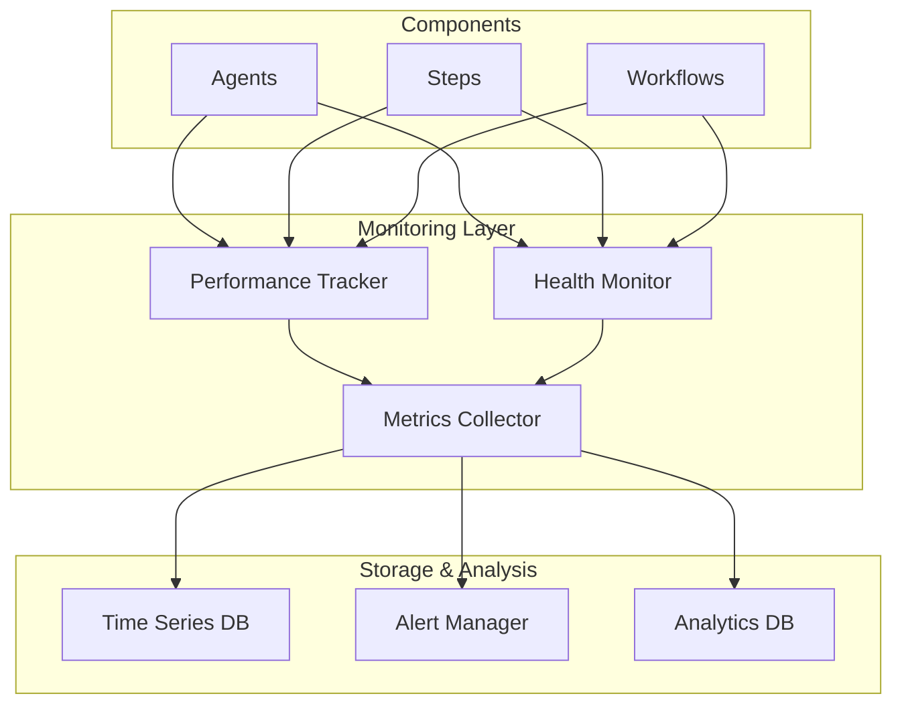

# NanoBrain Library Architecture

This document provides a comprehensive overview of the NanoBrain Library architecture, design principles, and component interactions. It serves as a guide for understanding the system's structure and for making architectural decisions.

## Table of Contents

- [Overview](#overview)
- [Design Principles](#design-principles)
- [System Architecture](#system-architecture)
- [Component Architecture](#component-architecture)
- [Data Flow](#data-flow)
- [Integration Patterns](#integration-patterns)
- [Scalability Considerations](#scalability-considerations)
- [Security Architecture](#security-architecture)
- [Performance Architecture](#performance-architecture)
- [Deployment Architecture](#deployment-architecture)

## Overview

The NanoBrain Library follows a layered, modular architecture that promotes separation of concerns, reusability, and maintainability. The architecture is designed to support complex AI workflows while maintaining flexibility and performance.

### Key Architectural Goals

1. **Modularity**: Components are loosely coupled and highly cohesive
2. **Scalability**: System can handle increasing loads through horizontal and vertical scaling
3. **Reliability**: Fault tolerance and graceful degradation under failure conditions
4. **Performance**: Optimized for low latency and high throughput
5. **Maintainability**: Clear interfaces and separation of concerns
6. **Extensibility**: Easy to add new components and capabilities

## Design Principles

### 1. Separation of Concerns

Each module has a single, well-defined responsibility:

```
Infrastructure Layer:
├── Data Management      → Data storage and retrieval
├── Interfaces          → External system integration
├── Steps               → Processing orchestration
├── Load Balancing      → Request distribution
└── Monitoring          → System observability

Application Layer:
├── Agents              → AI processing and collaboration
└── Workflows           → Business logic orchestration

Core Layer:
└── Framework           → Base abstractions and contracts
```

### 2. Dependency Inversion

High-level modules depend on abstractions, not concrete implementations:

```python
# High-level workflow depends on abstract interfaces
class ChatWorkflow:
    def __init__(
        self,
        data_store: DataStoreInterface,      # Abstract interface
        agent_pool: AgentPoolInterface,      # Abstract interface
        monitor: MonitorInterface            # Abstract interface
    ):
        self.data_store = data_store
        self.agent_pool = agent_pool
        self.monitor = monitor

# Concrete implementations are injected
workflow = ChatWorkflow(
    data_store=PostgreSQLDataStore(),        # Concrete implementation
    agent_pool=ParallelAgentPool(),          # Concrete implementation
    monitor=PrometheusMonitor()              # Concrete implementation
)
```

### 3. Interface Segregation

Interfaces are focused and client-specific:

```python
# Focused interfaces for specific use cases
class ReadOnlyDataInterface:
    async def get(self, key: str) -> Any: ...
    async def exists(self, key: str) -> bool: ...

class WriteOnlyDataInterface:
    async def set(self, key: str, value: Any) -> None: ...
    async def delete(self, key: str) -> None: ...

class StreamingDataInterface:
    async def subscribe(self) -> AsyncIterator: ...
    async def publish(self, data: Any) -> None: ...
```

### 4. Open/Closed Principle

Components are open for extension but closed for modification:

```python
# Base load balancer is closed for modification
class LoadBalancer(ABC):
    @abstractmethod
    async def select_processor(self, processors: List[Processor]) -> Processor:
        pass

# But open for extension through inheritance
class CustomLoadBalancer(LoadBalancer):
    async def select_processor(self, processors: List[Processor]) -> Processor:
        # Custom selection logic
        return self.custom_selection_algorithm(processors)
```

## System Architecture

### High-Level Architecture

```
┌─────────────────────────────────────────────────────────────┐
│                    Application Layer                        │
├─────────────────────────────────────────────────────────────┤
│  ┌─────────────────┐  ┌─────────────────┐                  │
│  │    Workflows    │  │     Agents      │                  │
│  │                 │  │                 │                  │
│  │ • Chat Workflow │  │ • Collaborative │                  │
│  │ • Orchestration │  │ • Enhanced      │                  │
│  │ • Coordination  │  │ • Specialized   │                  │
│  └─────────────────┘  └─────────────────┘                  │
└─────────────────────────────────────────────────────────────┘
┌─────────────────────────────────────────────────────────────┐
│                  Infrastructure Layer                       │
├─────────────────────────────────────────────────────────────┤
│  ┌─────────┐ ┌─────────┐ ┌─────────┐ ┌─────────┐ ┌─────────┐│
│  │  Data   │ │Interface│ │  Steps  │ │Load Bal.│ │Monitor. ││
│  │         │ │         │ │         │ │         │ │         ││
│  │• Memory │ │• DB     │ │• Parallel│ │• Strat. │ │• Metrics││
│  │• File   │ │• CLI    │ │• Agent  │ │• Circuit│ │• Health ││
│  │• Stream │ │• API    │ │• Custom │ │• Breaker│ │• Alerts ││
│  └─────────┘ └─────────┘ └─────────┘ └─────────┘ └─────────┘│
└─────────────────────────────────────────────────────────────┘
┌─────────────────────────────────────────────────────────────┐
│                      Core Layer                             │
├─────────────────────────────────────────────────────────────┤
│  ┌─────────────────────────────────────────────────────────┐ │
│  │              NanoBrain Framework                        │ │
│  │                                                         │ │
│  │ • Base Classes    • Interfaces    • Common Utilities    │ │
│  │ • Data Units      • Steps         • Configuration       │ │
│  │ • Agents          • Triggers      • Logging             │ │
│  │ • Executors       • Links         • Error Handling      │ │
│  └─────────────────────────────────────────────────────────┘ │
└─────────────────────────────────────────────────────────────┘
```

### Component Interaction Diagram



## Component Architecture

### Infrastructure Components

#### Data Management Architecture

```
Data Infrastructure
├── Abstractions
│   ├── DataUnitBase           # Core data interface
│   ├── DataUnitConfig         # Configuration management
│   └── DataUnitFactory        # Creation patterns
├── Implementations
│   ├── DataUnitMemory         # In-memory storage
│   ├── DataUnitFile           # File-based storage
│   ├── DataUnitStream         # Streaming data
│   └── DataUnitString         # String operations
├── Specialized
│   ├── ConversationHistory    # Chat persistence
│   ├── SessionManager         # Session lifecycle
│   └── ExportManager          # Data export/import
└── Interfaces
    ├── DatabaseInterface      # Database abstraction
    ├── SQLInterface           # SQL operations
    └── NoSQLInterface         # NoSQL operations
```

**Design Patterns Used:**
- **Factory Pattern**: For creating appropriate data unit types
- **Strategy Pattern**: For different storage backends
- **Observer Pattern**: For data change notifications
- **Adapter Pattern**: For database interface abstraction

#### Parallel Processing Architecture

```
Parallel Processing
├── Core Framework
│   ├── ParallelStep           # Generic parallel processing
│   ├── ProcessorPool          # Processor management
│   └── RequestQueue           # Request queuing
├── Specializations
│   ├── ParallelAgentStep      # Agent-specific processing
│   └── ParallelConversationalAgentStep  # Chat processing
├── Load Balancing
│   ├── LoadBalancer           # Abstract load balancer
│   ├── RoundRobinBalancer     # Round-robin strategy
│   ├── LeastLoadedBalancer    # Least loaded strategy
│   └── FastestResponseBalancer # Performance-based strategy
├── Fault Tolerance
│   ├── CircuitBreaker         # Circuit breaker pattern
│   ├── RetryPolicy            # Retry mechanisms
│   └── HealthChecker          # Health monitoring
└── Performance
    ├── PerformanceTracker     # Metrics collection
    ├── ResourceMonitor        # Resource usage tracking
    └── Optimizer              # Performance optimization
```

**Design Patterns Used:**
- **Template Method**: For parallel processing workflow
- **Strategy Pattern**: For load balancing algorithms
- **Circuit Breaker Pattern**: For fault tolerance
- **Observer Pattern**: For performance monitoring

### Agent Architecture

#### Enhanced Agent System

```
Enhanced Agents
├── Base Components
│   ├── CollaborativeAgent     # Multi-protocol agent
│   ├── ProtocolMixin          # Protocol support
│   └── AgentRegistry          # Service discovery
├── Protocol Support
│   ├── A2AProtocolMixin       # Agent-to-agent communication
│   ├── MCPProtocolMixin       # Model context protocol
│   └── CustomProtocolMixin    # Extensible protocols
├── Delegation
│   ├── DelegationEngine       # Task routing
│   ├── DelegationRule         # Routing rules
│   └── PerformanceDelegation  # Performance-based routing
├── Management
│   ├── ConversationManager    # Context management
│   ├── PerformanceTracker     # Agent metrics
│   └── AgentPool              # Agent pooling
└── Optimization
    ├── PerformanceOptimizer   # Automatic optimization
    ├── CacheManager           # Response caching
    └── ResourceManager        # Resource allocation
```

**Design Patterns Used:**
- **Mixin Pattern**: For protocol support composition
- **Strategy Pattern**: For delegation strategies
- **Registry Pattern**: For agent discovery
- **Pool Pattern**: For agent resource management

### Workflow Architecture

#### Chat Workflow System

```
Chat Workflow
├── Orchestration
│   ├── ChatWorkflowOrchestrator  # Main coordinator
│   ├── WorkflowEngine            # Execution engine
│   └── StepCoordinator           # Step management
├── Request Processing
│   ├── RequestProcessor          # Processing pipeline
│   ├── InputValidator            # Input validation
│   ├── ContextEnricher           # Context enhancement
│   └── RequestRouter             # Request routing
├── Response Processing
│   ├── ResponseAggregator        # Response collection
│   ├── ResponseFormatter         # Response formatting
│   └── StreamingHandler          # Real-time streaming
├── Session Management
│   ├── SessionStore              # Session persistence
│   ├── ContextManager            # Context management
│   └── UserPreferences           # User preference management
└── Monitoring
    ├── WorkflowMonitor           # Workflow monitoring
    ├── HealthChecker             # Health monitoring
    └── MetricsCollector          # Metrics collection
```

**Design Patterns Used:**
- **Orchestrator Pattern**: For workflow coordination
- **Pipeline Pattern**: For request processing
- **Aggregator Pattern**: For response collection
- **State Pattern**: For session management

## Data Flow

### Request Processing Flow



### Data Persistence Flow



### Monitoring Data Flow



## Integration Patterns

### Plugin Architecture

The library supports extensible plugin architecture for adding new capabilities:

```python
# Plugin interface
class PluginInterface(ABC):
    @abstractmethod
    async def initialize(self, config: Dict[str, Any]) -> None:
        pass
    
    @abstractmethod
    async def process(self, data: Any) -> Any:
        pass
    
    @abstractmethod
    async def shutdown(self) -> None:
        pass

# Plugin registry
class PluginRegistry:
    def __init__(self):
        self._plugins: Dict[str, PluginInterface] = {}
    
    def register_plugin(self, name: str, plugin: PluginInterface):
        self._plugins[name] = plugin
    
    async def load_plugins(self, plugin_configs: Dict[str, Dict]):
        for name, config in plugin_configs.items():
            if name in self._plugins:
                await self._plugins[name].initialize(config)

# Usage in components
class ExtensibleComponent:
    def __init__(self, plugin_registry: PluginRegistry):
        self.plugins = plugin_registry
    
    async def process_with_plugins(self, data: Any) -> Any:
        # Apply pre-processing plugins
        for plugin in self.plugins.get_pre_processors():
            data = await plugin.process(data)
        
        # Main processing
        result = await self.main_process(data)
        
        # Apply post-processing plugins
        for plugin in self.plugins.get_post_processors():
            result = await plugin.process(result)
        
        return result
```

### Event-Driven Architecture

Components communicate through events for loose coupling:

```python
# Event system
class EventBus:
    def __init__(self):
        self._handlers: Dict[str, List[Callable]] = defaultdict(list)
    
    def subscribe(self, event_type: str, handler: Callable):
        self._handlers[event_type].append(handler)
    
    async def publish(self, event: Event):
        handlers = self._handlers.get(event.type, [])
        await asyncio.gather(*[handler(event) for handler in handlers])

# Event-driven component
class EventDrivenComponent:
    def __init__(self, event_bus: EventBus):
        self.event_bus = event_bus
        self.setup_event_handlers()
    
    def setup_event_handlers(self):
        self.event_bus.subscribe('request_received', self.handle_request)
        self.event_bus.subscribe('processing_complete', self.handle_completion)
    
    async def handle_request(self, event: Event):
        # Handle incoming request
        pass
    
    async def handle_completion(self, event: Event):
        # Handle processing completion
        pass
```

### Microservices Integration

Support for microservices deployment patterns:

```python
# Service discovery
class ServiceRegistry:
    async def register_service(self, service_info: ServiceInfo):
        pass
    
    async def discover_services(self, service_type: str) -> List[ServiceInfo]:
        pass
    
    async def health_check(self, service_id: str) -> bool:
        pass

# Service mesh integration
class ServiceMeshAdapter:
    def __init__(self, mesh_config: Dict[str, Any]):
        self.config = mesh_config
    
    async def call_service(self, service_name: str, request: Any) -> Any:
        # Service mesh routing and load balancing
        pass
    
    async def register_endpoints(self, endpoints: List[Endpoint]):
        # Register service endpoints with mesh
        pass
```

## Scalability Considerations

### Horizontal Scaling

Components are designed for horizontal scaling:

```python
# Scalable agent pool
class ScalableAgentPool:
    def __init__(self, scaling_policy: ScalingPolicy):
        self.scaling_policy = scaling_policy
        self.agents: List[Agent] = []
        self.load_balancer = LoadBalancer()
    
    async def scale_up(self, count: int):
        new_agents = await self.create_agents(count)
        self.agents.extend(new_agents)
        await self.load_balancer.add_processors(new_agents)
    
    async def scale_down(self, count: int):
        agents_to_remove = self.agents[-count:]
        self.agents = self.agents[:-count]
        await self.load_balancer.remove_processors(agents_to_remove)
        await self.shutdown_agents(agents_to_remove)
    
    async def auto_scale(self):
        current_load = await self.get_current_load()
        if current_load > self.scaling_policy.scale_up_threshold:
            await self.scale_up(self.scaling_policy.scale_up_count)
        elif current_load < self.scaling_policy.scale_down_threshold:
            await self.scale_down(self.scaling_policy.scale_down_count)
```

### Vertical Scaling

Resource optimization for vertical scaling:

```python
# Resource-aware processing
class ResourceAwareProcessor:
    def __init__(self, resource_limits: ResourceLimits):
        self.resource_limits = resource_limits
        self.resource_monitor = ResourceMonitor()
    
    async def process(self, request: Any) -> Any:
        # Check resource availability
        if not await self.has_sufficient_resources(request):
            await self.wait_for_resources()
        
        # Process with resource tracking
        with self.resource_monitor.track_usage():
            return await self.do_process(request)
    
    async def has_sufficient_resources(self, request: Any) -> bool:
        estimated_memory = self.estimate_memory_usage(request)
        estimated_cpu = self.estimate_cpu_usage(request)
        
        current_memory = await self.resource_monitor.get_memory_usage()
        current_cpu = await self.resource_monitor.get_cpu_usage()
        
        return (
            current_memory + estimated_memory < self.resource_limits.max_memory and
            current_cpu + estimated_cpu < self.resource_limits.max_cpu
        )
```

### Data Partitioning

Support for data partitioning and sharding:

```python
# Partitioned data store
class PartitionedDataStore:
    def __init__(self, partitioning_strategy: PartitioningStrategy):
        self.partitioning_strategy = partitioning_strategy
        self.partitions: Dict[str, DataStore] = {}
    
    async def get(self, key: str) -> Any:
        partition_id = self.partitioning_strategy.get_partition(key)
        partition = self.partitions[partition_id]
        return await partition.get(key)
    
    async def set(self, key: str, value: Any) -> None:
        partition_id = self.partitioning_strategy.get_partition(key)
        partition = self.partitions[partition_id]
        await partition.set(key, value)
    
    async def rebalance_partitions(self):
        # Rebalance data across partitions
        pass
```

## Security Architecture

### Authentication and Authorization

```python
# Security framework
class SecurityManager:
    def __init__(self, auth_provider: AuthProvider, authz_provider: AuthzProvider):
        self.auth_provider = auth_provider
        self.authz_provider = authz_provider
    
    async def authenticate(self, credentials: Credentials) -> AuthToken:
        return await self.auth_provider.authenticate(credentials)
    
    async def authorize(self, token: AuthToken, resource: str, action: str) -> bool:
        return await self.authz_provider.authorize(token, resource, action)

# Secure component wrapper
class SecureComponent:
    def __init__(self, component: Component, security_manager: SecurityManager):
        self.component = component
        self.security_manager = security_manager
    
    async def process(self, request: SecureRequest) -> Any:
        # Authenticate request
        if not await self.security_manager.authenticate(request.credentials):
            raise AuthenticationError("Invalid credentials")
        
        # Authorize action
        if not await self.security_manager.authorize(
            request.token, request.resource, request.action
        ):
            raise AuthorizationError("Insufficient permissions")
        
        # Process securely
        return await self.component.process(request.data)
```

### Data Encryption

```python
# Encryption service
class EncryptionService:
    def __init__(self, encryption_config: EncryptionConfig):
        self.config = encryption_config
        self.key_manager = KeyManager(encryption_config.key_config)
    
    async def encrypt(self, data: bytes, context: EncryptionContext) -> bytes:
        key = await self.key_manager.get_key(context.key_id)
        return await self.encrypt_with_key(data, key)
    
    async def decrypt(self, encrypted_data: bytes, context: EncryptionContext) -> bytes:
        key = await self.key_manager.get_key(context.key_id)
        return await self.decrypt_with_key(encrypted_data, key)

# Encrypted data unit
class EncryptedDataUnit(DataUnitBase):
    def __init__(self, base_unit: DataUnitBase, encryption_service: EncryptionService):
        self.base_unit = base_unit
        self.encryption_service = encryption_service
    
    async def set(self, data: Any) -> None:
        serialized_data = self.serialize(data)
        encrypted_data = await self.encryption_service.encrypt(
            serialized_data, self.encryption_context
        )
        await self.base_unit.set(encrypted_data)
    
    async def get(self) -> Any:
        encrypted_data = await self.base_unit.get()
        decrypted_data = await self.encryption_service.decrypt(
            encrypted_data, self.encryption_context
        )
        return self.deserialize(decrypted_data)
```

## Performance Architecture

### Caching Strategy

Multi-level caching for optimal performance:

```python
# Cache hierarchy
class CacheHierarchy:
    def __init__(self):
        self.l1_cache = MemoryCache(size=1000)      # Fast, small
        self.l2_cache = RedisCache(size=10000)      # Medium speed, medium size
        self.l3_cache = DatabaseCache(size=100000)  # Slower, large
    
    async def get(self, key: str) -> Any:
        # Try L1 cache first
        value = await self.l1_cache.get(key)
        if value is not None:
            return value
        
        # Try L2 cache
        value = await self.l2_cache.get(key)
        if value is not None:
            await self.l1_cache.set(key, value)  # Promote to L1
            return value
        
        # Try L3 cache
        value = await self.l3_cache.get(key)
        if value is not None:
            await self.l2_cache.set(key, value)  # Promote to L2
            await self.l1_cache.set(key, value)  # Promote to L1
            return value
        
        return None
    
    async def set(self, key: str, value: Any) -> None:
        # Set in all cache levels
        await asyncio.gather(
            self.l1_cache.set(key, value),
            self.l2_cache.set(key, value),
            self.l3_cache.set(key, value)
        )
```

### Connection Pooling

Efficient resource management:

```python
# Connection pool manager
class ConnectionPoolManager:
    def __init__(self):
        self.pools: Dict[str, ConnectionPool] = {}
    
    def create_pool(self, name: str, config: PoolConfig) -> ConnectionPool:
        pool = ConnectionPool(
            min_connections=config.min_connections,
            max_connections=config.max_connections,
            connection_factory=config.connection_factory
        )
        self.pools[name] = pool
        return pool
    
    async def get_connection(self, pool_name: str) -> Connection:
        pool = self.pools[pool_name]
        return await pool.acquire()
    
    async def return_connection(self, pool_name: str, connection: Connection):
        pool = self.pools[pool_name]
        await pool.release(connection)
```

## Deployment Architecture

### Container Architecture

Components are designed for containerized deployment:

```dockerfile
# Multi-stage build for optimized containers
FROM python:3.11-slim as builder
WORKDIR /app
COPY requirements.txt .
RUN pip install --no-cache-dir -r requirements.txt

FROM python:3.11-slim as runtime
WORKDIR /app
COPY --from=builder /usr/local/lib/python3.11/site-packages /usr/local/lib/python3.11/site-packages
COPY library/ ./library/
COPY config/ ./config/

# Health check endpoint
HEALTHCHECK --interval=30s --timeout=10s --start-period=5s --retries=3 \
  CMD python -c "import asyncio; from library.monitoring import health_check; asyncio.run(health_check())"

CMD ["python", "-m", "library.workflows.chat_workflow"]
```

### Kubernetes Deployment

```yaml
# Kubernetes deployment configuration
apiVersion: apps/v1
kind: Deployment
metadata:
  name: nanobrain-chat-workflow
spec:
  replicas: 3
  selector:
    matchLabels:
      app: nanobrain-chat-workflow
  template:
    metadata:
      labels:
        app: nanobrain-chat-workflow
    spec:
      containers:
      - name: chat-workflow
        image: nanobrain/chat-workflow:latest
        ports:
        - containerPort: 8080
        env:
        - name: DATABASE_URL
          valueFrom:
            secretKeyRef:
              name: nanobrain-secrets
              key: database-url
        resources:
          requests:
            memory: "512Mi"
            cpu: "250m"
          limits:
            memory: "1Gi"
            cpu: "500m"
        livenessProbe:
          httpGet:
            path: /health
            port: 8080
          initialDelaySeconds: 30
          periodSeconds: 10
        readinessProbe:
          httpGet:
            path: /ready
            port: 8080
          initialDelaySeconds: 5
          periodSeconds: 5
```

### Service Mesh Integration

```yaml
# Istio service mesh configuration
apiVersion: networking.istio.io/v1alpha3
kind: VirtualService
metadata:
  name: nanobrain-chat-workflow
spec:
  http:
  - match:
    - uri:
        prefix: /chat
    route:
    - destination:
        host: nanobrain-chat-workflow
        subset: v1
      weight: 90
    - destination:
        host: nanobrain-chat-workflow
        subset: v2
      weight: 10
    fault:
      delay:
        percentage:
          value: 0.1
        fixedDelay: 5s
    retries:
      attempts: 3
      perTryTimeout: 10s
```

## Conclusion

The NanoBrain Library architecture provides a robust, scalable, and maintainable foundation for building complex AI workflows. The modular design, clear separation of concerns, and comprehensive infrastructure support enable developers to build production-ready applications while maintaining flexibility and performance.

Key architectural benefits:

1. **Modularity**: Easy to understand, test, and maintain
2. **Scalability**: Supports both horizontal and vertical scaling
3. **Reliability**: Built-in fault tolerance and recovery mechanisms
4. **Performance**: Optimized for low latency and high throughput
5. **Security**: Comprehensive security framework
6. **Observability**: Extensive monitoring and metrics collection
7. **Extensibility**: Plugin architecture for custom functionality

This architecture serves as the foundation for all library components and provides guidance for future development and extensions.

---

*For implementation details, see the individual component documentation in their respective directories.* 