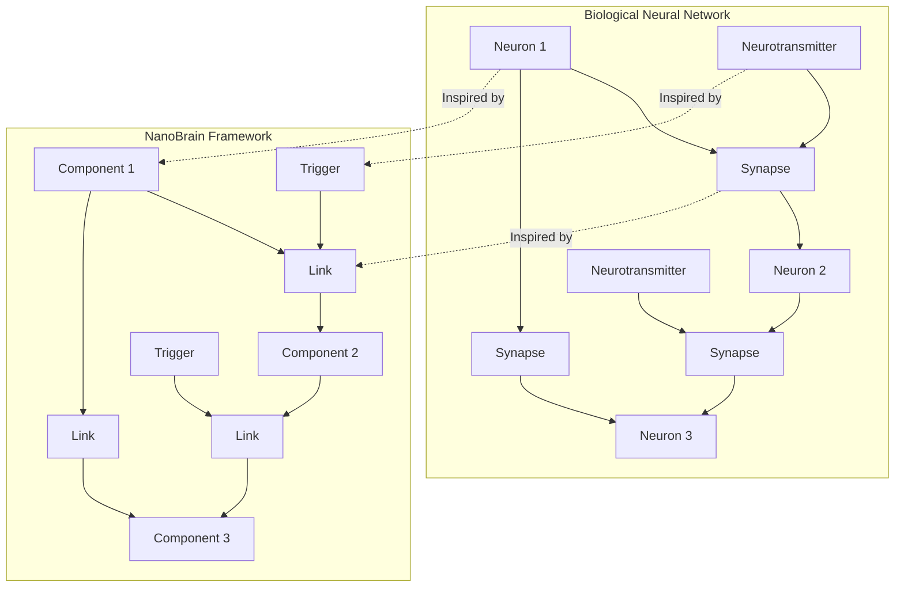
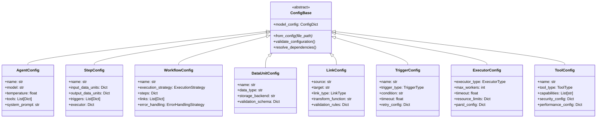
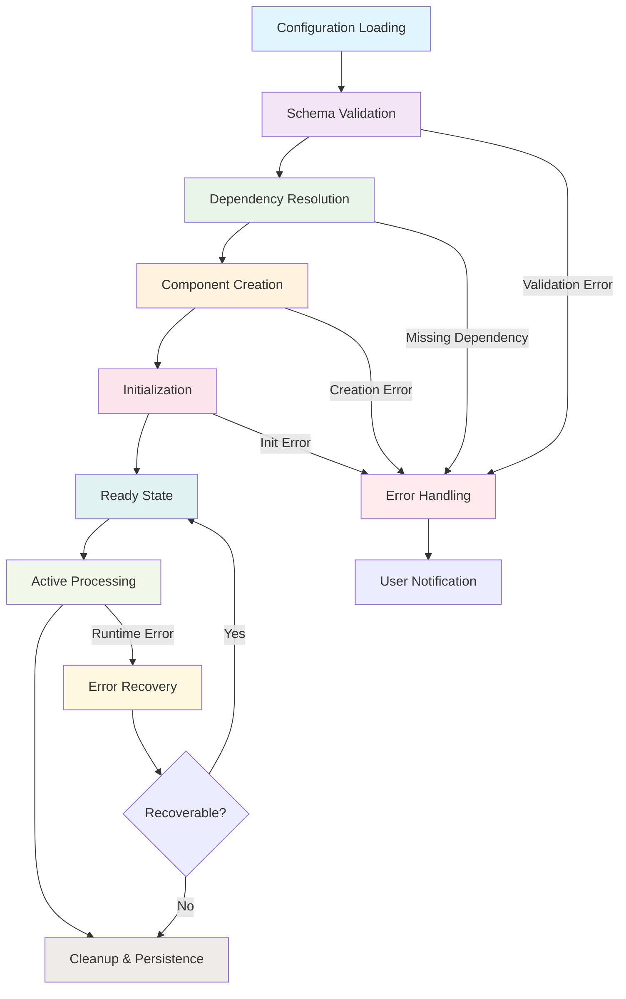
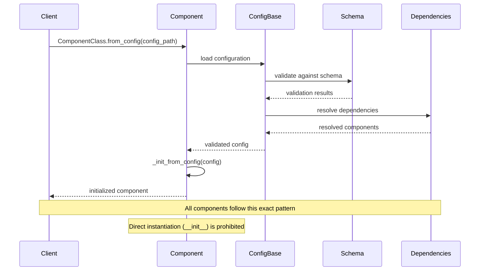
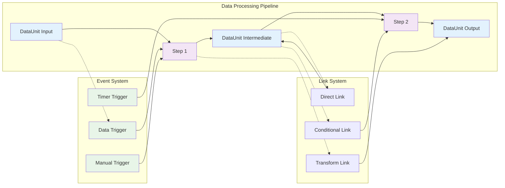
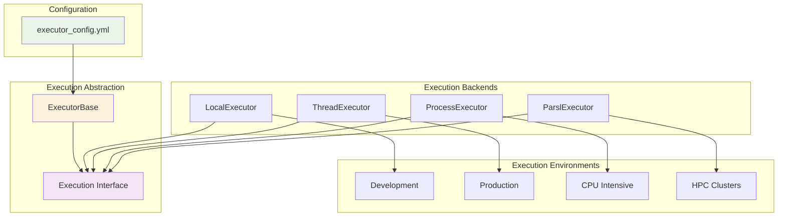
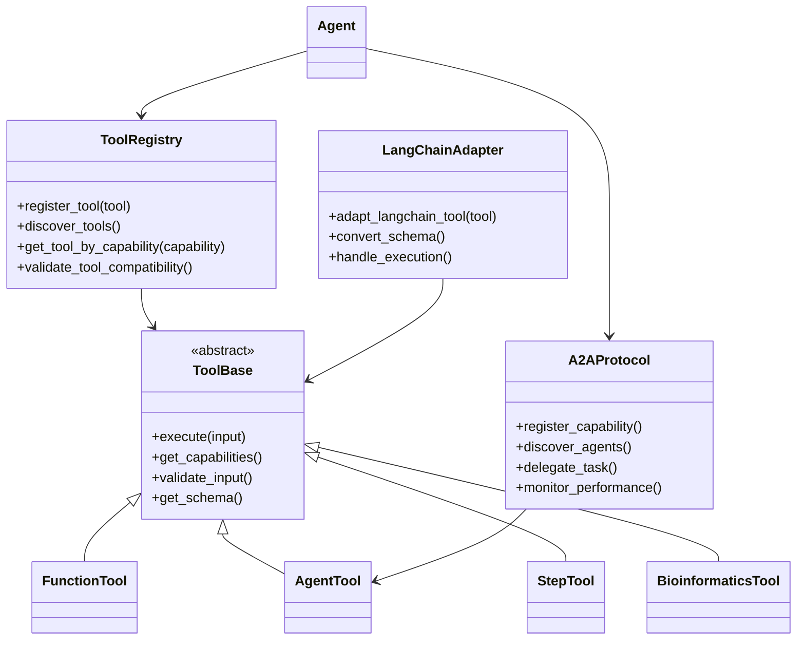
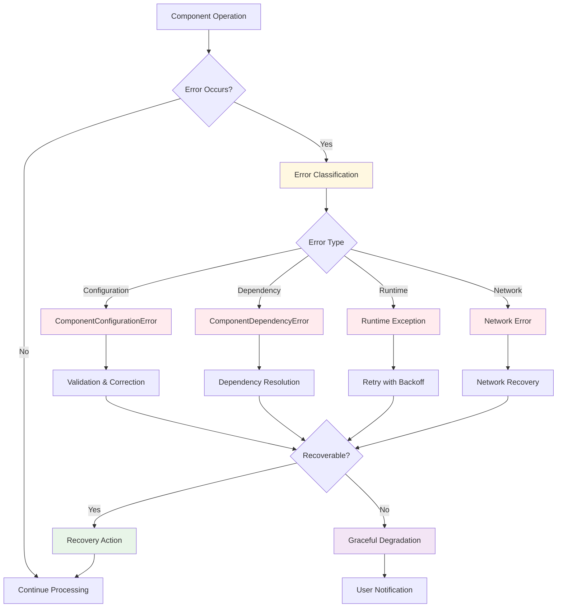
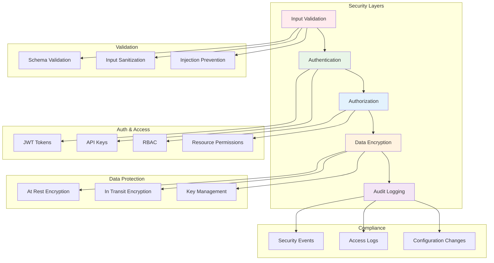

# NanoBrain Framework - Core Architecture
## Foundational Components, Patterns, and Design Philosophy

**Document Version**: 1.0.0  
**Created**: August 2024  
**Part of**: [NanoBrain High-Level Documentation](./NANOBRAIN_HIGH_LEVEL_DOCUMENTATION_PLAN.md)

---

## **1. Framework Philosophy and Core Principles**

### **1.1 Foundational Philosophy**

NanoBrain is built on four foundational principles that guide every architectural decision:

**🎯 Configuration-Driven Architecture**

**Design Intent & Purpose:**
The configuration-driven approach was deliberately chosen to solve several critical enterprise challenges:

- **Separation of Concerns**: By externalizing all behavior to YAML configurations, we achieve clean separation between business logic (code) and system behavior (configuration). This allows the same codebase to adapt to radically different use cases without modification.

- **Deployment Flexibility**: Different environments (development, staging, production) require different behaviors. Configuration-driven architecture enables the same binaries to run with environment-specific configurations, reducing deployment complexity and eliminating environment-specific code branches.

- **Non-Technical User Empowerment**: Domain experts can modify system behavior through YAML files without requiring programming knowledge. This democratizes system customization and reduces dependency on development teams for operational changes.

- **Regulatory Compliance**: In regulated industries, the ability to prove that no hardcoded behaviors exist is crucial. Configuration-driven architecture provides auditable trails of all system behaviors and their sources.

- All system behavior controlled via YAML configurations
- Zero hardcoding in production systems
- Declarative component definition and relationships
- Environment-specific configuration support

**⚡ Event-Driven Processing**

**Design Intent & Purpose:**
The event-driven architecture was selected as the core processing paradigm to address fundamental scalability and responsiveness challenges:

- **Reactive Scalability**: Traditional request-response patterns create blocking bottlenecks. Event-driven processing enables components to react to events as they occur, providing natural horizontal scaling as each component can process events independently.

- **Real-Time Responsiveness**: AI workflows often involve long-running processes with intermediate results. Event-driven architecture enables immediate propagation of partial results, providing real-time feedback to users rather than forcing them to wait for complete workflow execution.

- **Resilient Communication**: Events can be persisted, replayed, and processed asynchronously. This provides inherent fault tolerance - if a component fails, events can be reprocessed once the component recovers, ensuring no data loss.

- **Composable Workflows**: Events create natural composition boundaries. Complex workflows emerge from simple components reacting to events, enabling sophisticated behaviors without complex orchestration logic.

- Components communicate through data flows and triggers
- Asynchronous, non-blocking execution patterns
- Real-time responsiveness to data changes
- Scalable event propagation mechanisms

**🔧 Mandatory from_config Pattern**

**Design Intent & Purpose:**
The mandatory from_config pattern was implemented to solve critical consistency and reliability challenges in framework usage:

- **Unified Object Creation**: By prohibiting direct instantiation, we eliminate the primary source of configuration inconsistencies. Every component is guaranteed to be properly configured and validated before use, preventing runtime configuration errors.

- **Dependency Injection**: The from_config pattern enables automatic dependency resolution and injection. Components declare their dependencies in configuration, and the framework automatically provides them, reducing coupling and improving testability.

- **Configuration Validation**: All configuration validation occurs at creation time rather than runtime. This shifts errors left in the development cycle, making them cheaper and easier to fix.

- **Lifecycle Consistency**: Every component follows identical creation and initialization patterns, reducing cognitive load for developers and ensuring consistent behavior across the entire framework.

- Unified component creation interface across all types
- Prohibited direct instantiation (`__init__`)
- Configuration validation and dependency resolution
- Consistent lifecycle management

**🚀 Production-Ready Design**

**Design Intent & Purpose:**
Production-ready design was prioritized from the beginning to ensure enterprise adoption and long-term viability:

- **Enterprise-Grade Reliability**: AI systems in production must handle failures gracefully. Built-in error handling, circuit breakers, and recovery mechanisms ensure system stability under adverse conditions.

- **Observability by Design**: Production systems require comprehensive monitoring and debugging capabilities. Every component includes structured logging, metrics collection, and performance tracking to enable effective operations.

- **Security-First Implementation**: AI systems often handle sensitive data. Security patterns are built into the framework core rather than added as an afterthought, ensuring consistent security posture across all components.

- **Performance Optimization**: Production AI workloads demand high performance. The framework includes caching, resource pooling, and optimization patterns that enable efficient resource utilization at scale.

- Enterprise-grade reliability and scalability
- Comprehensive error handling and recovery
- Performance monitoring and optimization
- Security-first implementation

### **1.2 Biological Neural Network Inspiration**

**Design Intent & Purpose:**
The biological neural network metaphor was chosen as the foundational architecture model because it provides several unique advantages for AI system design:

**Emergent Intelligence Through Simple Rules:**
Biological neural networks demonstrate how complex, intelligent behavior can emerge from simple components following basic rules. This inspired the framework's design where sophisticated AI workflows emerge from simple components (neurons/agents) connected through defined relationships (synapses/links) and activated by events (neurotransmitters/triggers).

**Distributed Processing Resilience:**
Biological neural networks continue functioning even when individual neurons fail. This inspired the framework's event-driven, distributed architecture where individual component failures don't cascade through the entire system.

**Adaptive Learning and Optimization:**
Neural networks adapt their connections based on experience. The framework's configuration-driven approach enables similar adaptation - workflow connections and behaviors can be modified based on performance data without changing underlying code.

**Hierarchical Organization:**
Biological neural networks organize into circuits, regions, and systems. This inspired the framework's hierarchical organization where individual components compose into steps, steps compose into workflows, and workflows compose into complex AI applications.

The framework draws deep inspiration from biological neural networks:

**Key Parallels:**
- **Neurons ↔ Components**: Specialized processing units with defined capabilities
- **Synapses ↔ Links**: Connections that enable data transfer between processing units
- **Neurotransmitters ↔ Triggers**: Activation signals that initiate processing
- **Neural Circuits ↔ Workflows**: Complex networks of interconnected processing units

---

## **2. Core Component Hierarchy**

### **2.1 Complete Class Hierarchy**

**Design Intent & Purpose:**
The hierarchical component architecture was designed to address several fundamental software engineering challenges in AI system development:

**Single Responsibility with Composition:**
Each component type has a single, well-defined responsibility, but complex behaviors emerge through composition. This follows the UNIX philosophy of "do one thing well" while enabling sophisticated AI workflows through component orchestration.

**Pluggable Architecture:**
The abstract base classes define contracts that enable pluggable implementations. Users can provide custom agents, executors, or tools without modifying framework code, enabling extensibility while maintaining compatibility.

**Type Safety and Validation:**
The strong typing hierarchy enables compile-time and runtime validation of component interactions. Links can only connect compatible components, and workflows can validate that all required components are present before execution.

**Framework Evolution:**
The hierarchical structure enables framework evolution without breaking existing code. New component types can be added by extending base classes, and existing components gain new capabilities through base class enhancements.

```mermaid
classDiagram
    class FromConfigBase {
        <<abstract>>
        +from_config(config_path)* 
        +_get_config_class()*
        +_init_from_config(config)*
        +COMPONENT_TYPE: str
        +REQUIRED_CONFIG_FIELDS: List[str]
        +OPTIONAL_CONFIG_FIELDS: Dict
    }
    
    class Agent {
        <<abstract>>
        +aprocess(input)
        +tool_registry: ToolRegistry
        +conversation_history: List
        +performance_metrics: Dict
    }
    
    class BaseStep {
        <<abstract>>
        +execute()
        +input_data_units: Dict
        +output_data_units: Dict
        +triggers: List[TriggerBase]
    }
    
    class DataUnitBase {
        <<abstract>>
        +get_data()
        +set_data(data)
        +validate()
        +serialize()
    }
    
    class LinkBase {
        <<abstract>>
        +transfer_data()
        +validate_connection()
        +source: str
        +target: str
    }
    
    class TriggerBase {
        <<abstract>>
        +check_condition()
        +activate()
        +condition_met: bool
    }
    
    class ExecutorBase {
        <<abstract>>
        +execute_task(task)
        +manage_resources()
        +cleanup()
    }
    
    class ToolBase {
        <<abstract>>
        +execute(input)
        +get_capabilities()
        +validate_input()
    }
    
    FromConfigBase <|-- Agent
    FromConfigBase <|-- BaseStep
    FromConfigBase <|-- DataUnitBase
    FromConfigBase <|-- LinkBase
    FromConfigBase <|-- TriggerBase
    FromConfigBase <|-- ExecutorBase
    FromConfigBase <|-- ToolBase
    
    Agent <|-- ConversationalAgent
    Agent <|-- SimpleAgent
    Agent <|-- EnhancedCollaborativeAgent
    
    BaseStep <|-- Step
    BaseStep <|-- TransformStep
    BaseStep <|-- Workflow
    
    DataUnitBase <|-- DataUnitMemory
    DataUnitBase <|-- DataUnitFile
    DataUnitBase <|-- DataUnitString
    DataUnitBase <|-- DataUnitStream
    
    LinkBase <|-- DirectLink
    LinkBase <|-- FileLink
    LinkBase <|-- QueueLink
    LinkBase <|-- TransformLink
    LinkBase <|-- ConditionalLink
    
    TriggerBase <|-- DataUpdatedTrigger
    TriggerBase <|-- AllDataReceivedTrigger
    TriggerBase <|-- TimerTrigger
    TriggerBase <|-- ManualTrigger
    
    ExecutorBase <|-- LocalExecutor
    ExecutorBase <|-- ThreadExecutor
    ExecutorBase <|-- ProcessExecutor
    ExecutorBase <|-- ParslExecutor
    
    ToolBase <|-- FunctionTool
    ToolBase <|-- AgentTool
    ToolBase <|-- StepTool
    ToolBase <|-- LangChainTool
```

### **2.2 Component Responsibilities**

**Design Intent & Purpose:**
The component responsibility architecture was designed to create clear boundaries and enable independent evolution of different system concerns:

**🤖 Agent System (AI Processing)**

**Architectural Rationale:**
Agents represent the AI intelligence layer of the framework. By isolating AI-specific concerns (language understanding, tool selection, context management) into dedicated components, we enable:

- **Model Agnostic Design**: Agents abstract away specific LLM implementations, enabling the same workflow to use different AI models based on configuration
- **Conversation Context Management**: Agents handle the complex state management required for multi-turn conversations, including context window management and conversation history optimization
- **Tool Integration Strategy**: Agents intelligently select and orchestrate tools based on task requirements, providing the "intelligence" layer that coordinates other framework components
- **Collaborative Intelligence**: A2A protocol enables agents to collaborate and delegate, creating emergent intelligence greater than individual agent capabilities

- Natural language understanding and generation
- Tool integration and intelligent selection
- Context management and conversation history
- Multi-agent collaboration (A2A protocol)

**⚙️ Step System (Data Processing)**

**Architectural Rationale:**
Steps represent the functional processing layer, designed to provide reliable, repeatable data transformations:

- **Functional Decomposition**: Steps break complex workflows into discrete, testable units that can be developed, tested, and maintained independently
- **Event-Driven Activation**: Steps activate based on data availability rather than imperative control flow, enabling reactive architectures that respond to changing conditions
- **Resource Management**: Steps manage their own computational resources and lifecycle, enabling efficient resource utilization and clean error handling
- **Composable Operations**: Simple steps compose into complex workflows, following the principle of emergent complexity from simple components

- Discrete data transformation operations
- Event-driven processing activation
- Resource management and state tracking
- Error handling and recovery mechanisms

**📊 DataUnit System (Data Management)**

**Architectural Rationale:**
DataUnits provide type-safe data management with flexible storage backends:

- **Type Safety**: DataUnits enforce data schemas and validation, preventing runtime errors caused by incompatible data types or formats
- **Storage Abstraction**: Multiple storage backends (memory, file, stream) enable optimization for different data sizes and access patterns without changing consuming code
- **Data Lineage**: DataUnits track data provenance and transformations, enabling debugging and compliance requirements in regulated environments
- **Serialization Strategy**: Built-in serialization support enables data persistence and inter-process communication without custom serialization logic

- Type-safe data containers with validation
- Multiple storage backends (memory, file, stream)
- Serialization and persistence support
- Data lineage and audit trails

**🔗 Link System (Component Connectivity)**

**Architectural Rationale:**
Links provide flexible, typed connections between components while maintaining loose coupling:

- **Data Flow Management**: Links abstract data transfer patterns, enabling the same components to be connected in different ways (direct, queued, transformed) without modification
- **Type Validation**: Links validate data compatibility between connected components, preventing runtime type errors
- **Transformation Layer**: Links can transform data during transfer, enabling components with incompatible interfaces to work together
- **Asynchronous Communication**: Links support asynchronous data transfer, enabling non-blocking communication patterns that improve system responsiveness

- Data flow connections between components
- Multiple transfer patterns (direct, transform, conditional)
- Data validation and type checking
- Asynchronous and queued transfers

**⚡ Trigger System (Event Processing)**

**Architectural Rationale:**
Triggers implement the event-driven activation model that enables reactive architectures:

- **Condition Monitoring**: Triggers continuously monitor conditions and activate components when appropriate, enabling reactive behaviors without polling
- **Workflow Coordination**: Triggers coordinate the execution of complex workflows by activating steps in response to data availability and other conditions
- **Timer-Based Processing**: Timer triggers enable scheduled operations and timeout handling, supporting both real-time and batch processing patterns
- **Complex Logic Support**: Triggers support sophisticated conditional logic, enabling workflows that adapt to changing conditions and data characteristics

- Event detection and condition monitoring
- Workflow activation and coordination
- Timer-based and manual activation
- Complex conditional logic support

**🖥️ Executor System (Execution Backend)**

**Architectural Rationale:**
Executors provide pluggable execution environments that enable scaling from development to production:

- **Environment Abstraction**: The same code can run on local machines, thread pools, process pools, or distributed clusters by changing executor configuration
- **Resource Optimization**: Different executors optimize for different resource constraints (CPU, memory, network), enabling efficient utilization across diverse deployment environments
- **Scaling Strategy**: Executors enable transparent scaling from single-machine development to distributed production deployments
- **Performance Monitoring**: Executors collect execution metrics and performance data, enabling optimization and capacity planning

- Pluggable execution environments
- Resource allocation and optimization
- Local to distributed execution scaling
- Performance monitoring and metrics

**🛠️ Tool System (Capability Extension)**

**Architectural Rationale:**
Tools provide extensible capability enhancement while maintaining security and compatibility:

- **Capability Enhancement**: Tools extend agent capabilities without requiring agent modification, enabling rapid capability expansion
- **Integration Strategy**: LangChain compatibility enables leveraging existing tool ecosystems while maintaining framework consistency
- **Dynamic Discovery**: Tools can be discovered and registered at runtime, enabling plugin architectures and dynamic capability expansion
- **Security Boundary**: Tools provide controlled execution environments with permission management, enabling safe execution of external capabilities

- Agent capability enhancement
- LangChain compatibility and integration
- Dynamic tool discovery and registration
- Security and permission management

---

## **3. Configuration Schema Architecture**

### **3.1 Configuration Hierarchy**

**Design Intent & Purpose:**
The configuration schema architecture was designed to provide type-safe, validated, and composable configuration management:

**Hierarchical Configuration Design:**
The hierarchical structure mirrors the component hierarchy, ensuring that configuration complexity scales linearly with system complexity. Each component type has its own configuration schema, enabling independent evolution while maintaining compatibility.

**Validation Strategy:**
Pydantic-based validation provides compile-time and runtime guarantees about configuration correctness. This shifts configuration errors from runtime to development time, reducing production failures.

**Composition Patterns:**
The class+config pattern enables configuration composition - complex configurations are built from simpler, reusable components. This reduces duplication and enables configuration modularity.

**Schema Evolution:**
The schema hierarchy enables backward-compatible configuration evolution. New fields can be added with defaults, and validation rules can be enhanced without breaking existing configurations.

### **3.2 Configuration Features**

**Design Intent & Purpose:**
The configuration feature set was designed to address enterprise requirements for validation, flexibility, and maintainability:

**🔍 Pydantic V2 Validation**

**Architectural Rationale:**
Pydantic V2 validation was chosen to provide comprehensive type safety and validation:

- **Type Safety**: Strong typing prevents runtime type errors and enables better IDE support and static analysis
- **Constraint Enforcement**: Field-level constraints ensure configuration values meet business requirements before component creation
- **Custom Validation**: Business logic validation rules ensure configurations make semantic sense, not just syntactic sense
- **Error Reporting**: Detailed error messages with field-level context help users fix configuration issues quickly

- Comprehensive field validation with detailed error messages
- Type checking and constraint enforcement
- Custom validation rules and business logic
- Schema documentation generation

**🔄 Recursive Resolution**

**Architectural Rationale:**
Recursive resolution enables sophisticated configuration composition patterns:

- **Nested Components**: Complex components can be composed from simpler components through configuration, enabling reusable building blocks
- **Dependency Injection**: Dependencies are automatically resolved and injected based on configuration, reducing coupling and improving testability
- **Class+Config Pattern**: The class+config pattern enables polymorphic configuration where the actual implementation is determined at runtime based on configuration
- **Circular Dependency Detection**: Automatic detection prevents infinite loops during dependency resolution

- Automatic nested object instantiation
- Class+config pattern support
- Dependency injection and resolution
- Circular dependency detection

**🌍 Environment Integration**

**Architectural Rationale:**
Environment integration enables the same configuration to work across different deployment environments:

- **Environment Variables**: Sensitive values (API keys, passwords) can be externalized to environment variables, improving security
- **Environment-Specific Configurations**: Different environments (dev, staging, prod) can use different values while sharing the same configuration structure
- **Credential Management**: Secure credential handling patterns prevent secrets from being stored in configuration files
- **Template Substitution**: Configuration templates enable dynamic value resolution based on runtime context

- Environment variable interpolation
- Development vs. production configurations
- Secure credential management
- Template variable substitution

---

## **4. Component Lifecycle Management**

### **4.1 Standard Component Lifecycle**

**Design Intent & Purpose:**
The standardized component lifecycle was designed to ensure predictable, reliable component behavior across the entire framework:

**Predictable State Transitions:**
Every component follows the same lifecycle stages, making system behavior predictable and debuggable. This reduces cognitive load for developers and enables sophisticated lifecycle management tools.

**Error Handling Strategy:**
Errors are caught and handled at each lifecycle stage with appropriate recovery strategies. This prevents cascading failures and enables graceful degradation.

**Resource Management:**
The lifecycle includes explicit resource allocation and cleanup phases, preventing resource leaks and enabling efficient resource utilization.

**Observability Integration:**
Each lifecycle stage generates appropriate logs and metrics, enabling comprehensive monitoring and debugging of component behavior.

### **4.2 Lifecycle Phases Detailed**

**Design Intent & Purpose:**
Each lifecycle phase was designed to address specific reliability and maintainability concerns:

**1. Configuration Loading**
**Purpose**: Establish the foundation for all subsequent operations by loading and parsing configuration data.
**Design Intent**: Fail fast if configuration is malformed or missing, preventing wasted resources on components that cannot be properly initialized.

- Parse YAML/JSON configuration files
- Handle file path resolution and validation
- Support environment variable interpolation
- Validate file format and structure

**2. Schema Validation**
**Purpose**: Ensure configuration correctness before expensive operations like dependency resolution or component creation.
**Design Intent**: Provide detailed error messages that help users fix configuration issues quickly, reducing debugging time.

- Pydantic model validation against configuration schema
- Type checking and constraint validation
- Custom validation rule execution
- Comprehensive error reporting with suggestions

**3. Dependency Resolution**
**Purpose**: Resolve and prepare all component dependencies before component creation.
**Design Intent**: Detect dependency issues early and provide clear error messages about missing or circular dependencies.

- Resolve references to other components
- Handle class+config pattern instantiation
- Circular dependency detection and prevention
- Lazy loading of optional dependencies

**4. Component Creation**
**Purpose**: Instantiate the component with all validated configuration and resolved dependencies.
**Design Intent**: Ensure consistent component creation patterns and proper error handling during instantiation.

- Instantiate component using validated configuration
- Apply configuration-specific customizations
- Register component with framework systems
- Initialize component-specific resources

**5. Initialization**
**Purpose**: Perform component-specific initialization that requires the component to be fully created.
**Design Intent**: Provide a consistent hook for component-specific setup while maintaining framework consistency.

- Execute component-specific initialization logic
- Setup connections to dependent components
- Initialize performance monitoring and logging
- Prepare component for active processing

**6. Ready State**
**Purpose**: Signal that the component is fully initialized and ready for use.
**Design Intent**: Provide clear state indication for monitoring and orchestration systems.

- Component fully initialized and ready for use
- All dependencies resolved and connected
- Monitoring and health checks active
- Awaiting processing requests or events

**7. Active Processing**
**Purpose**: Execute the component's primary function.
**Design Intent**: Provide consistent monitoring and error handling during component operation.

- Process incoming requests or data
- Execute component-specific business logic
- Interact with other components as needed
- Monitor performance and resource usage

**8. Cleanup & Persistence**
**Purpose**: Properly release resources and persist important state.
**Design Intent**: Prevent resource leaks and ensure important state is preserved for debugging or recovery.

- Release allocated resources
- Persist important state information
- Close connections and cleanup resources
- Update performance metrics and logs

---

## **5. Architectural Patterns**

### **5.1 Unified Creation Pattern**

**Design Intent & Purpose:**
The unified creation pattern addresses fundamental consistency and reliability challenges in framework usage:

**Consistency Enforcement:**
By mandating that all components use the same creation pattern, we eliminate the primary source of configuration inconsistencies and ensure every component follows the same initialization sequence.

**Configuration Validation:**
All configuration validation occurs before component creation, shifting errors left in the development cycle where they're cheaper to fix.

**Dependency Injection:**
The pattern enables automatic dependency resolution and injection, reducing coupling between components and improving testability.

**Framework Evolution:**
The unified pattern enables framework-wide enhancements (like monitoring, security, or optimization) to be added to all components without modifying individual component implementations.

The `from_config` pattern is the cornerstone of NanoBrain's architecture:

**Key Benefits:**
- **Consistency**: Identical creation pattern across all component types
- **Validation**: Comprehensive configuration validation before creation
- **Dependencies**: Automatic dependency resolution and injection
- **Debugging**: Clear error messages with configuration context
- **Testing**: Easy mocking and testing with configuration overrides

### **5.2 Event-Driven Data Flow**

**Design Intent & Purpose:**
The event-driven data flow pattern was designed to create scalable, resilient, and composable system architectures:

**Reactive Scalability:**
Components react to events rather than polling for changes, enabling efficient resource utilization and natural horizontal scaling patterns.

**Fault Tolerance:**
Events can be persisted and replayed, providing inherent fault tolerance. If components fail, events can be reprocessed without data loss.

**Loose Coupling:**
Components are coupled through events rather than direct references, enabling independent development and deployment of different system parts.

**Composable Complexity:**
Complex behaviors emerge from simple components reacting to events, following the principle of emergent complexity from simple rules.

**Pattern Characteristics:**
- **Asynchronous**: Non-blocking component communication
- **Reactive**: Components respond to data availability events
- **Composable**: Complex workflows built from simple components
- **Resilient**: Fault tolerance through event replay and recovery

### **5.3 Pluggable Execution**

**Design Intent & Purpose:**
The pluggable execution pattern enables transparent scaling from development to production environments:

**Environment Agnostic Code:**
The same component code can run on different execution backends (local, threaded, distributed) without modification, enabling consistent behavior across environments.

**Resource Optimization:**
Different execution backends optimize for different resource constraints and deployment patterns, enabling efficient resource utilization.

**Development to Production Scaling:**
Code developed on local machines can seamlessly scale to production clusters through configuration changes rather than code changes.

**Performance Optimization:**
Execution backends can be swapped based on workload characteristics, enabling optimal performance for different use cases.

**Scaling Characteristics:**
- **Transparent**: Same code runs on different execution backends
- **Configurable**: Execution backend selected via configuration
- **Performance**: Optimal resource utilization for each environment
- **Distributed**: Seamless scaling to HPC and cloud environments

---

## **6. Tool Integration Ecosystem**

### **6.1 Tool Architecture**

**Design Intent & Purpose:**
The tool integration ecosystem was designed to provide extensible capability enhancement while maintaining security and compatibility:

**Capability Extension Strategy:**
Tools extend agent capabilities without requiring agent modification, enabling rapid capability expansion and plugin architectures.

**Integration Compatibility:**
LangChain compatibility enables leveraging existing tool ecosystems while maintaining framework consistency and adding framework-specific enhancements.

**Security Boundary Management:**
Tools provide controlled execution environments with permission management, enabling safe execution of external capabilities.

**Dynamic Discovery Patterns:**
Tools can be discovered and registered at runtime, enabling flexible deployment patterns and dynamic capability expansion.

### **6.2 Tool Integration Patterns**

**Design Intent & Purpose:**
Different tool integration patterns address different use cases and requirements:

**🔧 Framework-Native Tools**
**Purpose**: Provide optimal integration with framework patterns and capabilities.
**Design Intent**: Tools built using framework patterns inherit all framework benefits (configuration-driven behavior, monitoring, error handling) automatically.

- Built using NanoBrain patterns and conventions
- Full integration with configuration system
- Performance monitoring and error handling
- Security and permission management

**🔗 LangChain Compatibility**
**Purpose**: Leverage existing tool ecosystems while maintaining framework consistency.
**Design Intent**: Enable migration from LangChain-based systems while providing upgrade paths to framework-native patterns.

- Automatic adaptation of existing LangChain tools
- Schema translation and normalization
- Metadata preservation and enhancement
- Performance optimization for framework integration

**🤝 Agent-to-Agent (A2A) Protocol**
**Purpose**: Enable agent collaboration and capability sharing.
**Design Intent**: Create emergent intelligence through agent collaboration while maintaining clear responsibility boundaries.

- Standardized agent communication interface
- Capability advertisement and discovery
- Task delegation and collaboration patterns
- Performance tracking and optimization

---

## **7. Production-Ready Features**

### **7.1 Error Handling and Recovery**

**Design Intent & Purpose:**
The comprehensive error handling system was designed to ensure system reliability and maintainability in production environments:

**Graceful Degradation:**
The system continues operating with reduced functionality rather than complete failure, ensuring business continuity even during component failures.

**Error Classification:**
Different error types require different handling strategies. The classification system enables appropriate responses to each error category.

**Recovery Automation:**
Automated recovery mechanisms reduce operational burden and improve system availability by handling common failure modes automatically.

**Observability Integration:**
Error handling generates comprehensive logs and metrics for debugging and operational monitoring.

### **7.2 Performance Monitoring**

**Design Intent & Purpose:**
Comprehensive performance monitoring enables optimization and proactive issue detection:

**Real-Time Visibility:**
Real-time metrics enable immediate response to performance issues and capacity problems.

**Historical Analysis:**
Historical data enables trend analysis and capacity planning for long-term system optimization.

**Predictive Capabilities:**
Analytics and machine learning on performance data enable predicting and preventing issues before they impact users.

**Optimization Guidance:**
Performance data guides optimization efforts by identifying bottlenecks and inefficiencies.

**📊 Real-Time Metrics**
- Component execution times and throughput
- Resource utilization (CPU, memory, network)
- Error rates and recovery statistics
- Tool usage patterns and performance

**🔍 Comprehensive Logging**
- Structured logging with correlation IDs
- Performance profiling and optimization hints
- Security event tracking and audit trails
- Configuration change tracking

**📈 Predictive Analytics**
- Performance trend analysis
- Resource usage forecasting
- Bottleneck identification and alerts
- Optimization recommendations

---

## **8. Security and Compliance**

### **8.1 Security Architecture**

**Design Intent & Purpose:**
The multi-layered security architecture provides defense-in-depth protection for AI systems:

**Layered Defense:**
Multiple security layers ensure that single security control failures don't compromise the entire system.

**Input Validation Strategy:**
Comprehensive input validation prevents injection attacks and ensures data integrity throughout the system.

**Authentication and Authorization:**
Strong authentication and fine-grained authorization ensure only authorized users can access appropriate system capabilities.

**Audit and Compliance:**
Comprehensive audit logging enables compliance with regulatory requirements and forensic analysis.

**🛡️ Security Features**
- **Input Validation**: Comprehensive Pydantic validation with security rules
- **Authentication**: JWT-based authentication with refresh token support
- **Authorization**: Role-based access control (RBAC) with fine-grained permissions
- **Encryption**: Data encryption at rest and in transit
- **Audit Logging**: Comprehensive security event tracking and compliance reporting

---

## **9. Next Steps**

This framework core architecture provides the foundation for:

1. **[Workflow Orchestration](./02_WORKFLOW_ORCHESTRATION.md)** - Multi-component coordination patterns
2. **[Web Architecture](./03_WEB_ARCHITECTURE.md)** - Universal web interface design
3. **[LLM Code Generation](./04_LLM_CODE_GENERATION.md)** - AI-driven development rules
4. **[Component Library](./05_COMPONENT_LIBRARY.md)** - Production-ready implementations

Each section builds upon these core architectural principles while providing specialized capabilities for different aspects of the framework.

---

**📚 Related Documentation:**
- [API Reference](./build/html/index.html) - Comprehensive Sphinx autodoc documentation
- [Configuration Examples](../config/) - Sample configuration files
- [Getting Started Guide](./GETTING_STARTED.md) - Quick start tutorial
- [Best Practices](./BEST_PRACTICES.md) - Framework usage guidelines 