# NanoBrain Framework - Workflow Orchestration
## Multi-Component Coordination and Execution Strategies

**Document Version**: 1.0.0  
**Created**: August 2024  
**Part of**: [NanoBrain High-Level Documentation](./NANOBRAIN_HIGH_LEVEL_DOCUMENTATION_PLAN.md)

---

## **1. Workflow Philosophy and Design**

### **1.1 Workflow as Neural Circuit Complexes**

**Design Intent & Purpose:**
The neural circuit complex metaphor was deliberately chosen to address the fundamental challenge of orchestrating multiple AI components while maintaining emergent intelligence:

**Hierarchical Intelligence Organization:**
Just as biological neural circuits organize into specialized regions (sensory, motor, cognitive) that work together to produce intelligent behavior, NanoBrain workflows organize specialized steps into coordinated processing pipelines. This enables sophisticated AI capabilities to emerge from the interaction of simpler, focused components.

**Distributed Processing with Coordination:**
Neural circuits process information in parallel while maintaining coordination through inhibitory and excitatory connections. Similarly, workflow orchestration enables parallel processing of different data streams while maintaining coordination through links and triggers.

**Adaptive Behavior Through Connection Patterns:**
Neural circuits adapt their behavior by modifying connection strengths and patterns. Workflows achieve similar adaptability through configuration-driven link patterns and trigger conditions that can be modified without changing component code.

**Fault Tolerance Through Redundancy:**
Neural circuits maintain function even when individual neurons fail through redundant pathways and alternative routes. Workflow orchestration provides similar resilience through error handling strategies and alternative execution paths.

NanoBrain workflows are inspired by neural circuit complexes - sophisticated networks where multiple specialized circuits work in coordination to process information and generate responses.

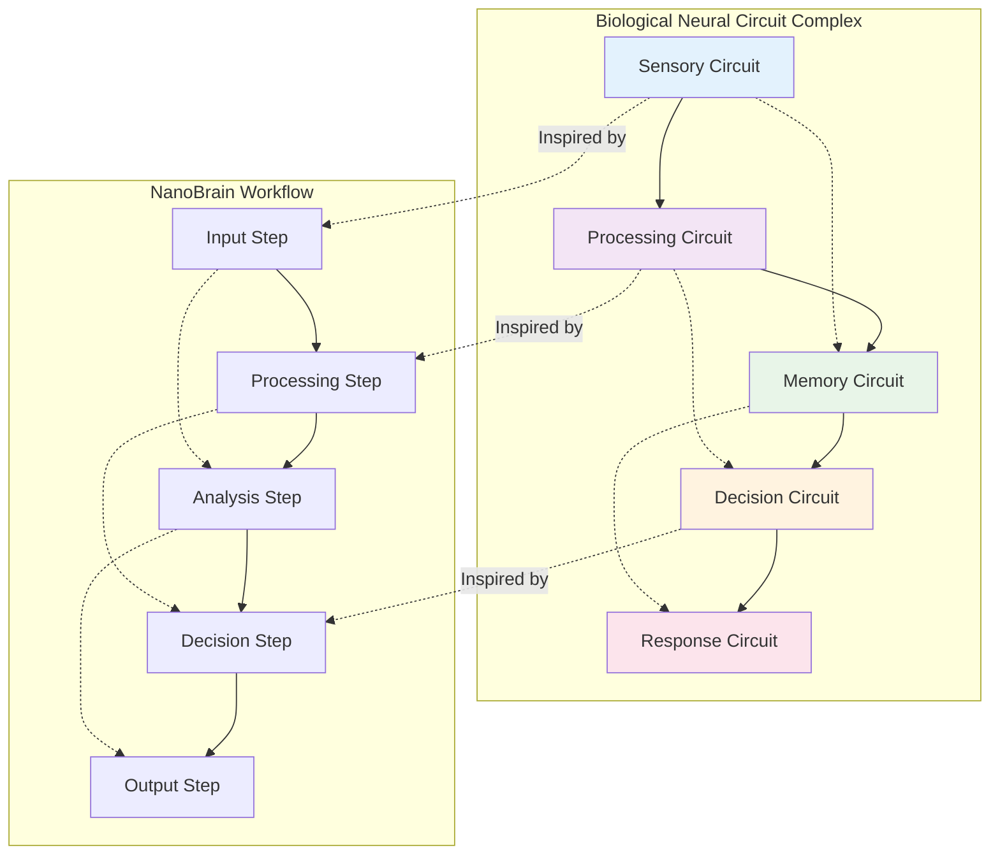

**Key Design Principles:**

**Design Intent & Purpose:**
These principles were established to ensure workflows provide both the flexibility needed for diverse AI applications and the reliability required for production systems:

- **Hierarchical Organization**: Steps can contain nested workflows (sub-circuits) - This enables complex workflows to be built from simpler, reusable components while maintaining clear abstraction boundaries. It also enables recursive decomposition of complex problems into manageable units.

- **Dynamic Coordination**: Steps activate based on data availability and conditions - This reactive model eliminates the need for complex orchestration logic and enables workflows to respond naturally to changing conditions and data arrival patterns.

- **Parallel Processing**: Independent operations execute concurrently - This maximizes resource utilization and reduces overall execution time while maintaining logical dependencies between operations.

- **Adaptive Behavior**: Workflows adapt execution paths based on intermediate results - This enables intelligent workflows that can modify their behavior based on data characteristics, quality, or intermediate analysis results.

### **1.2 Workflow Class Hierarchy**

**Design Intent & Purpose:**
The workflow class hierarchy was designed to provide both type safety and specialization while maintaining a unified orchestration model:

**Workflows as Steps:**
The decision to make Workflow extend Step enables recursive composition - workflows can contain other workflows, creating sophisticated hierarchical processing architectures. This enables building complex applications from reusable workflow components.

**Domain-Specific Specializations:**
Specialized workflow classes (ChatWorkflow, ViralAnalysisWebWorkflow) provide domain-specific optimizations and interfaces while inheriting the core orchestration capabilities. This enables domain experts to work with familiar abstractions while leveraging powerful underlying orchestration.

**Type Safety and Validation:**
The class hierarchy enables compile-time and runtime validation of workflow composition, ensuring that incompatible components cannot be connected and that all required dependencies are satisfied.

**Framework Integration:**
By extending the base framework classes, workflows inherit all framework capabilities (configuration management, monitoring, error handling) automatically, ensuring consistent behavior across all workflow types.

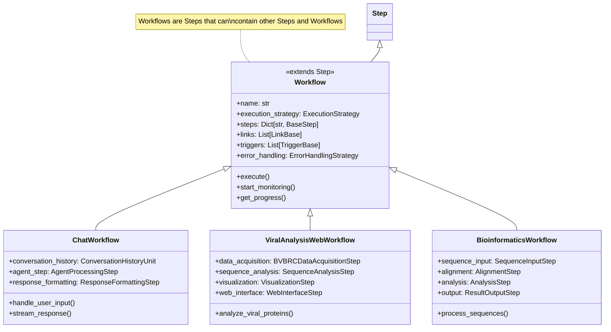

---

## **2. Execution Strategies**

### **2.1 Sequential Execution**

**Design Intent & Purpose:**
Sequential execution was designed as the foundational execution strategy, providing predictability and resource efficiency for workflows where step dependencies require ordered execution:

**Predictable Resource Usage:**
Sequential execution enables precise resource planning since only one step executes at a time. This is crucial for environments with limited resources or when steps have significant resource requirements that would conflict if run concurrently.

**Simplified Debugging and Monitoring:**
The linear execution model makes debugging and troubleshooting straightforward since there's a clear execution timeline and single point of focus at any given time. This reduces cognitive load for developers and operators.

**Error Isolation and Recovery:**
Failures are isolated to specific steps and don't cascade through parallel execution paths. This simplifies error handling and recovery since the system state at failure is well-defined and recovery strategies can be step-specific.

**Dependency Management:**
Sequential execution naturally handles dependencies since each step completes before the next begins. This eliminates race conditions and ensures data consistency between dependent operations.

Sequential execution processes steps in a defined order, ensuring predictable execution flow and resource management.

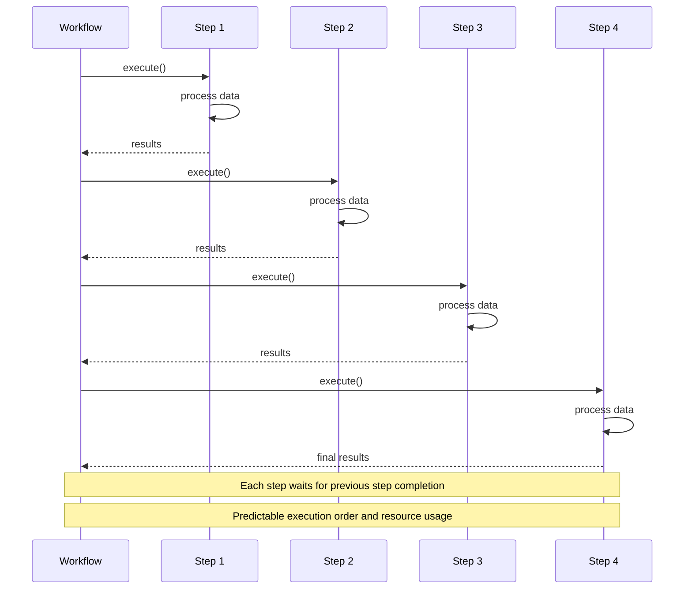

**Sequential Execution Characteristics:**

**Design Rationale:**
Each characteristic addresses specific operational and development challenges:

- **Predictable Order**: Steps execute in defined sequence - Enables deterministic behavior and reproducible results, crucial for scientific workflows and debugging
- **Resource Efficient**: Lower memory and CPU usage - Prevents resource contention and enables execution in resource-constrained environments
- **Simple Debugging**: Easy to trace execution flow - Reduces debugging complexity and enables clear performance profiling
- **Error Isolation**: Failures affect subsequent steps only - Simplifies error handling and enables targeted recovery strategies
- **Use Cases**: Linear data processing, report generation, simple transformations - Optimal for workflows where dependencies naturally form a linear chain

### **2.2 Parallel Execution**

**Design Intent & Purpose:**
Parallel execution was designed to maximize throughput and resource utilization for workflows with independent operations:

**Maximum Resource Utilization:**
Parallel execution leverages all available computational resources (CPU cores, I/O channels, network connections) simultaneously, dramatically reducing overall execution time for workflows with independent operations.

**Scalability Architecture:**
The parallel execution model scales naturally with available resources - adding more cores or workers automatically increases throughput without requiring workflow modifications.

**Load Distribution:**
Work is automatically distributed across available resources with built-in load balancing, ensuring optimal resource utilization and preventing bottlenecks from overwhelming individual workers.

**Synchronization Management:**
The framework handles complex synchronization automatically, ensuring that parallel results are properly collected and coordinated without requiring manual thread or process management.

Parallel execution processes independent steps concurrently to maximize throughput and reduce overall execution time.

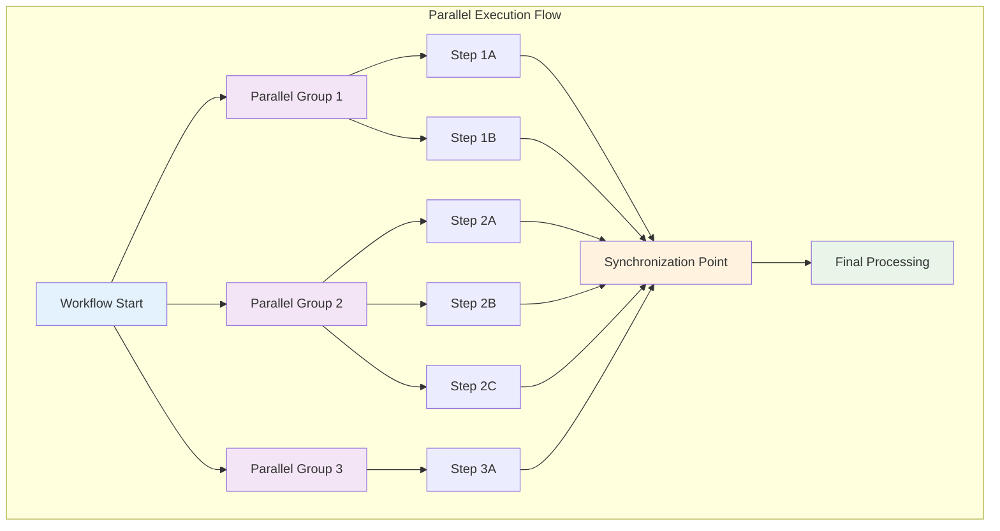

**Parallel Execution Features:**

**Design Rationale:**
Each feature addresses specific performance and scalability requirements:

- **Maximum Throughput**: Independent operations run simultaneously - Leverages all available computational resources to minimize total execution time
- **Resource Optimization**: Efficient CPU and I/O utilization - Prevents resource idle time and maximizes return on computational investment
- **Scalability**: Automatically utilizes available cores/workers - Enables transparent scaling from development to production environments
- **Load Balancing**: Dynamic work distribution across resources - Prevents bottlenecks and ensures optimal resource utilization
- **Synchronization**: Automatic coordination of parallel results - Handles complex coordination without exposing threading or process management complexity

### **2.3 Graph-Based Execution**

**Design Intent & Purpose:**
Graph-based execution was designed to automatically optimize execution order based on dependencies, providing the benefits of parallel execution while respecting complex dependency relationships:

**Automatic Dependency Analysis:**
The framework analyzes step dependencies to create an optimal execution plan without requiring manual optimization. This reduces development complexity while ensuring maximum performance.

**Dynamic Optimization:**
The execution plan adapts to runtime conditions (resource availability, step completion times) to continuously optimize performance based on actual execution characteristics.

**Complex Dependency Handling:**
Graph-based execution handles sophisticated dependency patterns including fan-out, fan-in, and diamond dependencies that would be difficult to optimize manually.

**Resource Efficiency:**
By understanding the complete dependency graph, the framework can make optimal resource allocation decisions, ensuring that critical path operations get priority while maximizing parallelism.

Graph-based execution analyzes step dependencies to determine optimal execution order and parallelization opportunities.

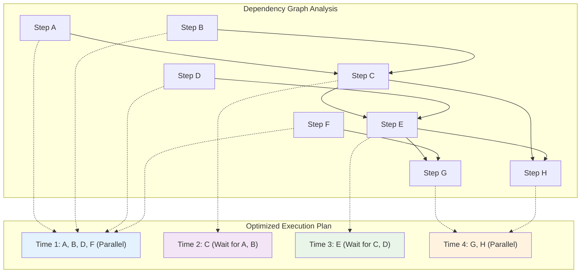

**Graph-Based Execution Benefits:**

**Design Rationale:**
Each benefit addresses specific challenges in complex workflow optimization:

- **Automatic Optimization**: Framework determines optimal execution order - Eliminates need for manual optimization while ensuring maximum performance
- **Dynamic Parallelization**: Maximum parallelism based on dependencies - Automatically identifies all opportunities for parallel execution
- **Resource Efficiency**: Optimal resource allocation and scheduling - Makes intelligent resource allocation decisions based on complete workflow understanding
- **Dependency Management**: Automatic handling of complex dependencies - Manages sophisticated dependency patterns without manual intervention
- **Performance Tuning**: Continuous optimization based on execution patterns - Learns from execution history to improve future performance

### **2.4 Event-Driven Execution**

**Design Intent & Purpose:**
Event-driven execution was designed to enable reactive, real-time workflows that respond to external events and data availability:

**Real-Time Responsiveness:**
Event-driven execution enables immediate response to external stimuli (user input, data arrival, system events) without polling or fixed scheduling, providing optimal responsiveness for interactive systems.

**Resource Efficiency:**
Steps activate only when needed, eliminating unnecessary resource consumption from idle or polling operations. This is particularly important for long-running workflows with sporadic activity.

**Complex Event Patterns:**
The system supports sophisticated event patterns including timers, conditions, data availability, and external triggers, enabling workflows that adapt to complex real-world scenarios.

**Stream Processing Support:**
Event-driven execution naturally supports streaming data processing where data arrives continuously and must be processed as it becomes available.

Event-driven execution responds reactively to data availability and external events, enabling real-time processing patterns.

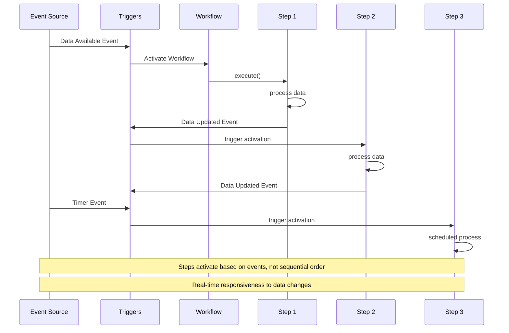

**Event-Driven Execution Patterns:**

**Design Rationale:**
Each pattern addresses specific real-time and reactive processing requirements:

- **Real-Time Response**: Immediate reaction to data availability - Enables responsive user experiences and timely data processing
- **Efficient Resource Usage**: Steps activate only when needed - Minimizes resource consumption and enables efficient long-running workflows
- **Complex Conditions**: Support for sophisticated activation logic - Enables workflows that respond to complex business rules and conditions
- **Streaming Support**: Continuous processing of streaming data - Supports real-time analytics and continuous data processing scenarios
- **Interactive Systems**: User-driven and external system integration - Enables interactive applications and integration with external systems

---

## **3. Workflow Component Integration**

### **3.1 Step Orchestration Architecture**

**Design Intent & Purpose:**
The step orchestration architecture was designed to provide comprehensive workflow management while maintaining clear separation of concerns:

**Modular Management Architecture:**
Each management subsystem (Step, Data Flow, Event, Execution) handles specific concerns independently while coordinating through well-defined interfaces. This enables independent evolution and optimization of each subsystem.

**Centralized Coordination:**
While management is modular, coordination is centralized in the workflow container to ensure consistent behavior and enable sophisticated cross-cutting concerns like monitoring and security.

**Scalable Resource Management:**
The architecture separates resource management from business logic, enabling sophisticated resource optimization strategies without affecting workflow functionality.

**Comprehensive Monitoring Integration:**
Built-in monitoring and performance tracking enable production operations and optimization without requiring additional instrumentation.

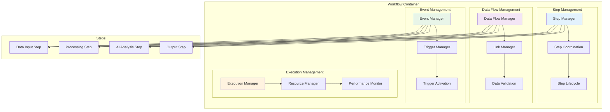

### **3.2 Data Flow Management**

**Design Intent & Purpose:**
The data flow management system was designed to provide flexible, type-safe data transfer between workflow components while supporting various data patterns and transformations:

**Layered Data Architecture:**
The separation of input, processing, and output layers enables clear data flow patterns while supporting complex routing and transformation requirements.

**Flexible Link Types:**
Multiple link types (Direct, Transform, Conditional, Queue) address different data transfer patterns and requirements without requiring custom implementations for each use case.

**Type Safety and Validation:**
Data validation occurs at link boundaries, ensuring type compatibility and data integrity throughout the workflow execution.

**Performance Optimization:**
Different link types are optimized for different scenarios - direct links for high-performance simple transfers, queued links for buffering and flow control, transform links for data adaptation.

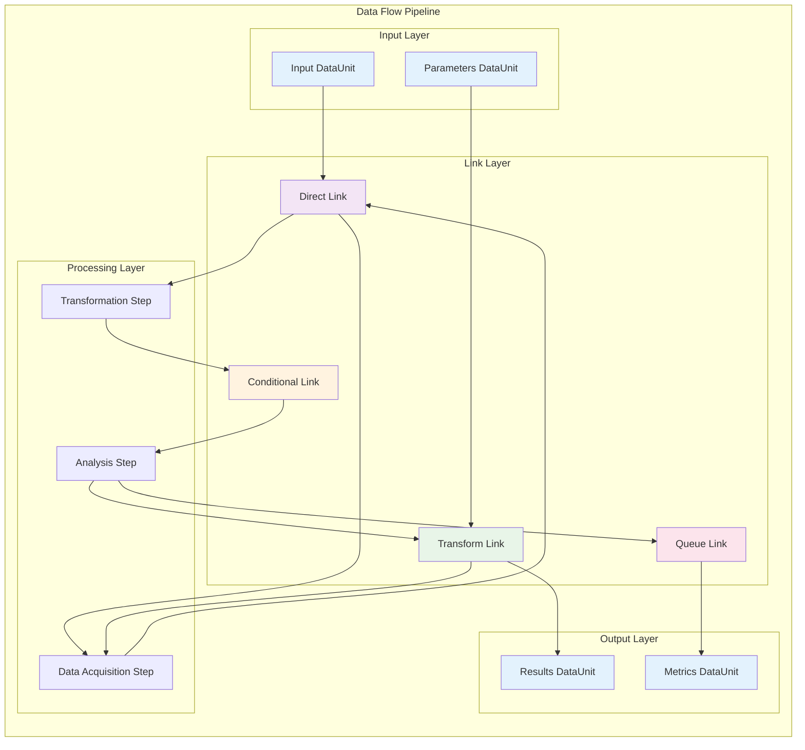

**Link Types and Functions:**

**Design Intent & Purpose:**
Each link type was designed to address specific data transfer patterns and requirements:

**🔗 Direct Link**
**Purpose**: Provide high-performance data transfer for compatible components.
**Design Intent**: Minimize overhead for simple data passing while maintaining type safety and validation.

- Immediate data transfer between components
- No transformation or validation
- High performance for simple data passing
- Synchronous operation

**⚙️ Transform Link**
**Purpose**: Enable data adaptation between components with different interfaces.
**Design Intent**: Support component reuse by enabling data format adaptation without modifying component implementations.

- Data transformation during transfer
- Format conversion and normalization
- Schema mapping and validation
- Custom transformation functions

**🔀 Conditional Link**
**Purpose**: Implement intelligent routing based on data characteristics or business rules.
**Design Intent**: Enable workflows that adapt their behavior based on data content or runtime conditions.

- Data transfer based on conditions
- Dynamic routing and branching logic
- Content-based routing decisions
- Filter and validation support

**📋 Queue Link**
**Purpose**: Provide buffering and flow control for asynchronous processing.
**Design Intent**: Enable workflows with different processing speeds and provide resilience through message persistence.

- Asynchronous data transfer
- Buffering and flow control
- Message persistence and reliability
- Load balancing and distribution

### **3.3 Trigger System Integration**

**Design Intent & Purpose:**
The trigger system was designed to implement sophisticated event-driven activation patterns while maintaining simplicity and reliability:

**State-Based Activation Model:**
The state machine approach ensures predictable trigger behavior and enables comprehensive monitoring and debugging of activation patterns.

**Multiple Trigger Types:**
Different trigger types address different activation scenarios - data availability, timers, manual intervention, and complex business conditions.

**Error Handling Integration:**
Trigger failures are handled gracefully with retry mechanisms and escalation paths, ensuring workflow reliability even in the presence of intermittent failures.

**Performance Optimization:**
The trigger system is designed for high-frequency operation with minimal overhead, enabling responsive event-driven workflows even under high load.

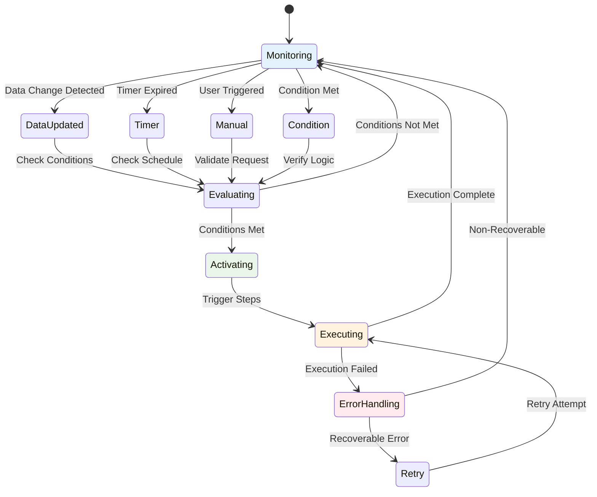

---

## **4. Error Handling and Recovery**

### **4.1 Comprehensive Error Management**

**Design Intent & Purpose:**
The comprehensive error management system was designed to provide production-grade reliability and operational visibility for complex workflows:

**Proactive Error Classification:**
By classifying errors at detection time, the system can apply appropriate handling strategies immediately rather than using generic error handling that may not be optimal for specific error types.

**Graduated Response Strategy:**
Different error types require different responses - configuration errors need user intervention, transient network errors can be retried, resource errors may require workflow rescheduling.

**Recovery Automation:**
Automated recovery reduces operational burden and improves system availability by handling common failure modes without human intervention.

**Operational Visibility:**
Comprehensive error logging and monitoring enable rapid diagnosis and resolution of issues, reducing mean time to recovery.

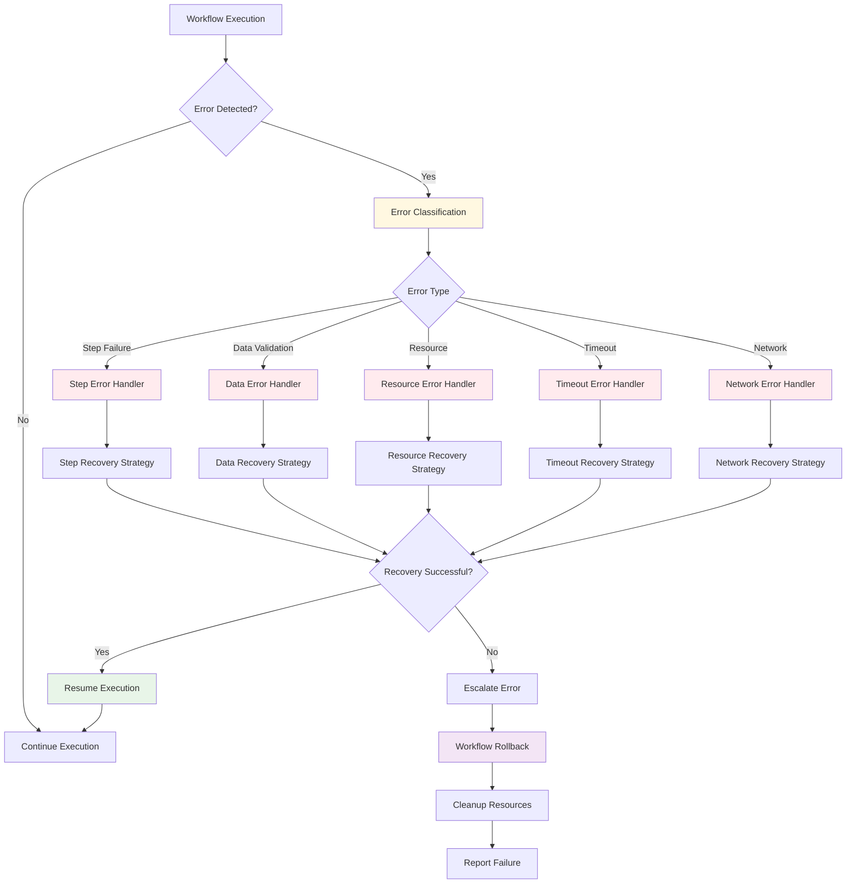

### **4.2 Error Handling Strategies**

**Design Intent & Purpose:**
Different error handling strategies address different business requirements and operational constraints:

**Strategy Selection Based on Context:**
The appropriate error handling strategy depends on workflow criticality, data requirements, and business constraints. The framework provides multiple strategies that can be selected based on specific requirements.

**Graduated Escalation:**
Error handling strategies provide graduated escalation from simple continuation through retry mechanisms to complete rollback, enabling appropriate responses to different failure scenarios.

**Resource and State Management:**
Each strategy includes appropriate resource cleanup and state management to prevent resource leaks and maintain system consistency.

**Operational Integration:**
All strategies include appropriate logging and notification mechanisms to enable operational monitoring and intervention when necessary.

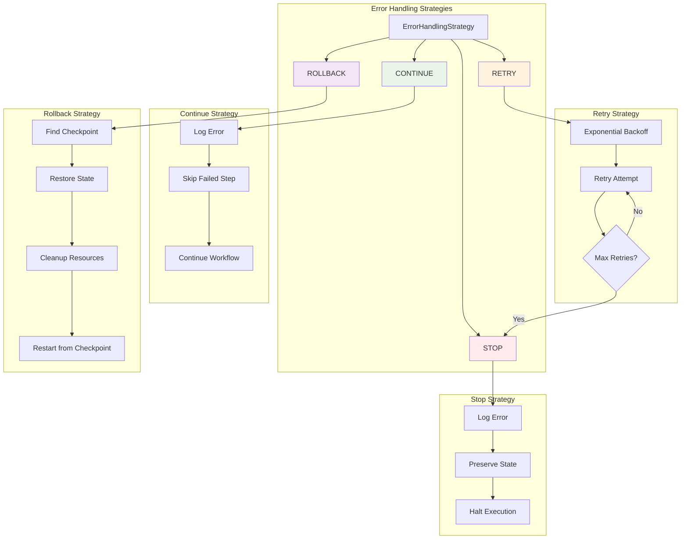

---

## **5. Workflow Configuration Patterns**

### **5.1 Multi-Stage Workflow Configuration**

**Design Intent & Purpose:**
The multi-stage configuration pattern was designed to provide comprehensive workflow definition while maintaining readability and maintainability:

**Declarative Workflow Definition:**
Complex workflows are defined declaratively through configuration rather than imperative code, enabling non-technical users to modify workflow behavior and enabling workflow evolution without code changes.

**Component Composition:**
The class+config pattern enables sophisticated component composition where complex workflows are built from reusable, configurable components.

**Environment Adaptation:**
Configuration supports environment variables and templating, enabling the same workflow definition to adapt to different deployment environments.

**Validation and Documentation:**
Configuration schemas provide validation and serve as documentation, ensuring that workflows are properly defined and making their structure clear to users.

```yaml
# Complex AI Research Workflow
name: "ai_research_workflow"
description: "Multi-stage AI-powered research pipeline"
execution_strategy: "event_driven"
error_handling: "retry"

# Step Definitions with Class+Config Patterns
steps:
  # Data Acquisition Stage
  literature_search:
    class: "nanobrain.library.steps.LiteratureSearchStep"
    config:
      search_engines: ["pubmed", "arxiv", "google_scholar"]
      max_results: 100
      quality_threshold: 0.8
  
  data_collection:
    class: "nanobrain.library.steps.DataCollectionStep"
    config:
      sources: ["api", "web_scraping", "database"]
      validation_schema: "schemas/research_data.json"
  
  # Processing Stage
  data_preprocessing:
    class: "nanobrain.library.steps.DataPreprocessingStep"
    config:
      cleaning_rules: "config/cleaning_rules.yml"
      normalization: true
      deduplication: true
  
  # AI Analysis Stage
  llm_analysis:
    class: "nanobrain.library.steps.AgentStep"
    config:
      agent:
        class: "nanobrain.library.agents.conversational.EnhancedCollaborativeAgent"
        config: "config/research_agent.yml"
      analysis_prompt: |
        Analyze the research data for patterns, insights, and recommendations.
        Focus on identifying novel findings and potential research directions.
  
  # Synthesis Stage
  report_generation:
    class: "nanobrain.library.steps.ReportGenerationStep"
    config:
      template: "templates/research_report.md"
      include_visualizations: true
      export_formats: ["pdf", "html", "docx"]

# Data Flow Links
links:
  # Literature to Data Collection
  literature_to_data:
    class: "nanobrain.core.link.TransformLink"
    config:
      source: "literature_search.search_results"
      target: "data_collection.input_sources"
      transform_function: "extract_data_sources"
  
  # Data Collection to Preprocessing
  data_to_preprocessing:
    class: "nanobrain.core.link.DirectLink"
    config:
      source: "data_collection.collected_data"
      target: "data_preprocessing.raw_data"
  
  # Preprocessing to Analysis
  preprocessing_to_analysis:
    class: "nanobrain.core.link.ConditionalLink"
    config:
      source: "data_preprocessing.clean_data"
      target: "llm_analysis.input_data"
      condition: "data_quality_score > 0.7"
  
  # Analysis to Report
  analysis_to_report:
    class: "nanobrain.core.link.TransformLink"
    config:
      source: "llm_analysis.analysis_results"
      target: "report_generation.analysis_input"
      transform_function: "format_for_report"

# Event Triggers
triggers:
  # Start workflow when new literature is available
  literature_available:
    class: "nanobrain.core.trigger.DataUpdatedTrigger"
    config:
      watch_data_units: ["literature_sources"]
      step_targets: ["literature_search"]
  
  # Progress monitoring trigger
  progress_monitor:
    class: "nanobrain.core.trigger.TimerTrigger"
    config:
      interval: 300  # 5 minutes
      step_targets: ["progress_monitoring"]

# Execution Configuration
executor:
  class: "nanobrain.core.executor.ParslExecutor"
  config: "config/hpc_executor.yml"

# Monitoring and Performance
monitoring:
  enable_progress_tracking: true
  checkpoint_interval: 300
  metrics_collection: true
  real_time_updates: true
  performance_optimization: true

# Error Handling Configuration
error_handling_config:
  max_retries: 3
  retry_delay: 60
  timeout: 3600
  rollback_on_failure: true
  preserve_partial_results: true
```

### **5.2 Workflow Lifecycle Management**

**Design Intent & Purpose:**
The workflow lifecycle management system was designed to provide comprehensive visibility and control over workflow execution:

**State-Based Lifecycle Model:**
The state machine approach ensures predictable workflow behavior and enables comprehensive monitoring and control of workflow execution.

**Error Recovery Integration:**
The lifecycle includes sophisticated error handling and recovery mechanisms that enable workflows to recover from failures and continue execution when possible.

**Resource Management:**
Explicit resource allocation and cleanup phases prevent resource leaks and enable efficient resource utilization across multiple concurrent workflows.

**Operational Integration:**
The lifecycle integrates with monitoring and alerting systems to provide operational visibility and enable proactive intervention when necessary.

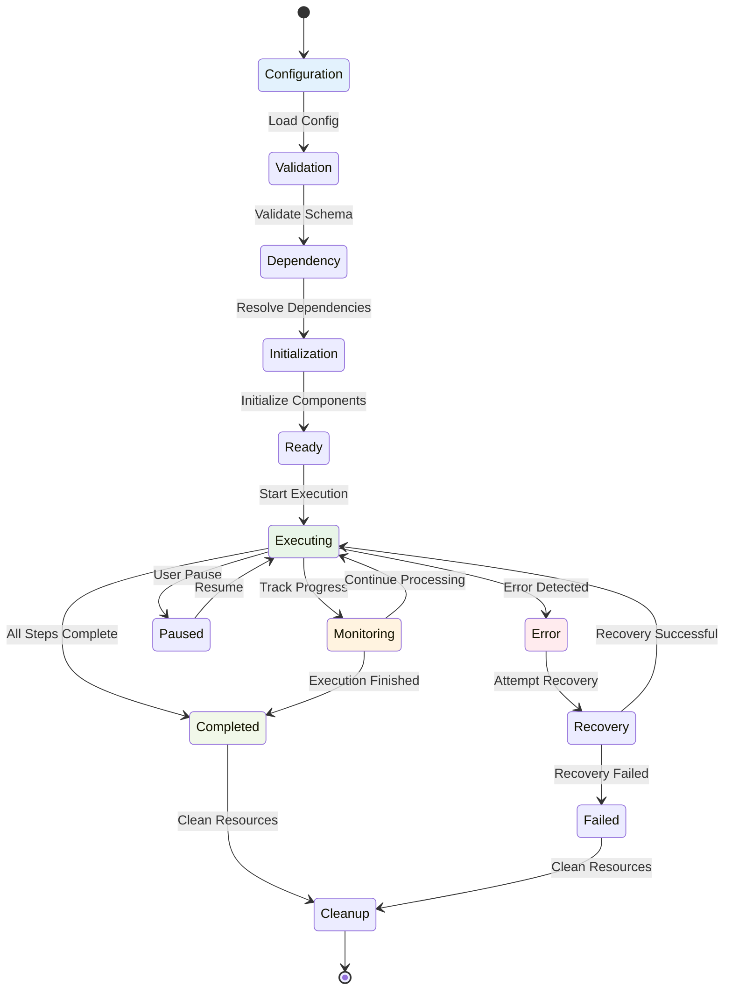

---

## **6. Performance Optimization**

### **6.1 Execution Optimization Strategies**

**Design Intent & Purpose:**
The performance optimization system was designed to provide automatic performance improvements without requiring manual tuning or code changes:

**Automatic Optimization:**
Performance optimization occurs automatically based on workflow characteristics and execution patterns, reducing the need for manual performance tuning and enabling optimal performance across diverse workloads.

**Multi-Dimensional Optimization:**
The system optimizes across multiple dimensions (parallelization, resource allocation, caching, load balancing) simultaneously to achieve optimal overall performance.

**Adaptive Behavior:**
Optimization strategies adapt based on execution history and system characteristics, enabling continuous improvement and adaptation to changing workload patterns.

**Resource Efficiency:**
Optimization focuses on efficient resource utilization rather than just raw performance, ensuring sustainable operation and cost effectiveness.

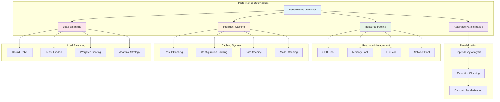

### **6.2 Monitoring and Analytics**

**Design Intent & Purpose:**
The monitoring and analytics system was designed to provide comprehensive visibility into workflow performance and enable data-driven optimization:

**Real-Time Visibility:**
Real-time monitoring enables immediate detection and response to performance issues, minimizing their impact on workflow execution and user experience.

**Predictive Capabilities:**
Analytics and machine learning on performance data enable predicting performance issues before they occur and proactively adjusting system behavior.

**Optimization Guidance:**
Performance data analysis provides specific recommendations for optimization, enabling targeted improvements with maximum impact.

**Historical Analysis:**
Long-term performance trends enable capacity planning and identification of systemic performance issues that require architectural changes.

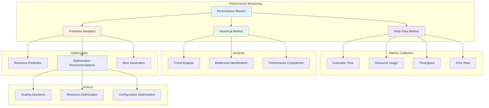

---

## **7. Advanced Workflow Patterns**

### **7.1 Nested Workflow Composition**

**Design Intent & Purpose:**
Nested workflow composition was designed to enable sophisticated hierarchical processing architectures while maintaining clear abstraction boundaries:

**Hierarchical Decomposition:**
Complex problems can be decomposed into manageable sub-problems, each handled by specialized workflows. This enables divide-and-conquer approaches to complex AI tasks.

**Reusable Components:**
Sub-workflows can be reused across different main workflows, reducing development effort and ensuring consistent behavior across applications.

**Encapsulation and Abstraction:**
Each workflow level provides appropriate abstraction, hiding internal complexity from higher levels while exposing clean interfaces.

**Independent Evolution:**
Sub-workflows can evolve independently as long as they maintain their external interfaces, enabling parallel development and maintenance.

```mermaid
graph TD
    subgraph "Main Workflow"
        MW[Main Workflow Controller]
        
        subgraph "Data Processing Sub-Workflow"
            DPS1[Input Validation Step]
            DPS2[Data Cleaning Step]
            DPS3[Data Transformation Step]
        end
        
        subgraph "AI Analysis Sub-Workflow"
            AIS1[Feature Extraction Step]
            AIS2[Model Inference Step]
            AIS3[Result Validation Step]
        end
        
        subgraph "Output Generation Sub-Workflow"
            OGS1[Result Formatting Step]
            OGS2[Visualization Step]
            OGS3[Report Generation Step]
        end
    end
    
    MW --> DPS1
    DPS1 --> DPS2
    DPS2 --> DPS3
    DPS3 --> AIS1
    AIS1 --> AIS2
    AIS2 --> AIS3
    AIS3 --> OGS1
    OGS1 --> OGS2
    OGS2 --> OGS3
    
    style MW fill:#e3f2fd
    style DPS1 fill:#f3e5f5
    style AIS1 fill:#e8f5e8
    style OGS1 fill:#fff3e0
```

### **7.2 Dynamic Workflow Adaptation**

**Design Intent & Purpose:**
Dynamic workflow adaptation enables workflows to optimize their behavior based on real-time performance data and changing conditions:

**Performance-Based Optimization:**
Workflows continuously monitor their performance and adapt their execution strategies, resource allocation, and component configuration to maintain optimal performance.

**Intelligent Feedback Loops:**
Monitoring data feeds back into optimization decisions, creating intelligent systems that improve their performance over time.

**Adaptive Resource Management:**
Resource allocation adapts to changing workload characteristics and system conditions, ensuring efficient resource utilization under varying conditions.

**Continuous Improvement:**
The system learns from execution patterns and outcomes to continuously improve workflow performance and reliability.

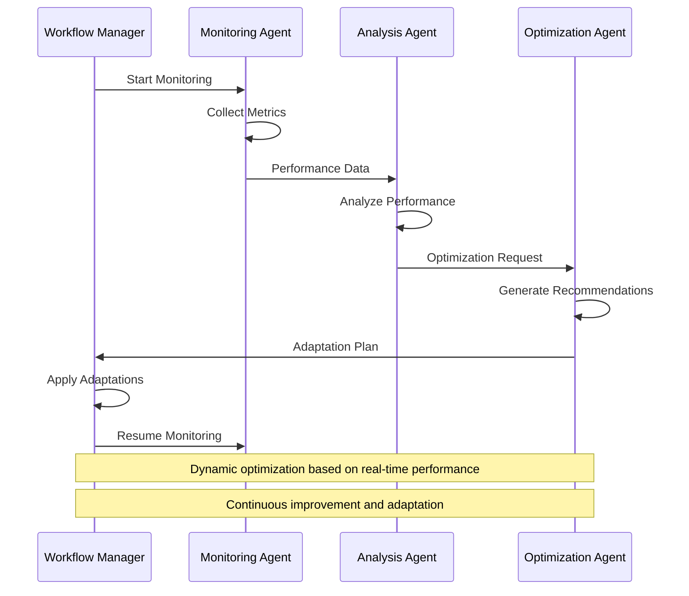

---

## **8. Next Steps**

This workflow orchestration architecture provides the foundation for:

1. **[Web Architecture](./03_WEB_ARCHITECTURE.md)** - Web interface integration with workflows
2. **[LLM Code Generation](./04_LLM_CODE_GENERATION.md)** - AI-driven workflow development
3. **[Component Library](./05_COMPONENT_LIBRARY.md)** - Pre-built workflow implementations
4. **[Configuration Management](./06_CONFIGURATION_MANAGEMENT.md)** - Advanced workflow configuration

---

**📚 Related Documentation:**
- [Framework Core Architecture](./01_FRAMEWORK_CORE_ARCHITECTURE.md) - Foundation components
- [API Reference](./build/html/index.html) - Detailed workflow API documentation
- [Configuration Examples](../config/) - Sample workflow configurations
- [Best Practices](./BEST_PRACTICES.md) - Workflow development guidelines 